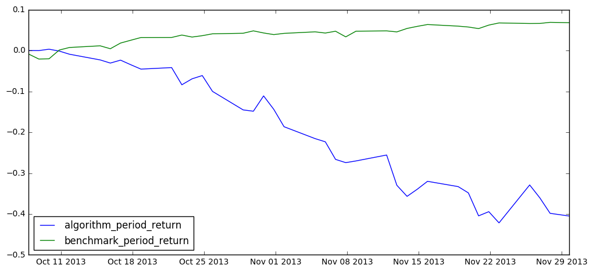
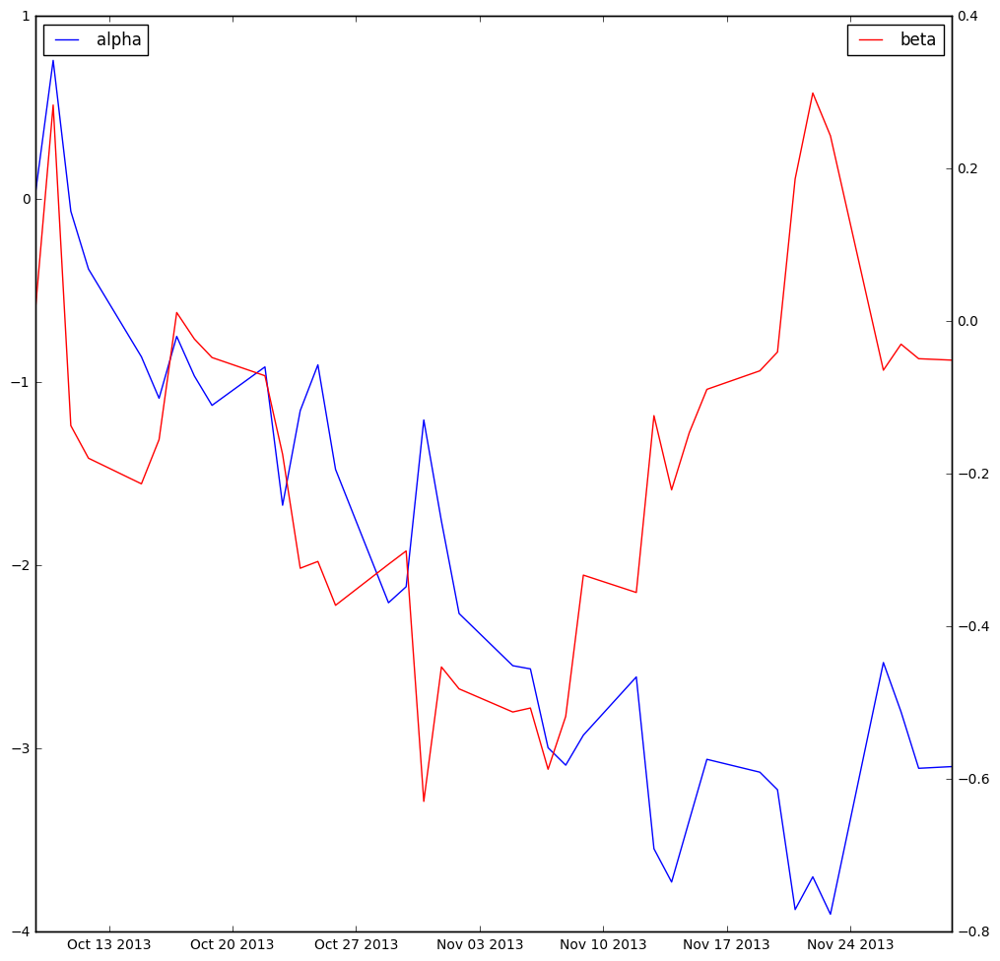
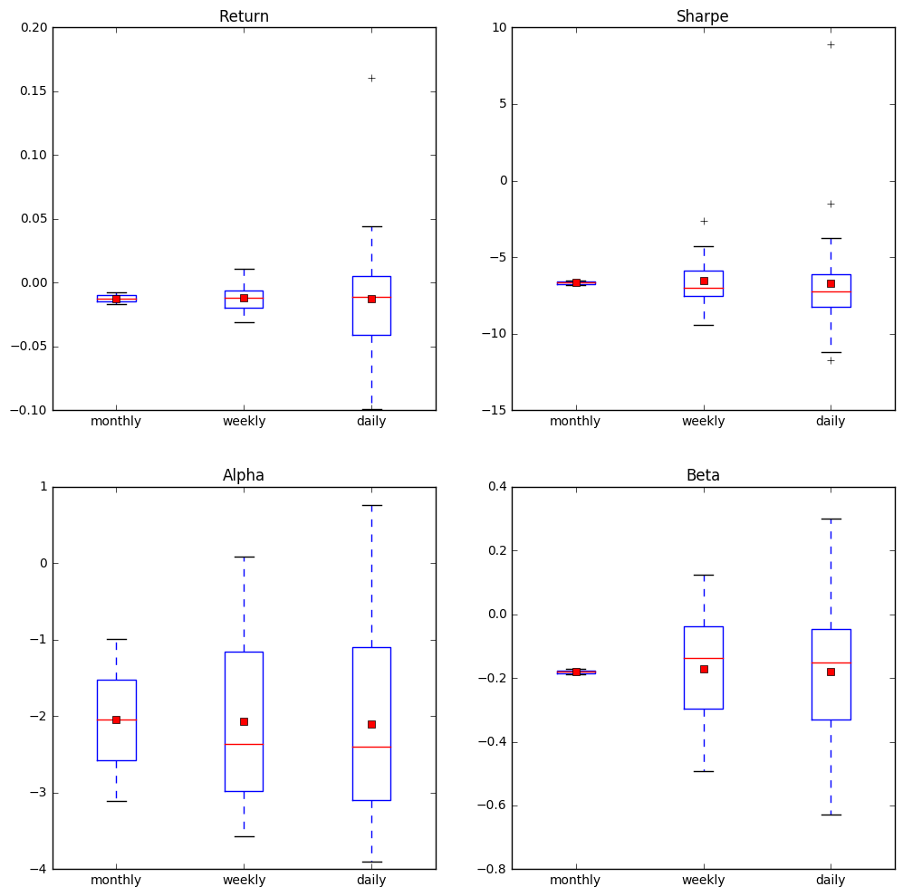

# Analysis of trading algorithm
DISCLAIMER: This analysis is done on a quite simple trading algorithm as our value investment algorithm is not yet finished. As a comparison benchmark for the algorithm we used the S&P500, which includes the shares of the 500 largest companies.

This notebook includes the analysis of the first part of our hypothesis.

Our hypothesis:
A distributed autonomous hedge fund implemented in a blockchain based on smart contracts is (1) able to be more profitable than benchmark indexes and (2) investments follow sustainability criteria that are transparent to the investors.

## Load data into notebook
We are using [zipline](https://github.com/quantopian/zipline) to simulate our trading algorithms. Zipline offers to output the results of the simulation as a pandas pickle file. The advantage of using zipline is that it already calculates common indicators including Sharpe, alpha, beta and the return.

We simulated our simple algorithm for a random period of two months. The period covered is from beginning of October 2013 to end of November 2013.


```python
import pandas as pd
performance = pd.read_pickle('results/momentum_pipeline.pickle')
# display the top 5 rows to see if the load worked
performance.head()
```


<div>
<table border="1" class="dataframe">
  <thead>
    <tr style="text-align: right;">
      <th></th>
      <th>algo_volatility</th>
      <th>algorithm_period_return</th>
      <th>alpha</th>
      <th>benchmark_period_return</th>
      <th>benchmark_volatility</th>
      <th>beta</th>
      <th>capital_used</th>
      <th>ending_cash</th>
      <th>ending_exposure</th>
      <th>ending_value</th>
      <th>...</th>
      <th>short_value</th>
      <th>shorts_count</th>
      <th>sortino</th>
      <th>starting_cash</th>
      <th>starting_exposure</th>
      <th>starting_value</th>
      <th>trading_days</th>
      <th>transactions</th>
      <th>treasury_period_return</th>
      <th>universe_size</th>
    </tr>
  </thead>
  <tbody>
    <tr>
      <th>2013-10-07 20:00:00</th>
      <td>NaN</td>
      <td>0.000000</td>
      <td>NaN</td>
      <td>-0.008506</td>
      <td>NaN</td>
      <td>NaN</td>
      <td>0.000000</td>
      <td>10000000.000000</td>
      <td>0.00</td>
      <td>0.00</td>
      <td>...</td>
      <td>0.00</td>
      <td>0</td>
      <td>NaN</td>
      <td>10000000.000000</td>
      <td>0.00</td>
      <td>0.00</td>
      <td>1</td>
      <td>[]</td>
      <td>0.0265</td>
      <td>3046</td>
    </tr>
    <tr>
      <th>2013-10-08 20:00:00</th>
      <td>0.000740</td>
      <td>-0.000066</td>
      <td>0.036942</td>
      <td>-0.020734</td>
      <td>0.042944</td>
      <td>0.017234</td>
      <td>164224.755949</td>
      <td>10164224.755949</td>
      <td>-164884.07</td>
      <td>-164884.07</td>
      <td>...</td>
      <td>-1111751.72</td>
      <td>2</td>
      <td>-11.224972</td>
      <td>10000000.000000</td>
      <td>0.00</td>
      <td>0.00</td>
      <td>2</td>
      <td>[{'dt': 2013-10-08 20:00:00+00:00, 'order_id':...</td>
      <td>0.0266</td>
      <td>3046</td>
    </tr>
    <tr>
      <th>2013-10-09 20:00:00</th>
      <td>0.031015</td>
      <td>0.003284</td>
      <td>0.758649</td>
      <td>-0.020172</td>
      <td>0.105230</td>
      <td>0.283593</td>
      <td>-136252.190979</td>
      <td>10027972.564970</td>
      <td>4871.72</td>
      <td>4871.72</td>
      <td>...</td>
      <td>-2191421.49</td>
      <td>3</td>
      <td>456.600448</td>
      <td>10164224.755949</td>
      <td>-164884.07</td>
      <td>-164884.07</td>
      <td>3</td>
      <td>[{'dt': 2013-10-09 20:00:00+00:00, 'order_id':...</td>
      <td>0.0268</td>
      <td>3046</td>
    </tr>
    <tr>
      <th>2013-10-10 20:00:00</th>
      <td>0.051333</td>
      <td>-0.001261</td>
      <td>-0.065033</td>
      <td>0.001219</td>
      <td>0.242613</td>
      <td>-0.136551</td>
      <td>-753117.984898</td>
      <td>9274854.580071</td>
      <td>712533.34</td>
      <td>712533.34</td>
      <td>...</td>
      <td>-3758922.04</td>
      <td>4</td>
      <td>-2.182774</td>
      <td>10027972.564970</td>
      <td>4871.72</td>
      <td>4871.72</td>
      <td>4</td>
      <td>[{'dt': 2013-10-10 20:00:00+00:00, 'order_id':...</td>
      <td>0.0271</td>
      <td>3049</td>
    </tr>
    <tr>
      <th>2013-10-11 20:00:00</th>
      <td>0.068803</td>
      <td>-0.008960</td>
      <td>-0.380379</td>
      <td>0.007513</td>
      <td>0.214236</td>
      <td>-0.179221</td>
      <td>-1215165.423702</td>
      <td>8059689.156369</td>
      <td>1850712.22</td>
      <td>1850712.22</td>
      <td>...</td>
      <td>-4379532.24</td>
      <td>4</td>
      <td>-7.109571</td>
      <td>9274854.580071</td>
      <td>712533.34</td>
      <td>712533.34</td>
      <td>5</td>
      <td>[{'dt': 2013-10-11 20:00:00+00:00, 'order_id':...</td>
      <td>0.0270</td>
      <td>3052</td>
    </tr>
  </tbody>
</table>
<p>5 rows × 39 columns</p>
</div>


```python
# display the rows that we have in the dataset
for row in performance.columns.values:
    print(row)
```

    algo_volatility
    algorithm_period_return
    alpha
    benchmark_period_return
    benchmark_volatility
    beta
    capital_used
    ending_cash
    ending_exposure
    ending_value
    excess_return
    gross_leverage
    information
    long_exposure
    long_value
    longs_count
    max_drawdown
    max_leverage
    net_leverage
    orders
    period_close
    period_label
    period_open
    pnl
    portfolio_value
    positions
    returns
    sharpe
    short_exposure
    short_value
    shorts_count
    sortino
    starting_cash
    starting_exposure
    starting_value
    trading_days
    transactions
    treasury_period_return
    universe_size


## Variables
Based on our algorithm assets are traded on the stock market. The algorithm works as follows: A simple algorithm that longs the top 3 stocks by Relative Strength Index (RSI) and shorts the bottom 3 each day. The idea of RSI is to give an indicator of overbought (i.e. overvalued) and oversold (i.e. undervalued) assets. Thus, we have the independent variable RSI, which influences the derivatives we are trading. Furthermore, the derivatives are evaluated based on other trades, which we will not consider in this analysis. The trading strategy itself is in itself a quite complex variable, as it will influence any performance measurement.

The following dependent variables will be analysed:

1. Return of the fund as daily intervals:
   Determine overall profit/loss, mean profit/loss per time interval (week/month) and outliers of profit and loss

2. Sharpe ratio of the fund as daily intervals:
   Determine overall Sharpe ratio (performance as compared to its risk), mean Sharpe ratio per time interval (week/month) and outliers

3. Beta of the fund as daily intervals:
   Measure historical volatility in comparison to S&P500 index

4. Alpha of the fund as daily intervals:
   Measure historical return on investment compared to its Sharpe ratio (risk adjusted expected return)

### Return of the fund
The return of the fund is influenced by how well the strategy is able to determine assets that are increasing (for long) or decreasing (for short) in value over time.

In the figure below we are printing the algorithm relative return compared to our S&P500 benchmark.


```python
%pylab inline
figsize(12, 12)
import matplotlib.pyplot as plt

fig = plt.figure()
return_graph1 = fig.add_subplot(211)
algo_performance = plt.plot(performance.algorithm_period_return)
bench_performance = plt.plot(performance.benchmark_period_return)
plt.legend(loc=0)
plt.show()
```

    Populating the interactive namespace from numpy and matplotlib





As we can see our algorithm does not outperform the benchmark. Thus, let us take a deeper look into our distribution of long and short values in the portfolio and our overall return.


```python
return_graph2 = fig.add_subplot(212)
algo_return = plt.plot(performance.ending_cash)
algo_long = plt.plot(performance.long_value)
# Take inverse of short value for comparison (by default short is always negative)
algo_short = plt.plot(-performance.short_value)
plt.legend(loc=0)
plt.show()
```


As we can see from the above figure, our algorithm performs quite well at the beginning. Around mid of October we see that the value which is bound in short investments starts to increase faster then our long investments. From the benchmark in the previous figure we have seen that the overall market increases. However, the algorithm holds primarily values that predict a decreasing market. As a first result, the RSI seems not to be a very well predictor of the actual value and the market behaviour. As we ran the simulation only for 2 months, this might only be true for that period of time. In a next step, we would need to analyse it over a longer period of time and go into depths of how RSI is calculated. Since we do not use RSI in our final algorithm, we will exclude this analysis here.

### Sharpe ratio
With the Sharpe ratio we can determine the return in respect to the risk involved. The Sharpe ratio is calculated by dividing the sum of the asset return and a benchmark return (S&P500 in our case) by the standard deviation of the asset return. The higher the Sharpe ratio, the higher the return with the same risk or the lower the risk with same return.


```python
return_graph3, ax1 = plt.subplots()
ax1.plot(performance.sharpe, 'b')
plt.legend(loc=2)
ax2 = ax1.twinx()
ax2.plot(performance.algo_volatility, 'g')
ax2.plot(performance.algorithm_period_return, 'r')
ax2.plot(performance.benchmark_period_return, 'y')
plt.legend(loc=1)
plt.show()
```


From the above figure we see the Sharpe ratio as well as the three components the ratio is calculated from: algo_volatility (the standard deviation of asset return), algorithm_period_return and benchmark_period_return. Our algorithm performs quite poorly in terms of Sharpe ratio as overall performance is worse than the benchmark and the volatility of the return increases over time due to our losses.

### Alpha and Beta
The alpha value expresses the performance of the fund in comparison to a benchmark. Typically a higher alpha indicates a higher profitability in comparison to the benchmark. An alpha of zero means exact performance as the benchmark, a positive value indicates outperforming the benchmark and a negative value represents falling behind the benchmark.

The beta value shows the volatility of the fund in comparison to a benchmark. The beta value baseline is one and represents the same volatility as the benchmark. A value below one indicates a lower volatility and consequently a value above one a higher volatility than the benchmark.


```python
alpha_graph, ax1 = plt.subplots()
ax1.plot(performance.alpha, 'b')
plt.legend(loc=2)
ax2 = ax1.twinx()
ax2.plot(performance.beta, 'r')
plt.legend(loc=1)
plt.show
```


    <function matplotlib.pyplot.show>





The figure above shows that the alpha value is decreasing overtime and confirms our observations earlier: our algorithm performs quite poorly in comparison to the S&P500.

Our beta value stays for the whole period below one, which means that our algorithm could be independent from the market. However, as it drops below zero the beta indicates that the algorithm reacts exactly opposite to the overall market.

## Time-based Performance
Lastly, we want to analyse our performance over time in terms of weekly and monthly results. Therefore our above mentioned indicators including return, Sharpe ratio, alpha and beta are put into a timely perspective.


```python
monthly_returns = performance.returns.resample('M', how='mean')
weekly_returns = performance.returns.resample('W', how='mean')
# replace NaN values for plotting with default return (0)
daily_returns = performance.returns.fillna(value=0)
print('Monthly')
print(monthly_returns)
print('\nWeekly')
print(weekly_returns)
print('\nDaily')
print(daily_returns)
```

    Monthly
    2013-10-31   -0.007902
    2013-11-30   -0.016631
    Freq: M, Name: returns, dtype: float64

    Weekly
    2013-10-13   -0.001791
    2013-10-20   -0.007440
    2013-10-27   -0.011356
    2013-11-03   -0.019341
    2013-11-10   -0.021259
    2013-11-17   -0.012731
    2013-11-24   -0.031288
    2013-12-01    0.010819
    Freq: W-SUN, Name: returns, dtype: float64

    Daily
    2013-10-07 20:00:00    0.000000
    2013-10-08 20:00:00   -0.000066
    2013-10-09 20:00:00    0.003351
    2013-10-10 20:00:00   -0.004531
    2013-10-11 20:00:00   -0.007708
    2013-10-14 20:00:00   -0.014056
    2013-10-15 20:00:00   -0.007917
    2013-10-16 20:00:00    0.007385
    2013-10-17 20:00:00   -0.011490
    2013-10-18 20:00:00   -0.011122
    2013-10-21 20:00:00    0.003932
    2013-10-22 20:00:00   -0.043902
    2013-10-23 20:00:00    0.015909
    2013-10-24 20:00:00    0.008591
    2013-10-25 20:00:00   -0.041307
    2013-10-28 20:00:00   -0.050311
    2013-10-29 20:00:00   -0.003790
    2013-10-30 20:00:00    0.044078
    2013-10-31 20:00:00   -0.037182
    2013-11-01 20:00:00   -0.049498
    2013-11-04 21:00:00   -0.035809
    2013-11-05 21:00:00   -0.009972
    2013-11-06 21:00:00   -0.055384
    2013-11-07 21:00:00   -0.010878
    2013-11-08 21:00:00    0.005748
    2013-11-11 21:00:00    0.019882
    2013-11-12 21:00:00   -0.099494
    2013-11-13 21:00:00   -0.040467
    2013-11-14 21:00:00    0.027167
    2013-11-15 21:00:00    0.029256
    2013-11-18 21:00:00   -0.019003
    2013-11-19 21:00:00   -0.023073
    2013-11-20 21:00:00   -0.086246
    2013-11-21 21:00:00    0.017184
    2013-11-22 21:00:00   -0.045301
    2013-11-25 21:00:00    0.160559
    2013-11-26 21:00:00   -0.047348
    2013-11-27 21:00:00   -0.058975
    2013-11-29 18:00:00   -0.010959
    Name: returns, dtype: float64


```python
monthly_sharpe = performance.sharpe.resample('M', how='mean')
weekly_sharpe = performance.sharpe.resample('W', how='mean')
# drop NaN values for plotting
daily_sharpe = performance.sharpe.dropna()
print('Monthly')
print(monthly_sharpe)
print('\nWeekly')
print(weekly_sharpe)
print('\nDaily')
print(daily_sharpe)
```

    Monthly
    2013-10-31   -6.524520
    2013-11-30   -6.831513
    Freq: M, Name: sharpe, dtype: float64

    Weekly
    2013-10-13   -2.604415
    2013-10-20   -9.433989
    2013-10-27   -6.863926
    2013-11-03   -6.425953
    2013-11-10   -7.985021
    2013-11-17   -7.398248
    2013-11-24   -7.179844
    2013-12-01   -4.304766
    Freq: W-SUN, Name: sharpe, dtype: float64

    Daily
    2013-10-08 20:00:00   -11.224972
    2013-10-09 20:00:00     8.895998
    2013-10-10 20:00:00    -1.529314
    2013-10-11 20:00:00    -6.559372
    2013-10-14 20:00:00    -9.613949
    2013-10-15 20:00:00   -11.722511
    2013-10-16 20:00:00    -6.735743
    2013-10-17 20:00:00    -8.720800
    2013-10-18 20:00:00   -10.376940
    2013-10-21 20:00:00    -8.490046
    2013-10-22 20:00:00    -8.478192
    2013-10-23 20:00:00    -5.966185
    2013-10-24 20:00:00    -4.884706
    2013-10-25 20:00:00    -6.500502
    2013-10-28 20:00:00    -7.798674
    2013-10-29 20:00:00    -7.746724
    2013-10-30 20:00:00    -4.476773
    2013-10-31 20:00:00    -5.511956
    2013-11-01 20:00:00    -6.595637
    2013-11-04 21:00:00    -7.389724
    2013-11-05 21:00:00    -7.533695
    2013-11-06 21:00:00    -8.389071
    2013-11-07 21:00:00    -8.516009
    2013-11-08 21:00:00    -8.096607
    2013-11-11 21:00:00    -7.176213
    2013-11-12 21:00:00    -7.731660
    2013-11-13 21:00:00    -8.273481
    2013-11-14 21:00:00    -7.344281
    2013-11-15 21:00:00    -6.465605
    2013-11-18 21:00:00    -6.685774
    2013-11-19 21:00:00    -6.960754
    2013-11-20 21:00:00    -7.585508
    2013-11-21 21:00:00    -7.106814
    2013-11-22 21:00:00    -7.560369
    2013-11-25 21:00:00    -3.773593
    2013-11-26 21:00:00    -4.162443
    2013-11-27 21:00:00    -4.617598
    2013-11-29 18:00:00    -4.665431
    Name: sharpe, dtype: float64


```python
monthly_alpha = performance.alpha.resample('M', how='mean')
weekly_alpha = performance.alpha.resample('W', how='mean')
# drop NaN values for plotting
daily_alpha = performance.alpha.dropna()
print('Monthly')
print(monthly_alpha)
print('\nWeekly')
print(weekly_alpha)
print('\nDaily')
print(daily_alpha)
```

    Monthly
    2013-10-31   -0.990603
    2013-11-30   -3.103839
    Freq: M, Name: alpha, dtype: float64

    Weekly
    2013-10-13    0.087545
    2013-10-20   -0.956792
    2013-10-27   -1.223401
    2013-11-03   -1.908321
    2013-11-10   -2.824007
    2013-11-17   -3.266186
    2013-11-24   -3.566527
    2013-12-01   -2.882911
    Freq: W-SUN, Name: alpha, dtype: float64

    Daily
    2013-10-08 20:00:00    0.036942
    2013-10-09 20:00:00    0.758649
    2013-10-10 20:00:00   -0.065033
    2013-10-11 20:00:00   -0.380379
    2013-10-14 20:00:00   -0.859815
    2013-10-15 20:00:00   -1.086251
    2013-10-16 20:00:00   -0.748424
    2013-10-17 20:00:00   -0.964517
    2013-10-18 20:00:00   -1.124954
    2013-10-21 20:00:00   -0.914962
    2013-10-22 20:00:00   -1.670275
    2013-10-23 20:00:00   -1.153664
    2013-10-24 20:00:00   -0.903466
    2013-10-25 20:00:00   -1.474639
    2013-10-28 20:00:00   -2.202693
    2013-10-29 20:00:00   -2.115291
    2013-10-30 20:00:00   -1.204656
    2013-10-31 20:00:00   -1.757429
    2013-11-01 20:00:00   -2.261536
    2013-11-04 21:00:00   -2.546405
    2013-11-05 21:00:00   -2.563873
    2013-11-06 21:00:00   -2.994339
    2013-11-07 21:00:00   -3.089532
    2013-11-08 21:00:00   -2.925885
    2013-11-11 21:00:00   -2.607770
    2013-11-12 21:00:00   -3.546002
    2013-11-13 21:00:00   -3.727671
    2013-11-14 21:00:00   -3.391785
    2013-11-15 21:00:00   -3.057704
    2013-11-18 21:00:00   -3.127854
    2013-11-19 21:00:00   -3.223878
    2013-11-20 21:00:00   -3.878153
    2013-11-21 21:00:00   -3.699196
    2013-11-22 21:00:00   -3.903553
    2013-11-25 21:00:00   -2.529162
    2013-11-26 21:00:00   -2.798351
    2013-11-27 21:00:00   -3.106773
    2013-11-29 18:00:00   -3.097358
    Name: alpha, dtype: float64


```python
monthly_beta = performance.beta.resample('M', how='mean')
weekly_beta = performance.beta.resample('W', how='mean')
# drop NaN values for plotting
daily_beta = performance.beta.dropna()
print('Monthly')
print(monthly_beta)
print('\nWeekly')
print(weekly_beta)
print('\nDaily')
print(daily_beta)
```

    Monthly
    2013-10-31   -0.188746
    2013-11-30   -0.171997
    Freq: M, Name: beta, dtype: float64

    Weekly
    2013-10-13   -0.003736
    2013-10-20   -0.085261
    2013-10-27   -0.251068
    2013-11-03   -0.436469
    2013-11-10   -0.491068
    2013-11-17   -0.186860
    2013-11-24    0.124898
    2013-12-01   -0.048320
    Freq: W-SUN, Name: beta, dtype: float64

    Daily
    2013-10-08 20:00:00    0.017234
    2013-10-09 20:00:00    0.283593
    2013-10-10 20:00:00   -0.136551
    2013-10-11 20:00:00   -0.179221
    2013-10-14 20:00:00   -0.212828
    2013-10-15 20:00:00   -0.154850
    2013-10-16 20:00:00    0.011665
    2013-10-17 20:00:00   -0.022990
    2013-10-18 20:00:00   -0.047300
    2013-10-21 20:00:00   -0.071181
    2013-10-22 20:00:00   -0.174213
    2013-10-23 20:00:00   -0.323420
    2013-10-24 20:00:00   -0.314524
    2013-10-25 20:00:00   -0.371999
    2013-10-28 20:00:00   -0.318256
    2013-10-29 20:00:00   -0.300793
    2013-10-30 20:00:00   -0.628982
    2013-10-31 20:00:00   -0.452803
    2013-11-01 20:00:00   -0.481513
    2013-11-04 21:00:00   -0.511828
    2013-11-05 21:00:00   -0.506633
    2013-11-06 21:00:00   -0.586860
    2013-11-07 21:00:00   -0.517577
    2013-11-08 21:00:00   -0.332443
    2013-11-11 21:00:00   -0.355205
    2013-11-12 21:00:00   -0.123472
    2013-11-13 21:00:00   -0.220742
    2013-11-14 21:00:00   -0.145864
    2013-11-15 21:00:00   -0.089018
    2013-11-18 21:00:00   -0.064730
    2013-11-19 21:00:00   -0.040106
    2013-11-20 21:00:00    0.186757
    2013-11-21 21:00:00    0.299348
    2013-11-22 21:00:00    0.243219
    2013-11-25 21:00:00   -0.063888
    2013-11-26 21:00:00   -0.029821
    2013-11-27 21:00:00   -0.048846
    2013-11-29 18:00:00   -0.050725
    Name: beta, dtype: float64


```python
fig, axes = plt.subplots(nrows=2, ncols=2)
labels = ['monthly', 'weekly', 'daily']
axes[0, 0].boxplot((monthly_returns, weekly_returns, daily_returns), labels=labels, showmeans=True)
axes[0, 0].set_title('Return')
axes[0, 1].boxplot((monthly_sharpe, weekly_sharpe, daily_sharpe), labels=labels, showmeans=True)
axes[0, 1].set_title('Sharpe')
axes[1, 0].boxplot((monthly_alpha, weekly_alpha, daily_alpha), labels=labels, showmeans=True)
axes[1, 0].set_title('Alpha')
axes[1, 1].boxplot((monthly_beta, weekly_beta, daily_beta), labels=labels, showmeans=True)
axes[1, 1].set_title('Beta')
plt.setp(axes)
plt.show()
```





Generally the standard deviation of our measurements increases when we go from monthly, to weekly and then to a daily view. This is primarily caused by having more data points the finer the date granularity. However, with the Sharpe ratio it is quite interesting to see, that the weekly and daily standard deviation stays quite similar.


```python
from statistics import stdev
print('Standard deviation\nWeekly Sharpe: {}\nDaily: Sharpe {}'.format(stdev(weekly_sharpe), stdev(daily_sharpe)))
```

    Standard deviation
    Weekly Sharpe: 2.1451061476445545
    Daily: Sharpe 3.285653294106114


The other measurements are less interesting and more data would be required to give a better view on their behaviour in relation to the time perspective. Especially, since the return of the algorithm more or less constantly falls behind the benchmark, the monthly indicators give a quite good representation of the overall trend. Simulating the algorithm for a year or more would however increase their meaning.
