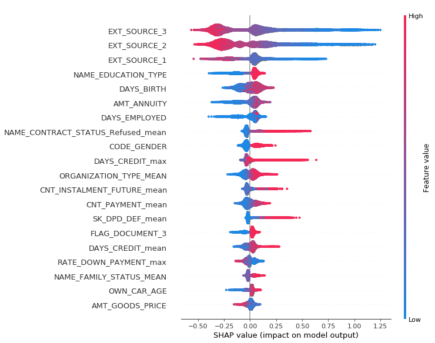

```python
# numpy and pandas for data manipulation
import numpy as np
import pandas as pd 
from sklearn.model_selection import KFold, StratifiedKFold
from sklearn.metrics import roc_auc_score
from lightgbm import LGBMClassifier
from sklearn.preprocessing import LabelEncoder
from sklearn.base import clone
import gc
import pandas as pd
import numpy as np
path = "/home/ubuntu/.kaggle/competitions/home-credit-default-risk/"


params = {
         'boosting_type': 'gbdt',
          'max_depth': -1,
          'objective': 'binary',
          'n_estimators': 3485, 
          'nthread': 5,
          'num_leaves': 39,
          'learning_rate': 0.05,
          'max_bin': 512,
          'subsample_for_bin': 200,
          'subsample': 0.36,
          'subsample_freq': 1,
          'colsample_bytree': 0.98,
          'reg_alpha': 8,
          'reg_lambda': 2,
          'min_split_gain': 0.5,
          'min_child_weight': 1,
          'min_child_samples': 5,
          'scale_pos_weight': 1,
          'num_class': 1,
          'metric': 'auc'}
```


```python
#Great snippet from https://www.kaggle.com/gemartin/load-data-reduce-memory-usage
def reduce_mem_usage(df):
    """ iterate through all the columns of a dataframe and modify the data type
        to reduce memory usage.        
    """
    start_mem = df.memory_usage().sum() / 1024**2
    print('Memory usage of dataframe is {:.2f} MB'.format(start_mem))
    
    for col in df.columns:
        col_type = df[col].dtype
        
        if col_type != object:
            c_min = df[col].min()
            c_max = df[col].max()
            if str(col_type)[:3] == 'int':
                if c_min > np.iinfo(np.int8).min and c_max < np.iinfo(np.int8).max:
                    df[col] = df[col].astype(np.int8)
                elif c_min > np.iinfo(np.int16).min and c_max < np.iinfo(np.int16).max:
                    df[col] = df[col].astype(np.int16)
                elif c_min > np.iinfo(np.int32).min and c_max < np.iinfo(np.int32).max:
                    df[col] = df[col].astype(np.int32)
                elif c_min > np.iinfo(np.int64).min and c_max < np.iinfo(np.int64).max:
                    df[col] = df[col].astype(np.int64)  
            else:
                if c_min > np.finfo(np.float16).min and c_max < np.finfo(np.float16).max:
                    df[col] = df[col].astype(np.float16)
                elif c_min > np.finfo(np.float32).min and c_max < np.finfo(np.float32).max:
                    df[col] = df[col].astype(np.float32)
                else:
                    df[col] = df[col].astype(np.float64)
        #else:
        #    df[col] = df[col].astype('category')

    end_mem = df.memory_usage().sum() / 1024**2
    print('Memory usage after optimization is: {:.2f} MB'.format(end_mem))
    print('Decreased by {:.1f}%'.format(100 * (start_mem - end_mem) / start_mem))
    
    return df
    
    
    
    
```


```python
train = reduce_mem_usage(pd.read_csv(path + "application_train.csv"))
test = reduce_mem_usage(pd.read_csv(path + "application_test.csv"))
test.loc[:, "is_test"] = True

alldata = pd.concat([train, test], axis=0)
alldata.loc[:, "is_test"] = alldata.loc[:, "is_test"].fillna(False)

num_cols = alldata.select_dtypes(exclude=["object"]).columns
num_cols = [col for col in num_cols if col not in ["SK_ID_CURR", "is_test", "TARGET"]]

del train, test; gc.collect()


bureau_balance = reduce_mem_usage(pd.read_csv(path + "bureau_balance.csv"))
bureau =  reduce_mem_usage(pd.read_csv(path + 'bureau.csv'))
full_bureau = pd.merge(bureau, bureau_balance, on="SK_ID_BUREAU", how="left")

del bureau_balance, bureau
gc.collect()

dataframes = [
    (
        "previous_application",  
        "SK_ID_PREV", 
        reduce_mem_usage(pd.read_csv(path + 'previous_application.csv'))
    ),
    (
        "bureau", 
        "SK_ID_BUREAU",
        full_bureau
    ),
    (
        "POS_CASH_balance",
        "SK_ID_PREV",
        reduce_mem_usage(pd.read_csv(path + "POS_CASH_balance.csv"))
    ),
    (
        "credit_card_balance",
        "SK_ID_PREV",
        reduce_mem_usage(pd.read_csv(path + "credit_card_balance.csv"))
    ),
    (
        "installments_payments",
        "SK_ID_PREV",
        reduce_mem_usage(pd.read_csv(path + "installments_payments.csv"))
    )
]


for name, key, df in dataframes:
    print("Working on %s..." % name, end="")
    cat_cols = df.select_dtypes(include=["object"]).columns
    
    df = pd.get_dummies(
        df, 
        columns=cat_cols, 
        drop_first=True, 
        dummy_na=True
    )
    
    tmp_df_mean = df.groupby("SK_ID_CURR").agg(["mean", "max"]).drop(key, axis=1)
    tmp_df_mean.columns = ["_".join(col) for col in tmp_df_mean.columns.ravel()]
    #tmp_df_mean.loc[:, "%s_count"%name] = df.loc[:, "SK_ID_CURR"].map(df.groupby('SK_ID_CURR').count()[key])
    
    cols_to_keep = [col for col in tmp_df_mean.columns if col not in alldata.columns]
    alldata = pd.merge(
        alldata, 
        tmp_df_mean[cols_to_keep].reset_index(), 
        on="SK_ID_CURR", 
        how="left"
    )
    del tmp_df_mean
    gc.collect()
    print("done")


for name, key, df in dataframes:
    del df; gc.collect()
    
del dataframes; gc.collect()


categorical_cols = [col for col in alldata.select_dtypes(include=["object"]).columns]

#Mean encoding of categorical variables
for col in categorical_cols:
    means = alldata.loc[~alldata.is_test, :].groupby(col)["TARGET"].mean()
    alldata.loc[:, "%s_MEAN" % col] = alldata.loc[:, col].map(means)
    
    #Missing values is filled with global mean
    alldata.loc[:, "%s_MEAN" % col] = alldata.loc[:, "%s_MEAN" % col].fillna(means.mean())
    
    
    
alldata.loc[:, categorical_cols] = alldata.loc[:, categorical_cols].apply(lambda x: LabelEncoder().fit_transform(x.astype(str)))

```


```python
pd.options.display.max_columns = None
alldata.head()
```


<div>
<style>
    .dataframe thead tr:only-child th {
        text-align: right;
    }

    .dataframe thead th {
        text-align: left;
    }

    .dataframe tbody tr th {
        vertical-align: top;
    }
</style>
<table border="1" class="dataframe">
  <thead>
    <tr style="text-align: right;">
      <th></th>
      <th>AMT_ANNUITY</th>
      <th>AMT_CREDIT</th>
      <th>AMT_GOODS_PRICE</th>
      <th>AMT_INCOME_TOTAL</th>
      <th>AMT_REQ_CREDIT_BUREAU_DAY</th>
      <th>AMT_REQ_CREDIT_BUREAU_HOUR</th>
      <th>AMT_REQ_CREDIT_BUREAU_MON</th>
      <th>AMT_REQ_CREDIT_BUREAU_QRT</th>
      <th>AMT_REQ_CREDIT_BUREAU_WEEK</th>
      <th>AMT_REQ_CREDIT_BUREAU_YEAR</th>
      <th>APARTMENTS_AVG</th>
      <th>APARTMENTS_MEDI</th>
      <th>APARTMENTS_MODE</th>
      <th>BASEMENTAREA_AVG</th>
      <th>BASEMENTAREA_MEDI</th>
      <th>BASEMENTAREA_MODE</th>
      <th>CNT_CHILDREN</th>
      <th>CNT_FAM_MEMBERS</th>
      <th>CODE_GENDER</th>
      <th>COMMONAREA_AVG</th>
      <th>COMMONAREA_MEDI</th>
      <th>COMMONAREA_MODE</th>
      <th>DAYS_BIRTH</th>
      <th>DAYS_EMPLOYED</th>
      <th>DAYS_ID_PUBLISH</th>
      <th>DAYS_LAST_PHONE_CHANGE</th>
      <th>DAYS_REGISTRATION</th>
      <th>DEF_30_CNT_SOCIAL_CIRCLE</th>
      <th>DEF_60_CNT_SOCIAL_CIRCLE</th>
      <th>ELEVATORS_AVG</th>
      <th>ELEVATORS_MEDI</th>
      <th>ELEVATORS_MODE</th>
      <th>EMERGENCYSTATE_MODE</th>
      <th>ENTRANCES_AVG</th>
      <th>ENTRANCES_MEDI</th>
      <th>ENTRANCES_MODE</th>
      <th>EXT_SOURCE_1</th>
      <th>EXT_SOURCE_2</th>
      <th>EXT_SOURCE_3</th>
      <th>FLAG_CONT_MOBILE</th>
      <th>FLAG_DOCUMENT_10</th>
      <th>FLAG_DOCUMENT_11</th>
      <th>FLAG_DOCUMENT_12</th>
      <th>FLAG_DOCUMENT_13</th>
      <th>FLAG_DOCUMENT_14</th>
      <th>FLAG_DOCUMENT_15</th>
      <th>FLAG_DOCUMENT_16</th>
      <th>FLAG_DOCUMENT_17</th>
      <th>FLAG_DOCUMENT_18</th>
      <th>FLAG_DOCUMENT_19</th>
      <th>FLAG_DOCUMENT_2</th>
      <th>FLAG_DOCUMENT_20</th>
      <th>FLAG_DOCUMENT_21</th>
      <th>FLAG_DOCUMENT_3</th>
      <th>FLAG_DOCUMENT_4</th>
      <th>FLAG_DOCUMENT_5</th>
      <th>FLAG_DOCUMENT_6</th>
      <th>FLAG_DOCUMENT_7</th>
      <th>FLAG_DOCUMENT_8</th>
      <th>FLAG_DOCUMENT_9</th>
      <th>FLAG_EMAIL</th>
      <th>FLAG_EMP_PHONE</th>
      <th>FLAG_MOBIL</th>
      <th>FLAG_OWN_CAR</th>
      <th>FLAG_OWN_REALTY</th>
      <th>FLAG_PHONE</th>
      <th>FLAG_WORK_PHONE</th>
      <th>FLOORSMAX_AVG</th>
      <th>FLOORSMAX_MEDI</th>
      <th>FLOORSMAX_MODE</th>
      <th>FLOORSMIN_AVG</th>
      <th>FLOORSMIN_MEDI</th>
      <th>FLOORSMIN_MODE</th>
      <th>FONDKAPREMONT_MODE</th>
      <th>HOUR_APPR_PROCESS_START</th>
      <th>HOUSETYPE_MODE</th>
      <th>LANDAREA_AVG</th>
      <th>LANDAREA_MEDI</th>
      <th>LANDAREA_MODE</th>
      <th>LIVE_CITY_NOT_WORK_CITY</th>
      <th>LIVE_REGION_NOT_WORK_REGION</th>
      <th>LIVINGAPARTMENTS_AVG</th>
      <th>LIVINGAPARTMENTS_MEDI</th>
      <th>LIVINGAPARTMENTS_MODE</th>
      <th>LIVINGAREA_AVG</th>
      <th>LIVINGAREA_MEDI</th>
      <th>LIVINGAREA_MODE</th>
      <th>NAME_CONTRACT_TYPE</th>
      <th>NAME_EDUCATION_TYPE</th>
      <th>NAME_FAMILY_STATUS</th>
      <th>NAME_HOUSING_TYPE</th>
      <th>NAME_INCOME_TYPE</th>
      <th>NAME_TYPE_SUITE</th>
      <th>NONLIVINGAPARTMENTS_AVG</th>
      <th>NONLIVINGAPARTMENTS_MEDI</th>
      <th>NONLIVINGAPARTMENTS_MODE</th>
      <th>NONLIVINGAREA_AVG</th>
      <th>NONLIVINGAREA_MEDI</th>
      <th>NONLIVINGAREA_MODE</th>
      <th>OBS_30_CNT_SOCIAL_CIRCLE</th>
      <th>OBS_60_CNT_SOCIAL_CIRCLE</th>
      <th>OCCUPATION_TYPE</th>
      <th>ORGANIZATION_TYPE</th>
      <th>OWN_CAR_AGE</th>
      <th>REGION_POPULATION_RELATIVE</th>
      <th>REGION_RATING_CLIENT</th>
      <th>REGION_RATING_CLIENT_W_CITY</th>
      <th>REG_CITY_NOT_LIVE_CITY</th>
      <th>REG_CITY_NOT_WORK_CITY</th>
      <th>REG_REGION_NOT_LIVE_REGION</th>
      <th>REG_REGION_NOT_WORK_REGION</th>
      <th>SK_ID_CURR</th>
      <th>TARGET</th>
      <th>TOTALAREA_MODE</th>
      <th>WALLSMATERIAL_MODE</th>
      <th>WEEKDAY_APPR_PROCESS_START</th>
      <th>YEARS_BEGINEXPLUATATION_AVG</th>
      <th>YEARS_BEGINEXPLUATATION_MEDI</th>
      <th>YEARS_BEGINEXPLUATATION_MODE</th>
      <th>YEARS_BUILD_AVG</th>
      <th>YEARS_BUILD_MEDI</th>
      <th>YEARS_BUILD_MODE</th>
      <th>is_test</th>
      <th>AMT_ANNUITY_mean</th>
      <th>AMT_ANNUITY_max</th>
      <th>AMT_APPLICATION_mean</th>
      <th>AMT_APPLICATION_max</th>
      <th>AMT_CREDIT_mean</th>
      <th>AMT_CREDIT_max</th>
      <th>AMT_DOWN_PAYMENT_mean</th>
      <th>AMT_DOWN_PAYMENT_max</th>
      <th>AMT_GOODS_PRICE_mean</th>
      <th>AMT_GOODS_PRICE_max</th>
      <th>HOUR_APPR_PROCESS_START_mean</th>
      <th>HOUR_APPR_PROCESS_START_max</th>
      <th>NFLAG_LAST_APPL_IN_DAY_mean</th>
      <th>NFLAG_LAST_APPL_IN_DAY_max</th>
      <th>RATE_DOWN_PAYMENT_mean</th>
      <th>RATE_DOWN_PAYMENT_max</th>
      <th>RATE_INTEREST_PRIMARY_mean</th>
      <th>RATE_INTEREST_PRIMARY_max</th>
      <th>RATE_INTEREST_PRIVILEGED_mean</th>
      <th>RATE_INTEREST_PRIVILEGED_max</th>
      <th>DAYS_DECISION_mean</th>
      <th>DAYS_DECISION_max</th>
      <th>SELLERPLACE_AREA_mean</th>
      <th>SELLERPLACE_AREA_max</th>
      <th>CNT_PAYMENT_mean</th>
      <th>CNT_PAYMENT_max</th>
      <th>DAYS_FIRST_DRAWING_mean</th>
      <th>DAYS_FIRST_DRAWING_max</th>
      <th>DAYS_FIRST_DUE_mean</th>
      <th>DAYS_FIRST_DUE_max</th>
      <th>DAYS_LAST_DUE_1ST_VERSION_mean</th>
      <th>DAYS_LAST_DUE_1ST_VERSION_max</th>
      <th>DAYS_LAST_DUE_mean</th>
      <th>DAYS_LAST_DUE_max</th>
      <th>DAYS_TERMINATION_mean</th>
      <th>DAYS_TERMINATION_max</th>
      <th>NFLAG_INSURED_ON_APPROVAL_mean</th>
      <th>NFLAG_INSURED_ON_APPROVAL_max</th>
      <th>NAME_CONTRACT_TYPE_Consumer loans_mean</th>
      <th>NAME_CONTRACT_TYPE_Consumer loans_max</th>
      <th>NAME_CONTRACT_TYPE_Revolving loans_mean</th>
      <th>NAME_CONTRACT_TYPE_Revolving loans_max</th>
      <th>NAME_CONTRACT_TYPE_XNA_mean</th>
      <th>NAME_CONTRACT_TYPE_XNA_max</th>
      <th>NAME_CONTRACT_TYPE_nan_mean</th>
      <th>NAME_CONTRACT_TYPE_nan_max</th>
      <th>WEEKDAY_APPR_PROCESS_START_MONDAY_mean</th>
      <th>WEEKDAY_APPR_PROCESS_START_MONDAY_max</th>
      <th>WEEKDAY_APPR_PROCESS_START_SATURDAY_mean</th>
      <th>WEEKDAY_APPR_PROCESS_START_SATURDAY_max</th>
      <th>WEEKDAY_APPR_PROCESS_START_SUNDAY_mean</th>
      <th>WEEKDAY_APPR_PROCESS_START_SUNDAY_max</th>
      <th>WEEKDAY_APPR_PROCESS_START_THURSDAY_mean</th>
      <th>WEEKDAY_APPR_PROCESS_START_THURSDAY_max</th>
      <th>WEEKDAY_APPR_PROCESS_START_TUESDAY_mean</th>
      <th>WEEKDAY_APPR_PROCESS_START_TUESDAY_max</th>
      <th>WEEKDAY_APPR_PROCESS_START_WEDNESDAY_mean</th>
      <th>WEEKDAY_APPR_PROCESS_START_WEDNESDAY_max</th>
      <th>WEEKDAY_APPR_PROCESS_START_nan_mean</th>
      <th>WEEKDAY_APPR_PROCESS_START_nan_max</th>
      <th>FLAG_LAST_APPL_PER_CONTRACT_Y_mean</th>
      <th>FLAG_LAST_APPL_PER_CONTRACT_Y_max</th>
      <th>FLAG_LAST_APPL_PER_CONTRACT_nan_mean</th>
      <th>FLAG_LAST_APPL_PER_CONTRACT_nan_max</th>
      <th>NAME_CASH_LOAN_PURPOSE_Business development_mean</th>
      <th>NAME_CASH_LOAN_PURPOSE_Business development_max</th>
      <th>NAME_CASH_LOAN_PURPOSE_Buying a garage_mean</th>
      <th>NAME_CASH_LOAN_PURPOSE_Buying a garage_max</th>
      <th>NAME_CASH_LOAN_PURPOSE_Buying a holiday home / land_mean</th>
      <th>NAME_CASH_LOAN_PURPOSE_Buying a holiday home / land_max</th>
      <th>NAME_CASH_LOAN_PURPOSE_Buying a home_mean</th>
      <th>NAME_CASH_LOAN_PURPOSE_Buying a home_max</th>
      <th>NAME_CASH_LOAN_PURPOSE_Buying a new car_mean</th>
      <th>NAME_CASH_LOAN_PURPOSE_Buying a new car_max</th>
      <th>NAME_CASH_LOAN_PURPOSE_Buying a used car_mean</th>
      <th>NAME_CASH_LOAN_PURPOSE_Buying a used car_max</th>
      <th>NAME_CASH_LOAN_PURPOSE_Car repairs_mean</th>
      <th>NAME_CASH_LOAN_PURPOSE_Car repairs_max</th>
      <th>NAME_CASH_LOAN_PURPOSE_Education_mean</th>
      <th>NAME_CASH_LOAN_PURPOSE_Education_max</th>
      <th>NAME_CASH_LOAN_PURPOSE_Everyday expenses_mean</th>
      <th>NAME_CASH_LOAN_PURPOSE_Everyday expenses_max</th>
      <th>NAME_CASH_LOAN_PURPOSE_Furniture_mean</th>
      <th>NAME_CASH_LOAN_PURPOSE_Furniture_max</th>
      <th>NAME_CASH_LOAN_PURPOSE_Gasification / water supply_mean</th>
      <th>NAME_CASH_LOAN_PURPOSE_Gasification / water supply_max</th>
      <th>NAME_CASH_LOAN_PURPOSE_Hobby_mean</th>
      <th>NAME_CASH_LOAN_PURPOSE_Hobby_max</th>
      <th>NAME_CASH_LOAN_PURPOSE_Journey_mean</th>
      <th>NAME_CASH_LOAN_PURPOSE_Journey_max</th>
      <th>NAME_CASH_LOAN_PURPOSE_Medicine_mean</th>
      <th>NAME_CASH_LOAN_PURPOSE_Medicine_max</th>
      <th>NAME_CASH_LOAN_PURPOSE_Money for a third person_mean</th>
      <th>NAME_CASH_LOAN_PURPOSE_Money for a third person_max</th>
      <th>NAME_CASH_LOAN_PURPOSE_Other_mean</th>
      <th>NAME_CASH_LOAN_PURPOSE_Other_max</th>
      <th>NAME_CASH_LOAN_PURPOSE_Payments on other loans_mean</th>
      <th>NAME_CASH_LOAN_PURPOSE_Payments on other loans_max</th>
      <th>NAME_CASH_LOAN_PURPOSE_Purchase of electronic equipment_mean</th>
      <th>NAME_CASH_LOAN_PURPOSE_Purchase of electronic equipment_max</th>
      <th>NAME_CASH_LOAN_PURPOSE_Refusal to name the goal_mean</th>
      <th>NAME_CASH_LOAN_PURPOSE_Refusal to name the goal_max</th>
      <th>NAME_CASH_LOAN_PURPOSE_Repairs_mean</th>
      <th>NAME_CASH_LOAN_PURPOSE_Repairs_max</th>
      <th>NAME_CASH_LOAN_PURPOSE_Urgent needs_mean</th>
      <th>NAME_CASH_LOAN_PURPOSE_Urgent needs_max</th>
      <th>NAME_CASH_LOAN_PURPOSE_Wedding / gift / holiday_mean</th>
      <th>NAME_CASH_LOAN_PURPOSE_Wedding / gift / holiday_max</th>
      <th>NAME_CASH_LOAN_PURPOSE_XAP_mean</th>
      <th>NAME_CASH_LOAN_PURPOSE_XAP_max</th>
      <th>NAME_CASH_LOAN_PURPOSE_XNA_mean</th>
      <th>NAME_CASH_LOAN_PURPOSE_XNA_max</th>
      <th>NAME_CASH_LOAN_PURPOSE_nan_mean</th>
      <th>NAME_CASH_LOAN_PURPOSE_nan_max</th>
      <th>NAME_CONTRACT_STATUS_Canceled_mean</th>
      <th>NAME_CONTRACT_STATUS_Canceled_max</th>
      <th>NAME_CONTRACT_STATUS_Refused_mean</th>
      <th>NAME_CONTRACT_STATUS_Refused_max</th>
      <th>NAME_CONTRACT_STATUS_Unused offer_mean</th>
      <th>NAME_CONTRACT_STATUS_Unused offer_max</th>
      <th>NAME_CONTRACT_STATUS_nan_mean</th>
      <th>NAME_CONTRACT_STATUS_nan_max</th>
      <th>NAME_PAYMENT_TYPE_Cashless from the account of the employer_mean</th>
      <th>NAME_PAYMENT_TYPE_Cashless from the account of the employer_max</th>
      <th>NAME_PAYMENT_TYPE_Non-cash from your account_mean</th>
      <th>NAME_PAYMENT_TYPE_Non-cash from your account_max</th>
      <th>NAME_PAYMENT_TYPE_XNA_mean</th>
      <th>NAME_PAYMENT_TYPE_XNA_max</th>
      <th>NAME_PAYMENT_TYPE_nan_mean</th>
      <th>NAME_PAYMENT_TYPE_nan_max</th>
      <th>CODE_REJECT_REASON_HC_mean</th>
      <th>CODE_REJECT_REASON_HC_max</th>
      <th>CODE_REJECT_REASON_LIMIT_mean</th>
      <th>CODE_REJECT_REASON_LIMIT_max</th>
      <th>CODE_REJECT_REASON_SCO_mean</th>
      <th>CODE_REJECT_REASON_SCO_max</th>
      <th>CODE_REJECT_REASON_SCOFR_mean</th>
      <th>CODE_REJECT_REASON_SCOFR_max</th>
      <th>CODE_REJECT_REASON_SYSTEM_mean</th>
      <th>CODE_REJECT_REASON_SYSTEM_max</th>
      <th>CODE_REJECT_REASON_VERIF_mean</th>
      <th>CODE_REJECT_REASON_VERIF_max</th>
      <th>CODE_REJECT_REASON_XAP_mean</th>
      <th>CODE_REJECT_REASON_XAP_max</th>
      <th>CODE_REJECT_REASON_XNA_mean</th>
      <th>CODE_REJECT_REASON_XNA_max</th>
      <th>CODE_REJECT_REASON_nan_mean</th>
      <th>CODE_REJECT_REASON_nan_max</th>
      <th>NAME_TYPE_SUITE_Family_mean</th>
      <th>NAME_TYPE_SUITE_Family_max</th>
      <th>NAME_TYPE_SUITE_Group of people_mean</th>
      <th>NAME_TYPE_SUITE_Group of people_max</th>
      <th>NAME_TYPE_SUITE_Other_A_mean</th>
      <th>NAME_TYPE_SUITE_Other_A_max</th>
      <th>NAME_TYPE_SUITE_Other_B_mean</th>
      <th>NAME_TYPE_SUITE_Other_B_max</th>
      <th>NAME_TYPE_SUITE_Spouse, partner_mean</th>
      <th>NAME_TYPE_SUITE_Spouse, partner_max</th>
      <th>NAME_TYPE_SUITE_Unaccompanied_mean</th>
      <th>NAME_TYPE_SUITE_Unaccompanied_max</th>
      <th>NAME_TYPE_SUITE_nan_mean</th>
      <th>NAME_TYPE_SUITE_nan_max</th>
      <th>NAME_CLIENT_TYPE_Refreshed_mean</th>
      <th>NAME_CLIENT_TYPE_Refreshed_max</th>
      <th>NAME_CLIENT_TYPE_Repeater_mean</th>
      <th>NAME_CLIENT_TYPE_Repeater_max</th>
      <th>NAME_CLIENT_TYPE_XNA_mean</th>
      <th>NAME_CLIENT_TYPE_XNA_max</th>
      <th>NAME_CLIENT_TYPE_nan_mean</th>
      <th>NAME_CLIENT_TYPE_nan_max</th>
      <th>NAME_GOODS_CATEGORY_Animals_mean</th>
      <th>NAME_GOODS_CATEGORY_Animals_max</th>
      <th>NAME_GOODS_CATEGORY_Audio/Video_mean</th>
      <th>NAME_GOODS_CATEGORY_Audio/Video_max</th>
      <th>NAME_GOODS_CATEGORY_Auto Accessories_mean</th>
      <th>NAME_GOODS_CATEGORY_Auto Accessories_max</th>
      <th>NAME_GOODS_CATEGORY_Clothing and Accessories_mean</th>
      <th>NAME_GOODS_CATEGORY_Clothing and Accessories_max</th>
      <th>NAME_GOODS_CATEGORY_Computers_mean</th>
      <th>NAME_GOODS_CATEGORY_Computers_max</th>
      <th>NAME_GOODS_CATEGORY_Construction Materials_mean</th>
      <th>NAME_GOODS_CATEGORY_Construction Materials_max</th>
      <th>NAME_GOODS_CATEGORY_Consumer Electronics_mean</th>
      <th>NAME_GOODS_CATEGORY_Consumer Electronics_max</th>
      <th>NAME_GOODS_CATEGORY_Direct Sales_mean</th>
      <th>NAME_GOODS_CATEGORY_Direct Sales_max</th>
      <th>NAME_GOODS_CATEGORY_Education_mean</th>
      <th>NAME_GOODS_CATEGORY_Education_max</th>
      <th>NAME_GOODS_CATEGORY_Fitness_mean</th>
      <th>NAME_GOODS_CATEGORY_Fitness_max</th>
      <th>NAME_GOODS_CATEGORY_Furniture_mean</th>
      <th>NAME_GOODS_CATEGORY_Furniture_max</th>
      <th>NAME_GOODS_CATEGORY_Gardening_mean</th>
      <th>NAME_GOODS_CATEGORY_Gardening_max</th>
      <th>NAME_GOODS_CATEGORY_Homewares_mean</th>
      <th>NAME_GOODS_CATEGORY_Homewares_max</th>
      <th>NAME_GOODS_CATEGORY_House Construction_mean</th>
      <th>NAME_GOODS_CATEGORY_House Construction_max</th>
      <th>NAME_GOODS_CATEGORY_Insurance_mean</th>
      <th>NAME_GOODS_CATEGORY_Insurance_max</th>
      <th>NAME_GOODS_CATEGORY_Jewelry_mean</th>
      <th>NAME_GOODS_CATEGORY_Jewelry_max</th>
      <th>NAME_GOODS_CATEGORY_Medical Supplies_mean</th>
      <th>NAME_GOODS_CATEGORY_Medical Supplies_max</th>
      <th>NAME_GOODS_CATEGORY_Medicine_mean</th>
      <th>NAME_GOODS_CATEGORY_Medicine_max</th>
      <th>NAME_GOODS_CATEGORY_Mobile_mean</th>
      <th>NAME_GOODS_CATEGORY_Mobile_max</th>
      <th>NAME_GOODS_CATEGORY_Office Appliances_mean</th>
      <th>NAME_GOODS_CATEGORY_Office Appliances_max</th>
      <th>NAME_GOODS_CATEGORY_Other_mean</th>
      <th>NAME_GOODS_CATEGORY_Other_max</th>
      <th>NAME_GOODS_CATEGORY_Photo / Cinema Equipment_mean</th>
      <th>NAME_GOODS_CATEGORY_Photo / Cinema Equipment_max</th>
      <th>NAME_GOODS_CATEGORY_Sport and Leisure_mean</th>
      <th>NAME_GOODS_CATEGORY_Sport and Leisure_max</th>
      <th>NAME_GOODS_CATEGORY_Tourism_mean</th>
      <th>NAME_GOODS_CATEGORY_Tourism_max</th>
      <th>NAME_GOODS_CATEGORY_Vehicles_mean</th>
      <th>NAME_GOODS_CATEGORY_Vehicles_max</th>
      <th>NAME_GOODS_CATEGORY_Weapon_mean</th>
      <th>NAME_GOODS_CATEGORY_Weapon_max</th>
      <th>NAME_GOODS_CATEGORY_XNA_mean</th>
      <th>NAME_GOODS_CATEGORY_XNA_max</th>
      <th>NAME_GOODS_CATEGORY_nan_mean</th>
      <th>NAME_GOODS_CATEGORY_nan_max</th>
      <th>NAME_PORTFOLIO_Cars_mean</th>
      <th>NAME_PORTFOLIO_Cars_max</th>
      <th>NAME_PORTFOLIO_Cash_mean</th>
      <th>NAME_PORTFOLIO_Cash_max</th>
      <th>NAME_PORTFOLIO_POS_mean</th>
      <th>NAME_PORTFOLIO_POS_max</th>
      <th>NAME_PORTFOLIO_XNA_mean</th>
      <th>NAME_PORTFOLIO_XNA_max</th>
      <th>NAME_PORTFOLIO_nan_mean</th>
      <th>NAME_PORTFOLIO_nan_max</th>
      <th>NAME_PRODUCT_TYPE_walk-in_mean</th>
      <th>NAME_PRODUCT_TYPE_walk-in_max</th>
      <th>NAME_PRODUCT_TYPE_x-sell_mean</th>
      <th>NAME_PRODUCT_TYPE_x-sell_max</th>
      <th>NAME_PRODUCT_TYPE_nan_mean</th>
      <th>NAME_PRODUCT_TYPE_nan_max</th>
      <th>CHANNEL_TYPE_Car dealer_mean</th>
      <th>CHANNEL_TYPE_Car dealer_max</th>
      <th>CHANNEL_TYPE_Channel of corporate sales_mean</th>
      <th>CHANNEL_TYPE_Channel of corporate sales_max</th>
      <th>CHANNEL_TYPE_Contact center_mean</th>
      <th>CHANNEL_TYPE_Contact center_max</th>
      <th>CHANNEL_TYPE_Country-wide_mean</th>
      <th>CHANNEL_TYPE_Country-wide_max</th>
      <th>CHANNEL_TYPE_Credit and cash offices_mean</th>
      <th>CHANNEL_TYPE_Credit and cash offices_max</th>
      <th>CHANNEL_TYPE_Regional / Local_mean</th>
      <th>CHANNEL_TYPE_Regional / Local_max</th>
      <th>CHANNEL_TYPE_Stone_mean</th>
      <th>CHANNEL_TYPE_Stone_max</th>
      <th>CHANNEL_TYPE_nan_mean</th>
      <th>CHANNEL_TYPE_nan_max</th>
      <th>NAME_SELLER_INDUSTRY_Clothing_mean</th>
      <th>NAME_SELLER_INDUSTRY_Clothing_max</th>
      <th>NAME_SELLER_INDUSTRY_Connectivity_mean</th>
      <th>NAME_SELLER_INDUSTRY_Connectivity_max</th>
      <th>NAME_SELLER_INDUSTRY_Construction_mean</th>
      <th>NAME_SELLER_INDUSTRY_Construction_max</th>
      <th>NAME_SELLER_INDUSTRY_Consumer electronics_mean</th>
      <th>NAME_SELLER_INDUSTRY_Consumer electronics_max</th>
      <th>NAME_SELLER_INDUSTRY_Furniture_mean</th>
      <th>NAME_SELLER_INDUSTRY_Furniture_max</th>
      <th>NAME_SELLER_INDUSTRY_Industry_mean</th>
      <th>NAME_SELLER_INDUSTRY_Industry_max</th>
      <th>NAME_SELLER_INDUSTRY_Jewelry_mean</th>
      <th>NAME_SELLER_INDUSTRY_Jewelry_max</th>
      <th>NAME_SELLER_INDUSTRY_MLM partners_mean</th>
      <th>NAME_SELLER_INDUSTRY_MLM partners_max</th>
      <th>NAME_SELLER_INDUSTRY_Tourism_mean</th>
      <th>NAME_SELLER_INDUSTRY_Tourism_max</th>
      <th>NAME_SELLER_INDUSTRY_XNA_mean</th>
      <th>NAME_SELLER_INDUSTRY_XNA_max</th>
      <th>NAME_SELLER_INDUSTRY_nan_mean</th>
      <th>NAME_SELLER_INDUSTRY_nan_max</th>
      <th>NAME_YIELD_GROUP_high_mean</th>
      <th>NAME_YIELD_GROUP_high_max</th>
      <th>NAME_YIELD_GROUP_low_action_mean</th>
      <th>NAME_YIELD_GROUP_low_action_max</th>
      <th>NAME_YIELD_GROUP_low_normal_mean</th>
      <th>NAME_YIELD_GROUP_low_normal_max</th>
      <th>NAME_YIELD_GROUP_middle_mean</th>
      <th>NAME_YIELD_GROUP_middle_max</th>
      <th>NAME_YIELD_GROUP_nan_mean</th>
      <th>NAME_YIELD_GROUP_nan_max</th>
      <th>PRODUCT_COMBINATION_Card X-Sell_mean</th>
      <th>PRODUCT_COMBINATION_Card X-Sell_max</th>
      <th>PRODUCT_COMBINATION_Cash_mean</th>
      <th>PRODUCT_COMBINATION_Cash_max</th>
      <th>PRODUCT_COMBINATION_Cash Street: high_mean</th>
      <th>PRODUCT_COMBINATION_Cash Street: high_max</th>
      <th>PRODUCT_COMBINATION_Cash Street: low_mean</th>
      <th>PRODUCT_COMBINATION_Cash Street: low_max</th>
      <th>PRODUCT_COMBINATION_Cash Street: middle_mean</th>
      <th>PRODUCT_COMBINATION_Cash Street: middle_max</th>
      <th>PRODUCT_COMBINATION_Cash X-Sell: high_mean</th>
      <th>PRODUCT_COMBINATION_Cash X-Sell: high_max</th>
      <th>PRODUCT_COMBINATION_Cash X-Sell: low_mean</th>
      <th>PRODUCT_COMBINATION_Cash X-Sell: low_max</th>
      <th>PRODUCT_COMBINATION_Cash X-Sell: middle_mean</th>
      <th>PRODUCT_COMBINATION_Cash X-Sell: middle_max</th>
      <th>PRODUCT_COMBINATION_POS household with interest_mean</th>
      <th>PRODUCT_COMBINATION_POS household with interest_max</th>
      <th>PRODUCT_COMBINATION_POS household without interest_mean</th>
      <th>PRODUCT_COMBINATION_POS household without interest_max</th>
      <th>PRODUCT_COMBINATION_POS industry with interest_mean</th>
      <th>PRODUCT_COMBINATION_POS industry with interest_max</th>
      <th>PRODUCT_COMBINATION_POS industry without interest_mean</th>
      <th>PRODUCT_COMBINATION_POS industry without interest_max</th>
      <th>PRODUCT_COMBINATION_POS mobile with interest_mean</th>
      <th>PRODUCT_COMBINATION_POS mobile with interest_max</th>
      <th>PRODUCT_COMBINATION_POS mobile without interest_mean</th>
      <th>PRODUCT_COMBINATION_POS mobile without interest_max</th>
      <th>PRODUCT_COMBINATION_POS other with interest_mean</th>
      <th>PRODUCT_COMBINATION_POS other with interest_max</th>
      <th>PRODUCT_COMBINATION_POS others without interest_mean</th>
      <th>PRODUCT_COMBINATION_POS others without interest_max</th>
      <th>PRODUCT_COMBINATION_nan_mean</th>
      <th>PRODUCT_COMBINATION_nan_max</th>
      <th>DAYS_CREDIT_mean</th>
      <th>DAYS_CREDIT_max</th>
      <th>CREDIT_DAY_OVERDUE_mean</th>
      <th>CREDIT_DAY_OVERDUE_max</th>
      <th>DAYS_CREDIT_ENDDATE_mean</th>
      <th>DAYS_CREDIT_ENDDATE_max</th>
      <th>DAYS_ENDDATE_FACT_mean</th>
      <th>DAYS_ENDDATE_FACT_max</th>
      <th>AMT_CREDIT_MAX_OVERDUE_mean</th>
      <th>AMT_CREDIT_MAX_OVERDUE_max</th>
      <th>CNT_CREDIT_PROLONG_mean</th>
      <th>CNT_CREDIT_PROLONG_max</th>
      <th>AMT_CREDIT_SUM_mean</th>
      <th>AMT_CREDIT_SUM_max</th>
      <th>AMT_CREDIT_SUM_DEBT_mean</th>
      <th>AMT_CREDIT_SUM_DEBT_max</th>
      <th>AMT_CREDIT_SUM_LIMIT_mean</th>
      <th>AMT_CREDIT_SUM_LIMIT_max</th>
      <th>AMT_CREDIT_SUM_OVERDUE_mean</th>
      <th>AMT_CREDIT_SUM_OVERDUE_max</th>
      <th>DAYS_CREDIT_UPDATE_mean</th>
      <th>DAYS_CREDIT_UPDATE_max</th>
      <th>MONTHS_BALANCE_mean</th>
      <th>MONTHS_BALANCE_max</th>
      <th>CREDIT_ACTIVE_Bad debt_mean</th>
      <th>CREDIT_ACTIVE_Bad debt_max</th>
      <th>CREDIT_ACTIVE_Closed_mean</th>
      <th>CREDIT_ACTIVE_Closed_max</th>
      <th>CREDIT_ACTIVE_Sold_mean</th>
      <th>CREDIT_ACTIVE_Sold_max</th>
      <th>CREDIT_ACTIVE_nan_mean</th>
      <th>CREDIT_ACTIVE_nan_max</th>
      <th>CREDIT_CURRENCY_currency 2_mean</th>
      <th>CREDIT_CURRENCY_currency 2_max</th>
      <th>CREDIT_CURRENCY_currency 3_mean</th>
      <th>CREDIT_CURRENCY_currency 3_max</th>
      <th>CREDIT_CURRENCY_currency 4_mean</th>
      <th>CREDIT_CURRENCY_currency 4_max</th>
      <th>CREDIT_CURRENCY_nan_mean</th>
      <th>CREDIT_CURRENCY_nan_max</th>
      <th>CREDIT_TYPE_Car loan_mean</th>
      <th>CREDIT_TYPE_Car loan_max</th>
      <th>CREDIT_TYPE_Cash loan (non-earmarked)_mean</th>
      <th>CREDIT_TYPE_Cash loan (non-earmarked)_max</th>
      <th>CREDIT_TYPE_Consumer credit_mean</th>
      <th>CREDIT_TYPE_Consumer credit_max</th>
      <th>CREDIT_TYPE_Credit card_mean</th>
      <th>CREDIT_TYPE_Credit card_max</th>
      <th>CREDIT_TYPE_Interbank credit_mean</th>
      <th>CREDIT_TYPE_Interbank credit_max</th>
      <th>CREDIT_TYPE_Loan for business development_mean</th>
      <th>CREDIT_TYPE_Loan for business development_max</th>
      <th>CREDIT_TYPE_Loan for purchase of shares (margin lending)_mean</th>
      <th>CREDIT_TYPE_Loan for purchase of shares (margin lending)_max</th>
      <th>CREDIT_TYPE_Loan for the purchase of equipment_mean</th>
      <th>CREDIT_TYPE_Loan for the purchase of equipment_max</th>
      <th>CREDIT_TYPE_Loan for working capital replenishment_mean</th>
      <th>CREDIT_TYPE_Loan for working capital replenishment_max</th>
      <th>CREDIT_TYPE_Microloan_mean</th>
      <th>CREDIT_TYPE_Microloan_max</th>
      <th>CREDIT_TYPE_Mobile operator loan_mean</th>
      <th>CREDIT_TYPE_Mobile operator loan_max</th>
      <th>CREDIT_TYPE_Mortgage_mean</th>
      <th>CREDIT_TYPE_Mortgage_max</th>
      <th>CREDIT_TYPE_Real estate loan_mean</th>
      <th>CREDIT_TYPE_Real estate loan_max</th>
      <th>CREDIT_TYPE_Unknown type of loan_mean</th>
      <th>CREDIT_TYPE_Unknown type of loan_max</th>
      <th>CREDIT_TYPE_nan_mean</th>
      <th>CREDIT_TYPE_nan_max</th>
      <th>STATUS_1_mean</th>
      <th>STATUS_1_max</th>
      <th>STATUS_2_mean</th>
      <th>STATUS_2_max</th>
      <th>STATUS_3_mean</th>
      <th>STATUS_3_max</th>
      <th>STATUS_4_mean</th>
      <th>STATUS_4_max</th>
      <th>STATUS_5_mean</th>
      <th>STATUS_5_max</th>
      <th>STATUS_C_mean</th>
      <th>STATUS_C_max</th>
      <th>STATUS_X_mean</th>
      <th>STATUS_X_max</th>
      <th>STATUS_nan_mean</th>
      <th>STATUS_nan_max</th>
      <th>CNT_INSTALMENT_mean</th>
      <th>CNT_INSTALMENT_max</th>
      <th>CNT_INSTALMENT_FUTURE_mean</th>
      <th>CNT_INSTALMENT_FUTURE_max</th>
      <th>SK_DPD_mean</th>
      <th>SK_DPD_max</th>
      <th>SK_DPD_DEF_mean</th>
      <th>SK_DPD_DEF_max</th>
      <th>NAME_CONTRACT_STATUS_Amortized debt_mean</th>
      <th>NAME_CONTRACT_STATUS_Amortized debt_max</th>
      <th>NAME_CONTRACT_STATUS_Approved_mean</th>
      <th>NAME_CONTRACT_STATUS_Approved_max</th>
      <th>NAME_CONTRACT_STATUS_Completed_mean</th>
      <th>NAME_CONTRACT_STATUS_Completed_max</th>
      <th>NAME_CONTRACT_STATUS_Demand_mean</th>
      <th>NAME_CONTRACT_STATUS_Demand_max</th>
      <th>NAME_CONTRACT_STATUS_Returned to the store_mean</th>
      <th>NAME_CONTRACT_STATUS_Returned to the store_max</th>
      <th>NAME_CONTRACT_STATUS_Signed_mean</th>
      <th>NAME_CONTRACT_STATUS_Signed_max</th>
      <th>NAME_CONTRACT_STATUS_XNA_mean</th>
      <th>NAME_CONTRACT_STATUS_XNA_max</th>
      <th>AMT_BALANCE_mean</th>
      <th>AMT_BALANCE_max</th>
      <th>AMT_CREDIT_LIMIT_ACTUAL_mean</th>
      <th>AMT_CREDIT_LIMIT_ACTUAL_max</th>
      <th>AMT_DRAWINGS_ATM_CURRENT_mean</th>
      <th>AMT_DRAWINGS_ATM_CURRENT_max</th>
      <th>AMT_DRAWINGS_CURRENT_mean</th>
      <th>AMT_DRAWINGS_CURRENT_max</th>
      <th>AMT_DRAWINGS_OTHER_CURRENT_mean</th>
      <th>AMT_DRAWINGS_OTHER_CURRENT_max</th>
      <th>AMT_DRAWINGS_POS_CURRENT_mean</th>
      <th>AMT_DRAWINGS_POS_CURRENT_max</th>
      <th>AMT_INST_MIN_REGULARITY_mean</th>
      <th>AMT_INST_MIN_REGULARITY_max</th>
      <th>AMT_PAYMENT_CURRENT_mean</th>
      <th>AMT_PAYMENT_CURRENT_max</th>
      <th>AMT_PAYMENT_TOTAL_CURRENT_mean</th>
      <th>AMT_PAYMENT_TOTAL_CURRENT_max</th>
      <th>AMT_RECEIVABLE_PRINCIPAL_mean</th>
      <th>AMT_RECEIVABLE_PRINCIPAL_max</th>
      <th>AMT_RECIVABLE_mean</th>
      <th>AMT_RECIVABLE_max</th>
      <th>AMT_TOTAL_RECEIVABLE_mean</th>
      <th>AMT_TOTAL_RECEIVABLE_max</th>
      <th>CNT_DRAWINGS_ATM_CURRENT_mean</th>
      <th>CNT_DRAWINGS_ATM_CURRENT_max</th>
      <th>CNT_DRAWINGS_CURRENT_mean</th>
      <th>CNT_DRAWINGS_CURRENT_max</th>
      <th>CNT_DRAWINGS_OTHER_CURRENT_mean</th>
      <th>CNT_DRAWINGS_OTHER_CURRENT_max</th>
      <th>CNT_DRAWINGS_POS_CURRENT_mean</th>
      <th>CNT_DRAWINGS_POS_CURRENT_max</th>
      <th>CNT_INSTALMENT_MATURE_CUM_mean</th>
      <th>CNT_INSTALMENT_MATURE_CUM_max</th>
      <th>NAME_CONTRACT_STATUS_Sent proposal_mean</th>
      <th>NAME_CONTRACT_STATUS_Sent proposal_max</th>
      <th>NUM_INSTALMENT_VERSION_mean</th>
      <th>NUM_INSTALMENT_VERSION_max</th>
      <th>NUM_INSTALMENT_NUMBER_mean</th>
      <th>NUM_INSTALMENT_NUMBER_max</th>
      <th>DAYS_INSTALMENT_mean</th>
      <th>DAYS_INSTALMENT_max</th>
      <th>DAYS_ENTRY_PAYMENT_mean</th>
      <th>DAYS_ENTRY_PAYMENT_max</th>
      <th>AMT_INSTALMENT_mean</th>
      <th>AMT_INSTALMENT_max</th>
      <th>AMT_PAYMENT_mean</th>
      <th>AMT_PAYMENT_max</th>
      <th>CODE_GENDER_MEAN</th>
      <th>EMERGENCYSTATE_MODE_MEAN</th>
      <th>FLAG_OWN_CAR_MEAN</th>
      <th>FLAG_OWN_REALTY_MEAN</th>
      <th>FONDKAPREMONT_MODE_MEAN</th>
      <th>HOUSETYPE_MODE_MEAN</th>
      <th>NAME_CONTRACT_TYPE_MEAN</th>
      <th>NAME_EDUCATION_TYPE_MEAN</th>
      <th>NAME_FAMILY_STATUS_MEAN</th>
      <th>NAME_HOUSING_TYPE_MEAN</th>
      <th>NAME_INCOME_TYPE_MEAN</th>
      <th>NAME_TYPE_SUITE_MEAN</th>
      <th>OCCUPATION_TYPE_MEAN</th>
      <th>ORGANIZATION_TYPE_MEAN</th>
      <th>WALLSMATERIAL_MODE_MEAN</th>
      <th>WEEKDAY_APPR_PROCESS_START_MEAN</th>
    </tr>
  </thead>
  <tbody>
    <tr>
      <th>0</th>
      <td>24700.5</td>
      <td>406597.5</td>
      <td>351000.0</td>
      <td>202500.0</td>
      <td>0.0</td>
      <td>0.0</td>
      <td>0.0</td>
      <td>0.0</td>
      <td>0.0</td>
      <td>1.0</td>
      <td>0.024704</td>
      <td>0.024994</td>
      <td>0.025208</td>
      <td>0.036896</td>
      <td>0.036896</td>
      <td>0.038300</td>
      <td>0</td>
      <td>1.0</td>
      <td>1</td>
      <td>0.014297</td>
      <td>0.014397</td>
      <td>0.014397</td>
      <td>-9461</td>
      <td>-637</td>
      <td>-2120</td>
      <td>-1134.0</td>
      <td>-3648.0</td>
      <td>2.0</td>
      <td>2.0</td>
      <td>0.000000</td>
      <td>0.000000</td>
      <td>0.000000</td>
      <td>0</td>
      <td>0.068970</td>
      <td>0.068970</td>
      <td>0.068970</td>
      <td>0.083008</td>
      <td>0.262939</td>
      <td>0.139404</td>
      <td>1</td>
      <td>0</td>
      <td>0</td>
      <td>0</td>
      <td>0</td>
      <td>0</td>
      <td>0</td>
      <td>0</td>
      <td>0</td>
      <td>0</td>
      <td>0</td>
      <td>0</td>
      <td>0</td>
      <td>0</td>
      <td>1</td>
      <td>0</td>
      <td>0</td>
      <td>0</td>
      <td>0</td>
      <td>0</td>
      <td>0</td>
      <td>0</td>
      <td>1</td>
      <td>1</td>
      <td>0</td>
      <td>1</td>
      <td>1</td>
      <td>0</td>
      <td>0.083313</td>
      <td>0.083313</td>
      <td>0.083313</td>
      <td>0.125000</td>
      <td>0.125000</td>
      <td>0.125000</td>
      <td>3</td>
      <td>10</td>
      <td>0</td>
      <td>0.036896</td>
      <td>0.037506</td>
      <td>0.037689</td>
      <td>0</td>
      <td>0</td>
      <td>0.020203</td>
      <td>0.020493</td>
      <td>0.022003</td>
      <td>0.018997</td>
      <td>0.019302</td>
      <td>0.019806</td>
      <td>0</td>
      <td>4</td>
      <td>3</td>
      <td>1</td>
      <td>7</td>
      <td>6</td>
      <td>0.000000</td>
      <td>0.000000</td>
      <td>0.0</td>
      <td>0.000000</td>
      <td>0.000000</td>
      <td>0.0</td>
      <td>2.0</td>
      <td>2.0</td>
      <td>8</td>
      <td>5</td>
      <td>NaN</td>
      <td>0.018799</td>
      <td>2</td>
      <td>2</td>
      <td>0</td>
      <td>0</td>
      <td>0</td>
      <td>0</td>
      <td>100002</td>
      <td>1.0</td>
      <td>0.014900</td>
      <td>5</td>
      <td>6</td>
      <td>0.972168</td>
      <td>0.972168</td>
      <td>0.972168</td>
      <td>0.619141</td>
      <td>0.624512</td>
      <td>0.634277</td>
      <td>False</td>
      <td>9251.775391</td>
      <td>9251.775391</td>
      <td>179055.00</td>
      <td>179055.0</td>
      <td>179055.00</td>
      <td>179055.0</td>
      <td>0.000000</td>
      <td>0.0</td>
      <td>179055.000</td>
      <td>179055.0</td>
      <td>9.000000</td>
      <td>9.0</td>
      <td>1.0</td>
      <td>1.0</td>
      <td>0.000000</td>
      <td>0.000000</td>
      <td>NaN</td>
      <td>NaN</td>
      <td>NaN</td>
      <td>NaN</td>
      <td>-606.000000</td>
      <td>-606.0</td>
      <td>500.000000</td>
      <td>500.0</td>
      <td>24.000000</td>
      <td>24.0</td>
      <td>365243.0</td>
      <td>365243.0</td>
      <td>-565.000000</td>
      <td>-565.0</td>
      <td>125.000000</td>
      <td>125.0</td>
      <td>-25.000000</td>
      <td>-25.0</td>
      <td>-17.000000</td>
      <td>-17.0</td>
      <td>0.000000</td>
      <td>0.0</td>
      <td>1.000000</td>
      <td>1.0</td>
      <td>0.000000</td>
      <td>0.0</td>
      <td>0.0</td>
      <td>0.0</td>
      <td>0.0</td>
      <td>0.0</td>
      <td>0.000000</td>
      <td>0.0</td>
      <td>1.000000</td>
      <td>1.0</td>
      <td>0.000000</td>
      <td>0.0</td>
      <td>0.000000</td>
      <td>0.0</td>
      <td>0.000000</td>
      <td>0.0</td>
      <td>0.0</td>
      <td>0.0</td>
      <td>0.0</td>
      <td>0.0</td>
      <td>1.0</td>
      <td>1.0</td>
      <td>0.0</td>
      <td>0.0</td>
      <td>0.0</td>
      <td>0.0</td>
      <td>0.0</td>
      <td>0.0</td>
      <td>0.0</td>
      <td>0.0</td>
      <td>0.0</td>
      <td>0.0</td>
      <td>0.0</td>
      <td>0.0</td>
      <td>0.0</td>
      <td>0.0</td>
      <td>0.0</td>
      <td>0.0</td>
      <td>0.0</td>
      <td>0.0</td>
      <td>0.0</td>
      <td>0.0</td>
      <td>0.0</td>
      <td>0.0</td>
      <td>0.0</td>
      <td>0.0</td>
      <td>0.0</td>
      <td>0.0</td>
      <td>0.0</td>
      <td>0.0</td>
      <td>0.0</td>
      <td>0.0</td>
      <td>0.0</td>
      <td>0.0</td>
      <td>0.0</td>
      <td>0.0</td>
      <td>0.0</td>
      <td>0.0</td>
      <td>0.0</td>
      <td>0.0</td>
      <td>0.0</td>
      <td>0.0</td>
      <td>0.0</td>
      <td>0.0</td>
      <td>0.0</td>
      <td>0.0</td>
      <td>0.0</td>
      <td>0.0</td>
      <td>1.000000</td>
      <td>1.0</td>
      <td>0.000000</td>
      <td>0.0</td>
      <td>0.0</td>
      <td>0.0</td>
      <td>0.000000</td>
      <td>0.0</td>
      <td>0.000000</td>
      <td>0.0</td>
      <td>0.0</td>
      <td>0.0</td>
      <td>0.0</td>
      <td>0.0</td>
      <td>0.0</td>
      <td>0.0</td>
      <td>0.0</td>
      <td>0.0</td>
      <td>1.000000</td>
      <td>1.0</td>
      <td>0.0</td>
      <td>0.0</td>
      <td>0.0</td>
      <td>0.0</td>
      <td>0.000000</td>
      <td>0.0</td>
      <td>0.0</td>
      <td>0.0</td>
      <td>0.0</td>
      <td>0.0</td>
      <td>0.0</td>
      <td>0.0</td>
      <td>0.0</td>
      <td>0.0</td>
      <td>1.000000</td>
      <td>1.0</td>
      <td>0.0</td>
      <td>0.0</td>
      <td>0.0</td>
      <td>0.0</td>
      <td>0.000000</td>
      <td>0.0</td>
      <td>0.0</td>
      <td>0.0</td>
      <td>0.0</td>
      <td>0.0</td>
      <td>0.0</td>
      <td>0.0</td>
      <td>0.0</td>
      <td>0.0</td>
      <td>0.000000</td>
      <td>0.0</td>
      <td>1.000000</td>
      <td>1.0</td>
      <td>0.000000</td>
      <td>0.0</td>
      <td>0.000000</td>
      <td>0.0</td>
      <td>0.0</td>
      <td>0.0</td>
      <td>0.0</td>
      <td>0.0</td>
      <td>0.0</td>
      <td>0.0</td>
      <td>0.000000</td>
      <td>0.0</td>
      <td>0.0</td>
      <td>0.0</td>
      <td>0.0</td>
      <td>0.0</td>
      <td>0.0</td>
      <td>0.0</td>
      <td>0.000000</td>
      <td>0.0</td>
      <td>0.000000</td>
      <td>0.0</td>
      <td>0.0</td>
      <td>0.0</td>
      <td>0.0</td>
      <td>0.0</td>
      <td>0.0</td>
      <td>0.0</td>
      <td>0.000000</td>
      <td>0.0</td>
      <td>0.0</td>
      <td>0.0</td>
      <td>0.0</td>
      <td>0.0</td>
      <td>0.0</td>
      <td>0.0</td>
      <td>0.0</td>
      <td>0.0</td>
      <td>0.0</td>
      <td>0.0</td>
      <td>0.0</td>
      <td>0.0</td>
      <td>0.0</td>
      <td>0.0</td>
      <td>0.0</td>
      <td>0.0</td>
      <td>0.0</td>
      <td>0.0</td>
      <td>0.0</td>
      <td>0.0</td>
      <td>0.0</td>
      <td>0.0</td>
      <td>0.0</td>
      <td>0.0</td>
      <td>0.0</td>
      <td>0.0</td>
      <td>1.0</td>
      <td>1.0</td>
      <td>0.0</td>
      <td>0.0</td>
      <td>0.000000</td>
      <td>0.0</td>
      <td>0.0</td>
      <td>0.0</td>
      <td>0.0</td>
      <td>0.0</td>
      <td>0.000000</td>
      <td>0.0</td>
      <td>1.000000</td>
      <td>1.0</td>
      <td>0.000000</td>
      <td>0.0</td>
      <td>0.0</td>
      <td>0.0</td>
      <td>0.000000</td>
      <td>0.0</td>
      <td>0.000000</td>
      <td>0.0</td>
      <td>0.0</td>
      <td>0.0</td>
      <td>0.0</td>
      <td>0.0</td>
      <td>0.0</td>
      <td>0.0</td>
      <td>0.0</td>
      <td>0.0</td>
      <td>0.000000</td>
      <td>0.0</td>
      <td>0.000000</td>
      <td>0.0</td>
      <td>0.000000</td>
      <td>0.0</td>
      <td>1.000000</td>
      <td>1.0</td>
      <td>0.0</td>
      <td>0.0</td>
      <td>0.0</td>
      <td>0.0</td>
      <td>0.000000</td>
      <td>0.0</td>
      <td>0.000000</td>
      <td>0.0</td>
      <td>0.000000</td>
      <td>0.0</td>
      <td>0.000000</td>
      <td>0.0</td>
      <td>0.0</td>
      <td>0.0</td>
      <td>0.0</td>
      <td>0.0</td>
      <td>0.0</td>
      <td>0.0</td>
      <td>0.0</td>
      <td>0.0</td>
      <td>0.000000</td>
      <td>0.0</td>
      <td>0.0</td>
      <td>0.0</td>
      <td>0.000000</td>
      <td>0.0</td>
      <td>0.0</td>
      <td>0.0</td>
      <td>1.000000</td>
      <td>1.0</td>
      <td>0.000000</td>
      <td>0.0</td>
      <td>0.0</td>
      <td>0.0</td>
      <td>0.000000</td>
      <td>0.0</td>
      <td>0.000000</td>
      <td>0.0</td>
      <td>0.000000</td>
      <td>0.0</td>
      <td>0.0</td>
      <td>0.0</td>
      <td>0.0</td>
      <td>0.0</td>
      <td>0.000000</td>
      <td>0.0</td>
      <td>0.000000</td>
      <td>0.0</td>
      <td>0.0</td>
      <td>0.0</td>
      <td>0.000000</td>
      <td>0.0</td>
      <td>0.0</td>
      <td>0.0</td>
      <td>0.000000</td>
      <td>0.0</td>
      <td>0.0</td>
      <td>0.0</td>
      <td>0.000000</td>
      <td>0.0</td>
      <td>0.0</td>
      <td>0.0</td>
      <td>1.0</td>
      <td>1.0</td>
      <td>0.0</td>
      <td>0.0</td>
      <td>0.0</td>
      <td>0.0</td>
      <td>-996.781818</td>
      <td>-103.0</td>
      <td>0.0</td>
      <td>0.0</td>
      <td>-452.75</td>
      <td>780.0</td>
      <td>-808.5</td>
      <td>-36.0</td>
      <td>1312.010376</td>
      <td>5043.64502</td>
      <td>0.0</td>
      <td>0.0</td>
      <td>111388.835938</td>
      <td>450000.000000</td>
      <td>70223.140625</td>
      <td>245781.0</td>
      <td>3198.856445</td>
      <td>31988.564453</td>
      <td>0.0</td>
      <td>0.0</td>
      <td>-631.963636</td>
      <td>-7.0</td>
      <td>-24.554545</td>
      <td>0.0</td>
      <td>0.0</td>
      <td>0.0</td>
      <td>0.818182</td>
      <td>1.0</td>
      <td>0.0</td>
      <td>0.0</td>
      <td>0.0</td>
      <td>0.0</td>
      <td>0.0</td>
      <td>0.0</td>
      <td>0.0</td>
      <td>0.0</td>
      <td>0.0</td>
      <td>0.0</td>
      <td>0.0</td>
      <td>0.0</td>
      <td>0.0</td>
      <td>0.0</td>
      <td>0.0</td>
      <td>0.0</td>
      <td>0.472727</td>
      <td>1.0</td>
      <td>0.527273</td>
      <td>1.0</td>
      <td>0.0</td>
      <td>0.0</td>
      <td>0.0</td>
      <td>0.0</td>
      <td>0.0</td>
      <td>0.0</td>
      <td>0.0</td>
      <td>0.0</td>
      <td>0.0</td>
      <td>0.0</td>
      <td>0.0</td>
      <td>0.0</td>
      <td>0.0</td>
      <td>0.0</td>
      <td>0.0</td>
      <td>0.0</td>
      <td>0.0</td>
      <td>0.0</td>
      <td>0.0</td>
      <td>0.0</td>
      <td>0.0</td>
      <td>0.0</td>
      <td>0.245455</td>
      <td>1.0</td>
      <td>0.0</td>
      <td>0.0</td>
      <td>0.0</td>
      <td>0.0</td>
      <td>0.0</td>
      <td>0.0</td>
      <td>0.0</td>
      <td>0.0</td>
      <td>0.209091</td>
      <td>1.0</td>
      <td>0.136364</td>
      <td>1.0</td>
      <td>0.0</td>
      <td>0.0</td>
      <td>24.000000</td>
      <td>24.0</td>
      <td>15.000000</td>
      <td>24.0</td>
      <td>0.0</td>
      <td>0.0</td>
      <td>0.0</td>
      <td>0.0</td>
      <td>0.0</td>
      <td>0.0</td>
      <td>0.0</td>
      <td>0.0</td>
      <td>0.000000</td>
      <td>0.0</td>
      <td>0.0</td>
      <td>0.0</td>
      <td>0.000000</td>
      <td>0.0</td>
      <td>0.000000</td>
      <td>0.0</td>
      <td>0.0</td>
      <td>0.0</td>
      <td>NaN</td>
      <td>NaN</td>
      <td>NaN</td>
      <td>NaN</td>
      <td>NaN</td>
      <td>NaN</td>
      <td>NaN</td>
      <td>NaN</td>
      <td>NaN</td>
      <td>NaN</td>
      <td>NaN</td>
      <td>NaN</td>
      <td>NaN</td>
      <td>NaN</td>
      <td>NaN</td>
      <td>NaN</td>
      <td>NaN</td>
      <td>NaN</td>
      <td>NaN</td>
      <td>NaN</td>
      <td>NaN</td>
      <td>NaN</td>
      <td>NaN</td>
      <td>NaN</td>
      <td>NaN</td>
      <td>NaN</td>
      <td>NaN</td>
      <td>NaN</td>
      <td>NaN</td>
      <td>NaN</td>
      <td>NaN</td>
      <td>NaN</td>
      <td>NaN</td>
      <td>NaN</td>
      <td>NaN</td>
      <td>NaN</td>
      <td>1.052734</td>
      <td>2.0</td>
      <td>10.000000</td>
      <td>19.0</td>
      <td>-295.00</td>
      <td>-25.0</td>
      <td>-315.5</td>
      <td>-49.0</td>
      <td>11559.247070</td>
      <td>53093.746094</td>
      <td>11559.247070</td>
      <td>53093.746094</td>
      <td>0.101419</td>
      <td>0.069649</td>
      <td>0.085002</td>
      <td>0.079616</td>
      <td>0.069782</td>
      <td>0.069434</td>
      <td>0.083459</td>
      <td>0.089399</td>
      <td>0.098077</td>
      <td>0.077957</td>
      <td>0.095885</td>
      <td>0.081830</td>
      <td>0.105788</td>
      <td>0.092996</td>
      <td>0.074057</td>
      <td>0.081604</td>
    </tr>
    <tr>
      <th>1</th>
      <td>35698.5</td>
      <td>1293502.5</td>
      <td>1129500.0</td>
      <td>270000.0</td>
      <td>0.0</td>
      <td>0.0</td>
      <td>0.0</td>
      <td>0.0</td>
      <td>0.0</td>
      <td>0.0</td>
      <td>0.095886</td>
      <td>0.096802</td>
      <td>0.092407</td>
      <td>0.052887</td>
      <td>0.052887</td>
      <td>0.053802</td>
      <td>0</td>
      <td>2.0</td>
      <td>0</td>
      <td>0.060486</td>
      <td>0.060791</td>
      <td>0.049713</td>
      <td>-16765</td>
      <td>-1188</td>
      <td>-291</td>
      <td>-828.0</td>
      <td>-1186.0</td>
      <td>0.0</td>
      <td>0.0</td>
      <td>0.080017</td>
      <td>0.080017</td>
      <td>0.080627</td>
      <td>0</td>
      <td>0.034485</td>
      <td>0.034485</td>
      <td>0.034485</td>
      <td>0.311279</td>
      <td>0.622070</td>
      <td>NaN</td>
      <td>1</td>
      <td>0</td>
      <td>0</td>
      <td>0</td>
      <td>0</td>
      <td>0</td>
      <td>0</td>
      <td>0</td>
      <td>0</td>
      <td>0</td>
      <td>0</td>
      <td>0</td>
      <td>0</td>
      <td>0</td>
      <td>1</td>
      <td>0</td>
      <td>0</td>
      <td>0</td>
      <td>0</td>
      <td>0</td>
      <td>0</td>
      <td>0</td>
      <td>1</td>
      <td>1</td>
      <td>0</td>
      <td>0</td>
      <td>1</td>
      <td>0</td>
      <td>0.291748</td>
      <td>0.291748</td>
      <td>0.291748</td>
      <td>0.333252</td>
      <td>0.333252</td>
      <td>0.333252</td>
      <td>3</td>
      <td>11</td>
      <td>0</td>
      <td>0.013000</td>
      <td>0.013199</td>
      <td>0.012802</td>
      <td>0</td>
      <td>0</td>
      <td>0.077271</td>
      <td>0.078674</td>
      <td>0.078979</td>
      <td>0.054901</td>
      <td>0.055786</td>
      <td>0.055389</td>
      <td>0</td>
      <td>1</td>
      <td>1</td>
      <td>1</td>
      <td>4</td>
      <td>1</td>
      <td>0.003901</td>
      <td>0.003901</td>
      <td>0.0</td>
      <td>0.009804</td>
      <td>0.010002</td>
      <td>0.0</td>
      <td>1.0</td>
      <td>1.0</td>
      <td>3</td>
      <td>39</td>
      <td>NaN</td>
      <td>0.003542</td>
      <td>1</td>
      <td>1</td>
      <td>0</td>
      <td>0</td>
      <td>0</td>
      <td>0</td>
      <td>100003</td>
      <td>0.0</td>
      <td>0.071411</td>
      <td>0</td>
      <td>1</td>
      <td>0.984863</td>
      <td>0.984863</td>
      <td>0.984863</td>
      <td>0.795898</td>
      <td>0.798828</td>
      <td>0.804199</td>
      <td>False</td>
      <td>56553.988281</td>
      <td>98356.992188</td>
      <td>435436.50</td>
      <td>900000.0</td>
      <td>484191.00</td>
      <td>1035882.0</td>
      <td>3442.500000</td>
      <td>6885.0</td>
      <td>435436.500</td>
      <td>900000.0</td>
      <td>14.666667</td>
      <td>17.0</td>
      <td>1.0</td>
      <td>1.0</td>
      <td>0.050018</td>
      <td>0.100037</td>
      <td>NaN</td>
      <td>NaN</td>
      <td>NaN</td>
      <td>NaN</td>
      <td>-1305.000000</td>
      <td>-746.0</td>
      <td>533.000000</td>
      <td>1400.0</td>
      <td>10.000000</td>
      <td>12.0</td>
      <td>365243.0</td>
      <td>365243.0</td>
      <td>-1274.333374</td>
      <td>-716.0</td>
      <td>-1004.333313</td>
      <td>-386.0</td>
      <td>-1054.333374</td>
      <td>-536.0</td>
      <td>-1047.333374</td>
      <td>-527.0</td>
      <td>0.666504</td>
      <td>1.0</td>
      <td>0.666667</td>
      <td>1.0</td>
      <td>0.000000</td>
      <td>0.0</td>
      <td>0.0</td>
      <td>0.0</td>
      <td>0.0</td>
      <td>0.0</td>
      <td>0.000000</td>
      <td>0.0</td>
      <td>0.333333</td>
      <td>1.0</td>
      <td>0.333333</td>
      <td>1.0</td>
      <td>0.000000</td>
      <td>0.0</td>
      <td>0.000000</td>
      <td>0.0</td>
      <td>0.0</td>
      <td>0.0</td>
      <td>0.0</td>
      <td>0.0</td>
      <td>1.0</td>
      <td>1.0</td>
      <td>0.0</td>
      <td>0.0</td>
      <td>0.0</td>
      <td>0.0</td>
      <td>0.0</td>
      <td>0.0</td>
      <td>0.0</td>
      <td>0.0</td>
      <td>0.0</td>
      <td>0.0</td>
      <td>0.0</td>
      <td>0.0</td>
      <td>0.0</td>
      <td>0.0</td>
      <td>0.0</td>
      <td>0.0</td>
      <td>0.0</td>
      <td>0.0</td>
      <td>0.0</td>
      <td>0.0</td>
      <td>0.0</td>
      <td>0.0</td>
      <td>0.0</td>
      <td>0.0</td>
      <td>0.0</td>
      <td>0.0</td>
      <td>0.0</td>
      <td>0.0</td>
      <td>0.0</td>
      <td>0.0</td>
      <td>0.0</td>
      <td>0.0</td>
      <td>0.0</td>
      <td>0.0</td>
      <td>0.0</td>
      <td>0.0</td>
      <td>0.0</td>
      <td>0.0</td>
      <td>0.0</td>
      <td>0.0</td>
      <td>0.0</td>
      <td>0.0</td>
      <td>0.0</td>
      <td>0.0</td>
      <td>0.0</td>
      <td>0.0</td>
      <td>0.666667</td>
      <td>1.0</td>
      <td>0.333333</td>
      <td>1.0</td>
      <td>0.0</td>
      <td>0.0</td>
      <td>0.000000</td>
      <td>0.0</td>
      <td>0.000000</td>
      <td>0.0</td>
      <td>0.0</td>
      <td>0.0</td>
      <td>0.0</td>
      <td>0.0</td>
      <td>0.0</td>
      <td>0.0</td>
      <td>0.0</td>
      <td>0.0</td>
      <td>0.333333</td>
      <td>1.0</td>
      <td>0.0</td>
      <td>0.0</td>
      <td>0.0</td>
      <td>0.0</td>
      <td>0.000000</td>
      <td>0.0</td>
      <td>0.0</td>
      <td>0.0</td>
      <td>0.0</td>
      <td>0.0</td>
      <td>0.0</td>
      <td>0.0</td>
      <td>0.0</td>
      <td>0.0</td>
      <td>1.000000</td>
      <td>1.0</td>
      <td>0.0</td>
      <td>0.0</td>
      <td>0.0</td>
      <td>0.0</td>
      <td>0.666667</td>
      <td>1.0</td>
      <td>0.0</td>
      <td>0.0</td>
      <td>0.0</td>
      <td>0.0</td>
      <td>0.0</td>
      <td>0.0</td>
      <td>0.0</td>
      <td>0.0</td>
      <td>0.333333</td>
      <td>1.0</td>
      <td>0.000000</td>
      <td>0.0</td>
      <td>0.666667</td>
      <td>1.0</td>
      <td>0.333333</td>
      <td>1.0</td>
      <td>0.0</td>
      <td>0.0</td>
      <td>0.0</td>
      <td>0.0</td>
      <td>0.0</td>
      <td>0.0</td>
      <td>0.000000</td>
      <td>0.0</td>
      <td>0.0</td>
      <td>0.0</td>
      <td>0.0</td>
      <td>0.0</td>
      <td>0.0</td>
      <td>0.0</td>
      <td>0.000000</td>
      <td>0.0</td>
      <td>0.333333</td>
      <td>1.0</td>
      <td>0.0</td>
      <td>0.0</td>
      <td>0.0</td>
      <td>0.0</td>
      <td>0.0</td>
      <td>0.0</td>
      <td>0.333333</td>
      <td>1.0</td>
      <td>0.0</td>
      <td>0.0</td>
      <td>0.0</td>
      <td>0.0</td>
      <td>0.0</td>
      <td>0.0</td>
      <td>0.0</td>
      <td>0.0</td>
      <td>0.0</td>
      <td>0.0</td>
      <td>0.0</td>
      <td>0.0</td>
      <td>0.0</td>
      <td>0.0</td>
      <td>0.0</td>
      <td>0.0</td>
      <td>0.0</td>
      <td>0.0</td>
      <td>0.0</td>
      <td>0.0</td>
      <td>0.0</td>
      <td>0.0</td>
      <td>0.0</td>
      <td>0.0</td>
      <td>0.0</td>
      <td>0.0</td>
      <td>0.0</td>
      <td>0.0</td>
      <td>0.0</td>
      <td>0.0</td>
      <td>0.333333</td>
      <td>1.0</td>
      <td>0.0</td>
      <td>0.0</td>
      <td>0.0</td>
      <td>0.0</td>
      <td>0.333333</td>
      <td>1.0</td>
      <td>0.666667</td>
      <td>1.0</td>
      <td>0.000000</td>
      <td>0.0</td>
      <td>0.0</td>
      <td>0.0</td>
      <td>0.000000</td>
      <td>0.0</td>
      <td>0.333333</td>
      <td>1.0</td>
      <td>0.0</td>
      <td>0.0</td>
      <td>0.0</td>
      <td>0.0</td>
      <td>0.0</td>
      <td>0.0</td>
      <td>0.0</td>
      <td>0.0</td>
      <td>0.333333</td>
      <td>1.0</td>
      <td>0.333333</td>
      <td>1.0</td>
      <td>0.000000</td>
      <td>0.0</td>
      <td>0.333333</td>
      <td>1.0</td>
      <td>0.0</td>
      <td>0.0</td>
      <td>0.0</td>
      <td>0.0</td>
      <td>0.000000</td>
      <td>0.0</td>
      <td>0.000000</td>
      <td>0.0</td>
      <td>0.333333</td>
      <td>1.0</td>
      <td>0.333333</td>
      <td>1.0</td>
      <td>0.0</td>
      <td>0.0</td>
      <td>0.0</td>
      <td>0.0</td>
      <td>0.0</td>
      <td>0.0</td>
      <td>0.0</td>
      <td>0.0</td>
      <td>0.333333</td>
      <td>1.0</td>
      <td>0.0</td>
      <td>0.0</td>
      <td>0.000000</td>
      <td>0.0</td>
      <td>0.0</td>
      <td>0.0</td>
      <td>0.333333</td>
      <td>1.0</td>
      <td>0.666667</td>
      <td>1.0</td>
      <td>0.0</td>
      <td>0.0</td>
      <td>0.000000</td>
      <td>0.0</td>
      <td>0.000000</td>
      <td>0.0</td>
      <td>0.000000</td>
      <td>0.0</td>
      <td>0.0</td>
      <td>0.0</td>
      <td>0.0</td>
      <td>0.0</td>
      <td>0.000000</td>
      <td>0.0</td>
      <td>0.333333</td>
      <td>1.0</td>
      <td>0.0</td>
      <td>0.0</td>
      <td>0.333333</td>
      <td>1.0</td>
      <td>0.0</td>
      <td>0.0</td>
      <td>0.333333</td>
      <td>1.0</td>
      <td>0.0</td>
      <td>0.0</td>
      <td>0.000000</td>
      <td>0.0</td>
      <td>0.0</td>
      <td>0.0</td>
      <td>0.0</td>
      <td>0.0</td>
      <td>0.0</td>
      <td>0.0</td>
      <td>0.0</td>
      <td>0.0</td>
      <td>-1400.750000</td>
      <td>-606.0</td>
      <td>0.0</td>
      <td>0.0</td>
      <td>-544.50</td>
      <td>1216.0</td>
      <td>-1098.0</td>
      <td>-540.0</td>
      <td>0.000000</td>
      <td>0.00000</td>
      <td>0.0</td>
      <td>0.0</td>
      <td>254350.125000</td>
      <td>810000.000000</td>
      <td>0.000000</td>
      <td>0.0</td>
      <td>202500.000000</td>
      <td>810000.000000</td>
      <td>0.0</td>
      <td>0.0</td>
      <td>-816.000000</td>
      <td>-43.0</td>
      <td>NaN</td>
      <td>NaN</td>
      <td>0.0</td>
      <td>0.0</td>
      <td>0.750000</td>
      <td>1.0</td>
      <td>0.0</td>
      <td>0.0</td>
      <td>0.0</td>
      <td>0.0</td>
      <td>0.0</td>
      <td>0.0</td>
      <td>0.0</td>
      <td>0.0</td>
      <td>0.0</td>
      <td>0.0</td>
      <td>0.0</td>
      <td>0.0</td>
      <td>0.0</td>
      <td>0.0</td>
      <td>0.0</td>
      <td>0.0</td>
      <td>0.500000</td>
      <td>1.0</td>
      <td>0.500000</td>
      <td>1.0</td>
      <td>0.0</td>
      <td>0.0</td>
      <td>0.0</td>
      <td>0.0</td>
      <td>0.0</td>
      <td>0.0</td>
      <td>0.0</td>
      <td>0.0</td>
      <td>0.0</td>
      <td>0.0</td>
      <td>0.0</td>
      <td>0.0</td>
      <td>0.0</td>
      <td>0.0</td>
      <td>0.0</td>
      <td>0.0</td>
      <td>0.0</td>
      <td>0.0</td>
      <td>0.0</td>
      <td>0.0</td>
      <td>0.0</td>
      <td>0.0</td>
      <td>0.000000</td>
      <td>0.0</td>
      <td>0.0</td>
      <td>0.0</td>
      <td>0.0</td>
      <td>0.0</td>
      <td>0.0</td>
      <td>0.0</td>
      <td>0.0</td>
      <td>0.0</td>
      <td>0.000000</td>
      <td>0.0</td>
      <td>0.000000</td>
      <td>0.0</td>
      <td>1.0</td>
      <td>1.0</td>
      <td>10.109375</td>
      <td>12.0</td>
      <td>5.785156</td>
      <td>12.0</td>
      <td>0.0</td>
      <td>0.0</td>
      <td>0.0</td>
      <td>0.0</td>
      <td>0.0</td>
      <td>0.0</td>
      <td>0.0</td>
      <td>0.0</td>
      <td>0.071429</td>
      <td>1.0</td>
      <td>0.0</td>
      <td>0.0</td>
      <td>0.000000</td>
      <td>0.0</td>
      <td>0.000000</td>
      <td>0.0</td>
      <td>0.0</td>
      <td>0.0</td>
      <td>NaN</td>
      <td>NaN</td>
      <td>NaN</td>
      <td>NaN</td>
      <td>NaN</td>
      <td>NaN</td>
      <td>NaN</td>
      <td>NaN</td>
      <td>NaN</td>
      <td>NaN</td>
      <td>NaN</td>
      <td>NaN</td>
      <td>NaN</td>
      <td>NaN</td>
      <td>NaN</td>
      <td>NaN</td>
      <td>NaN</td>
      <td>NaN</td>
      <td>NaN</td>
      <td>NaN</td>
      <td>NaN</td>
      <td>NaN</td>
      <td>NaN</td>
      <td>NaN</td>
      <td>NaN</td>
      <td>NaN</td>
      <td>NaN</td>
      <td>NaN</td>
      <td>NaN</td>
      <td>NaN</td>
      <td>NaN</td>
      <td>NaN</td>
      <td>NaN</td>
      <td>NaN</td>
      <td>NaN</td>
      <td>NaN</td>
      <td>1.040039</td>
      <td>2.0</td>
      <td>5.080000</td>
      <td>12.0</td>
      <td>-1378.00</td>
      <td>-536.0</td>
      <td>-1385.0</td>
      <td>-544.0</td>
      <td>64754.585938</td>
      <td>560835.375000</td>
      <td>64754.585938</td>
      <td>560835.375000</td>
      <td>0.069993</td>
      <td>0.069649</td>
      <td>0.085002</td>
      <td>0.083249</td>
      <td>0.069782</td>
      <td>0.069434</td>
      <td>0.083459</td>
      <td>0.053551</td>
      <td>0.075599</td>
      <td>0.077957</td>
      <td>0.057550</td>
      <td>0.074946</td>
      <td>0.063040</td>
      <td>0.059148</td>
      <td>0.070247</td>
      <td>0.077572</td>
    </tr>
    <tr>
      <th>2</th>
      <td>6750.0</td>
      <td>135000.0</td>
      <td>135000.0</td>
      <td>67500.0</td>
      <td>0.0</td>
      <td>0.0</td>
      <td>0.0</td>
      <td>0.0</td>
      <td>0.0</td>
      <td>0.0</td>
      <td>NaN</td>
      <td>NaN</td>
      <td>NaN</td>
      <td>NaN</td>
      <td>NaN</td>
      <td>NaN</td>
      <td>0</td>
      <td>1.0</td>
      <td>1</td>
      <td>NaN</td>
      <td>NaN</td>
      <td>NaN</td>
      <td>-19046</td>
      <td>-225</td>
      <td>-2531</td>
      <td>-815.0</td>
      <td>-4260.0</td>
      <td>0.0</td>
      <td>0.0</td>
      <td>NaN</td>
      <td>NaN</td>
      <td>NaN</td>
      <td>2</td>
      <td>NaN</td>
      <td>NaN</td>
      <td>NaN</td>
      <td>NaN</td>
      <td>0.556152</td>
      <td>0.729492</td>
      <td>1</td>
      <td>0</td>
      <td>0</td>
      <td>0</td>
      <td>0</td>
      <td>0</td>
      <td>0</td>
      <td>0</td>
      <td>0</td>
      <td>0</td>
      <td>0</td>
      <td>0</td>
      <td>0</td>
      <td>0</td>
      <td>0</td>
      <td>0</td>
      <td>0</td>
      <td>0</td>
      <td>0</td>
      <td>0</td>
      <td>0</td>
      <td>0</td>
      <td>1</td>
      <td>1</td>
      <td>1</td>
      <td>1</td>
      <td>1</td>
      <td>1</td>
      <td>NaN</td>
      <td>NaN</td>
      <td>NaN</td>
      <td>NaN</td>
      <td>NaN</td>
      <td>NaN</td>
      <td>0</td>
      <td>9</td>
      <td>1</td>
      <td>NaN</td>
      <td>NaN</td>
      <td>NaN</td>
      <td>0</td>
      <td>0</td>
      <td>NaN</td>
      <td>NaN</td>
      <td>NaN</td>
      <td>NaN</td>
      <td>NaN</td>
      <td>NaN</td>
      <td>1</td>
      <td>4</td>
      <td>3</td>
      <td>1</td>
      <td>7</td>
      <td>6</td>
      <td>NaN</td>
      <td>NaN</td>
      <td>NaN</td>
      <td>NaN</td>
      <td>NaN</td>
      <td>NaN</td>
      <td>0.0</td>
      <td>0.0</td>
      <td>8</td>
      <td>11</td>
      <td>26.0</td>
      <td>0.010033</td>
      <td>2</td>
      <td>2</td>
      <td>0</td>
      <td>0</td>
      <td>0</td>
      <td>0</td>
      <td>100004</td>
      <td>0.0</td>
      <td>NaN</td>
      <td>7</td>
      <td>1</td>
      <td>NaN</td>
      <td>NaN</td>
      <td>NaN</td>
      <td>NaN</td>
      <td>NaN</td>
      <td>NaN</td>
      <td>False</td>
      <td>5357.250000</td>
      <td>5357.250000</td>
      <td>24282.00</td>
      <td>24282.0</td>
      <td>20106.00</td>
      <td>20106.0</td>
      <td>4860.000000</td>
      <td>4860.0</td>
      <td>24282.000</td>
      <td>24282.0</td>
      <td>5.000000</td>
      <td>5.0</td>
      <td>1.0</td>
      <td>1.0</td>
      <td>0.212036</td>
      <td>0.212036</td>
      <td>NaN</td>
      <td>NaN</td>
      <td>NaN</td>
      <td>NaN</td>
      <td>-815.000000</td>
      <td>-815.0</td>
      <td>30.000000</td>
      <td>30.0</td>
      <td>4.000000</td>
      <td>4.0</td>
      <td>365243.0</td>
      <td>365243.0</td>
      <td>-784.000000</td>
      <td>-784.0</td>
      <td>-694.000000</td>
      <td>-694.0</td>
      <td>-724.000000</td>
      <td>-724.0</td>
      <td>-714.000000</td>
      <td>-714.0</td>
      <td>0.000000</td>
      <td>0.0</td>
      <td>1.000000</td>
      <td>1.0</td>
      <td>0.000000</td>
      <td>0.0</td>
      <td>0.0</td>
      <td>0.0</td>
      <td>0.0</td>
      <td>0.0</td>
      <td>0.000000</td>
      <td>0.0</td>
      <td>0.000000</td>
      <td>0.0</td>
      <td>0.000000</td>
      <td>0.0</td>
      <td>0.000000</td>
      <td>0.0</td>
      <td>0.000000</td>
      <td>0.0</td>
      <td>0.0</td>
      <td>0.0</td>
      <td>0.0</td>
      <td>0.0</td>
      <td>1.0</td>
      <td>1.0</td>
      <td>0.0</td>
      <td>0.0</td>
      <td>0.0</td>
      <td>0.0</td>
      <td>0.0</td>
      <td>0.0</td>
      <td>0.0</td>
      <td>0.0</td>
      <td>0.0</td>
      <td>0.0</td>
      <td>0.0</td>
      <td>0.0</td>
      <td>0.0</td>
      <td>0.0</td>
      <td>0.0</td>
      <td>0.0</td>
      <td>0.0</td>
      <td>0.0</td>
      <td>0.0</td>
      <td>0.0</td>
      <td>0.0</td>
      <td>0.0</td>
      <td>0.0</td>
      <td>0.0</td>
      <td>0.0</td>
      <td>0.0</td>
      <td>0.0</td>
      <td>0.0</td>
      <td>0.0</td>
      <td>0.0</td>
      <td>0.0</td>
      <td>0.0</td>
      <td>0.0</td>
      <td>0.0</td>
      <td>0.0</td>
      <td>0.0</td>
      <td>0.0</td>
      <td>0.0</td>
      <td>0.0</td>
      <td>0.0</td>
      <td>0.0</td>
      <td>0.0</td>
      <td>0.0</td>
      <td>0.0</td>
      <td>0.0</td>
      <td>0.0</td>
      <td>1.000000</td>
      <td>1.0</td>
      <td>0.000000</td>
      <td>0.0</td>
      <td>0.0</td>
      <td>0.0</td>
      <td>0.000000</td>
      <td>0.0</td>
      <td>0.000000</td>
      <td>0.0</td>
      <td>0.0</td>
      <td>0.0</td>
      <td>0.0</td>
      <td>0.0</td>
      <td>0.0</td>
      <td>0.0</td>
      <td>0.0</td>
      <td>0.0</td>
      <td>0.000000</td>
      <td>0.0</td>
      <td>0.0</td>
      <td>0.0</td>
      <td>0.0</td>
      <td>0.0</td>
      <td>0.000000</td>
      <td>0.0</td>
      <td>0.0</td>
      <td>0.0</td>
      <td>0.0</td>
      <td>0.0</td>
      <td>0.0</td>
      <td>0.0</td>
      <td>0.0</td>
      <td>0.0</td>
      <td>1.000000</td>
      <td>1.0</td>
      <td>0.0</td>
      <td>0.0</td>
      <td>0.0</td>
      <td>0.0</td>
      <td>0.000000</td>
      <td>0.0</td>
      <td>0.0</td>
      <td>0.0</td>
      <td>0.0</td>
      <td>0.0</td>
      <td>0.0</td>
      <td>0.0</td>
      <td>0.0</td>
      <td>0.0</td>
      <td>1.000000</td>
      <td>1.0</td>
      <td>0.000000</td>
      <td>0.0</td>
      <td>0.000000</td>
      <td>0.0</td>
      <td>0.000000</td>
      <td>0.0</td>
      <td>0.0</td>
      <td>0.0</td>
      <td>0.0</td>
      <td>0.0</td>
      <td>0.0</td>
      <td>0.0</td>
      <td>0.000000</td>
      <td>0.0</td>
      <td>0.0</td>
      <td>0.0</td>
      <td>0.0</td>
      <td>0.0</td>
      <td>0.0</td>
      <td>0.0</td>
      <td>0.000000</td>
      <td>0.0</td>
      <td>0.000000</td>
      <td>0.0</td>
      <td>0.0</td>
      <td>0.0</td>
      <td>0.0</td>
      <td>0.0</td>
      <td>0.0</td>
      <td>0.0</td>
      <td>0.000000</td>
      <td>0.0</td>
      <td>0.0</td>
      <td>0.0</td>
      <td>0.0</td>
      <td>0.0</td>
      <td>0.0</td>
      <td>0.0</td>
      <td>0.0</td>
      <td>0.0</td>
      <td>0.0</td>
      <td>0.0</td>
      <td>0.0</td>
      <td>0.0</td>
      <td>0.0</td>
      <td>0.0</td>
      <td>1.0</td>
      <td>1.0</td>
      <td>0.0</td>
      <td>0.0</td>
      <td>0.0</td>
      <td>0.0</td>
      <td>0.0</td>
      <td>0.0</td>
      <td>0.0</td>
      <td>0.0</td>
      <td>0.0</td>
      <td>0.0</td>
      <td>0.0</td>
      <td>0.0</td>
      <td>0.0</td>
      <td>0.0</td>
      <td>0.000000</td>
      <td>0.0</td>
      <td>0.0</td>
      <td>0.0</td>
      <td>0.0</td>
      <td>0.0</td>
      <td>0.000000</td>
      <td>0.0</td>
      <td>1.000000</td>
      <td>1.0</td>
      <td>0.000000</td>
      <td>0.0</td>
      <td>0.0</td>
      <td>0.0</td>
      <td>0.000000</td>
      <td>0.0</td>
      <td>0.000000</td>
      <td>0.0</td>
      <td>0.0</td>
      <td>0.0</td>
      <td>0.0</td>
      <td>0.0</td>
      <td>0.0</td>
      <td>0.0</td>
      <td>0.0</td>
      <td>0.0</td>
      <td>0.000000</td>
      <td>0.0</td>
      <td>0.000000</td>
      <td>0.0</td>
      <td>1.000000</td>
      <td>1.0</td>
      <td>0.000000</td>
      <td>0.0</td>
      <td>0.0</td>
      <td>0.0</td>
      <td>0.0</td>
      <td>0.0</td>
      <td>1.000000</td>
      <td>1.0</td>
      <td>0.000000</td>
      <td>0.0</td>
      <td>0.000000</td>
      <td>0.0</td>
      <td>0.000000</td>
      <td>0.0</td>
      <td>0.0</td>
      <td>0.0</td>
      <td>0.0</td>
      <td>0.0</td>
      <td>0.0</td>
      <td>0.0</td>
      <td>0.0</td>
      <td>0.0</td>
      <td>0.000000</td>
      <td>0.0</td>
      <td>0.0</td>
      <td>0.0</td>
      <td>0.000000</td>
      <td>0.0</td>
      <td>0.0</td>
      <td>0.0</td>
      <td>0.000000</td>
      <td>0.0</td>
      <td>1.000000</td>
      <td>1.0</td>
      <td>0.0</td>
      <td>0.0</td>
      <td>0.000000</td>
      <td>0.0</td>
      <td>0.000000</td>
      <td>0.0</td>
      <td>0.000000</td>
      <td>0.0</td>
      <td>0.0</td>
      <td>0.0</td>
      <td>0.0</td>
      <td>0.0</td>
      <td>0.000000</td>
      <td>0.0</td>
      <td>0.000000</td>
      <td>0.0</td>
      <td>0.0</td>
      <td>0.0</td>
      <td>0.000000</td>
      <td>0.0</td>
      <td>0.0</td>
      <td>0.0</td>
      <td>0.000000</td>
      <td>0.0</td>
      <td>0.0</td>
      <td>0.0</td>
      <td>0.000000</td>
      <td>0.0</td>
      <td>1.0</td>
      <td>1.0</td>
      <td>0.0</td>
      <td>0.0</td>
      <td>0.0</td>
      <td>0.0</td>
      <td>0.0</td>
      <td>0.0</td>
      <td>-867.000000</td>
      <td>-408.0</td>
      <td>0.0</td>
      <td>0.0</td>
      <td>-488.50</td>
      <td>-382.0</td>
      <td>-532.5</td>
      <td>-382.0</td>
      <td>0.000000</td>
      <td>0.00000</td>
      <td>0.0</td>
      <td>0.0</td>
      <td>94518.898438</td>
      <td>94537.796875</td>
      <td>0.000000</td>
      <td>0.0</td>
      <td>0.000000</td>
      <td>0.000000</td>
      <td>0.0</td>
      <td>0.0</td>
      <td>-532.000000</td>
      <td>-382.0</td>
      <td>NaN</td>
      <td>NaN</td>
      <td>0.0</td>
      <td>0.0</td>
      <td>1.000000</td>
      <td>1.0</td>
      <td>0.0</td>
      <td>0.0</td>
      <td>0.0</td>
      <td>0.0</td>
      <td>0.0</td>
      <td>0.0</td>
      <td>0.0</td>
      <td>0.0</td>
      <td>0.0</td>
      <td>0.0</td>
      <td>0.0</td>
      <td>0.0</td>
      <td>0.0</td>
      <td>0.0</td>
      <td>0.0</td>
      <td>0.0</td>
      <td>1.000000</td>
      <td>1.0</td>
      <td>0.000000</td>
      <td>0.0</td>
      <td>0.0</td>
      <td>0.0</td>
      <td>0.0</td>
      <td>0.0</td>
      <td>0.0</td>
      <td>0.0</td>
      <td>0.0</td>
      <td>0.0</td>
      <td>0.0</td>
      <td>0.0</td>
      <td>0.0</td>
      <td>0.0</td>
      <td>0.0</td>
      <td>0.0</td>
      <td>0.0</td>
      <td>0.0</td>
      <td>0.0</td>
      <td>0.0</td>
      <td>0.0</td>
      <td>0.0</td>
      <td>0.0</td>
      <td>0.0</td>
      <td>0.000000</td>
      <td>0.0</td>
      <td>0.0</td>
      <td>0.0</td>
      <td>0.0</td>
      <td>0.0</td>
      <td>0.0</td>
      <td>0.0</td>
      <td>0.0</td>
      <td>0.0</td>
      <td>0.000000</td>
      <td>0.0</td>
      <td>0.000000</td>
      <td>0.0</td>
      <td>1.0</td>
      <td>1.0</td>
      <td>3.750000</td>
      <td>4.0</td>
      <td>2.250000</td>
      <td>4.0</td>
      <td>0.0</td>
      <td>0.0</td>
      <td>0.0</td>
      <td>0.0</td>
      <td>0.0</td>
      <td>0.0</td>
      <td>0.0</td>
      <td>0.0</td>
      <td>0.250000</td>
      <td>1.0</td>
      <td>0.0</td>
      <td>0.0</td>
      <td>0.000000</td>
      <td>0.0</td>
      <td>0.000000</td>
      <td>0.0</td>
      <td>0.0</td>
      <td>0.0</td>
      <td>NaN</td>
      <td>NaN</td>
      <td>NaN</td>
      <td>NaN</td>
      <td>NaN</td>
      <td>NaN</td>
      <td>NaN</td>
      <td>NaN</td>
      <td>NaN</td>
      <td>NaN</td>
      <td>NaN</td>
      <td>NaN</td>
      <td>NaN</td>
      <td>NaN</td>
      <td>NaN</td>
      <td>NaN</td>
      <td>NaN</td>
      <td>NaN</td>
      <td>NaN</td>
      <td>NaN</td>
      <td>NaN</td>
      <td>NaN</td>
      <td>NaN</td>
      <td>NaN</td>
      <td>NaN</td>
      <td>NaN</td>
      <td>NaN</td>
      <td>NaN</td>
      <td>NaN</td>
      <td>NaN</td>
      <td>NaN</td>
      <td>NaN</td>
      <td>NaN</td>
      <td>NaN</td>
      <td>NaN</td>
      <td>NaN</td>
      <td>1.333008</td>
      <td>2.0</td>
      <td>2.000000</td>
      <td>3.0</td>
      <td>-754.00</td>
      <td>-724.0</td>
      <td>-761.5</td>
      <td>-727.0</td>
      <td>7096.154785</td>
      <td>10573.964844</td>
      <td>7096.154785</td>
      <td>10573.964844</td>
      <td>0.101419</td>
      <td>0.082720</td>
      <td>0.072437</td>
      <td>0.079616</td>
      <td>0.067244</td>
      <td>0.085273</td>
      <td>0.054783</td>
      <td>0.089399</td>
      <td>0.098077</td>
      <td>0.077957</td>
      <td>0.095885</td>
      <td>0.081830</td>
      <td>0.105788</td>
      <td>0.069781</td>
      <td>0.072915</td>
      <td>0.077572</td>
    </tr>
    <tr>
      <th>3</th>
      <td>29686.5</td>
      <td>312682.5</td>
      <td>297000.0</td>
      <td>135000.0</td>
      <td>NaN</td>
      <td>NaN</td>
      <td>NaN</td>
      <td>NaN</td>
      <td>NaN</td>
      <td>NaN</td>
      <td>NaN</td>
      <td>NaN</td>
      <td>NaN</td>
      <td>NaN</td>
      <td>NaN</td>
      <td>NaN</td>
      <td>0</td>
      <td>2.0</td>
      <td>0</td>
      <td>NaN</td>
      <td>NaN</td>
      <td>NaN</td>
      <td>-19005</td>
      <td>-3039</td>
      <td>-2437</td>
      <td>-617.0</td>
      <td>-9832.0</td>
      <td>0.0</td>
      <td>0.0</td>
      <td>NaN</td>
      <td>NaN</td>
      <td>NaN</td>
      <td>2</td>
      <td>NaN</td>
      <td>NaN</td>
      <td>NaN</td>
      <td>NaN</td>
      <td>0.650391</td>
      <td>NaN</td>
      <td>1</td>
      <td>0</td>
      <td>0</td>
      <td>0</td>
      <td>0</td>
      <td>0</td>
      <td>0</td>
      <td>0</td>
      <td>0</td>
      <td>0</td>
      <td>0</td>
      <td>0</td>
      <td>0</td>
      <td>0</td>
      <td>1</td>
      <td>0</td>
      <td>0</td>
      <td>0</td>
      <td>0</td>
      <td>0</td>
      <td>0</td>
      <td>0</td>
      <td>1</td>
      <td>1</td>
      <td>0</td>
      <td>1</td>
      <td>0</td>
      <td>0</td>
      <td>NaN</td>
      <td>NaN</td>
      <td>NaN</td>
      <td>NaN</td>
      <td>NaN</td>
      <td>NaN</td>
      <td>0</td>
      <td>17</td>
      <td>1</td>
      <td>NaN</td>
      <td>NaN</td>
      <td>NaN</td>
      <td>0</td>
      <td>0</td>
      <td>NaN</td>
      <td>NaN</td>
      <td>NaN</td>
      <td>NaN</td>
      <td>NaN</td>
      <td>NaN</td>
      <td>0</td>
      <td>4</td>
      <td>0</td>
      <td>1</td>
      <td>7</td>
      <td>6</td>
      <td>NaN</td>
      <td>NaN</td>
      <td>NaN</td>
      <td>NaN</td>
      <td>NaN</td>
      <td>NaN</td>
      <td>2.0</td>
      <td>2.0</td>
      <td>8</td>
      <td>5</td>
      <td>NaN</td>
      <td>0.008018</td>
      <td>2</td>
      <td>2</td>
      <td>0</td>
      <td>0</td>
      <td>0</td>
      <td>0</td>
      <td>100006</td>
      <td>0.0</td>
      <td>NaN</td>
      <td>7</td>
      <td>6</td>
      <td>NaN</td>
      <td>NaN</td>
      <td>NaN</td>
      <td>NaN</td>
      <td>NaN</td>
      <td>NaN</td>
      <td>False</td>
      <td>23651.175781</td>
      <td>39954.511719</td>
      <td>272203.25</td>
      <td>688500.0</td>
      <td>291695.50</td>
      <td>906615.0</td>
      <td>34840.171875</td>
      <td>66987.0</td>
      <td>408304.875</td>
      <td>688500.0</td>
      <td>14.666667</td>
      <td>15.0</td>
      <td>1.0</td>
      <td>1.0</td>
      <td>0.163330</td>
      <td>0.217773</td>
      <td>NaN</td>
      <td>NaN</td>
      <td>NaN</td>
      <td>NaN</td>
      <td>-272.444444</td>
      <td>-181.0</td>
      <td>894.222222</td>
      <td>8025.0</td>
      <td>23.000000</td>
      <td>48.0</td>
      <td>365243.0</td>
      <td>365243.0</td>
      <td>91066.500000</td>
      <td>365243.0</td>
      <td>91584.000000</td>
      <td>365243.0</td>
      <td>182477.500000</td>
      <td>365243.0</td>
      <td>182481.750000</td>
      <td>365243.0</td>
      <td>0.000000</td>
      <td>0.0</td>
      <td>0.222222</td>
      <td>1.0</td>
      <td>0.222222</td>
      <td>1.0</td>
      <td>0.0</td>
      <td>0.0</td>
      <td>0.0</td>
      <td>0.0</td>
      <td>0.000000</td>
      <td>0.0</td>
      <td>0.111111</td>
      <td>1.0</td>
      <td>0.111111</td>
      <td>1.0</td>
      <td>0.666667</td>
      <td>1.0</td>
      <td>0.111111</td>
      <td>1.0</td>
      <td>0.0</td>
      <td>0.0</td>
      <td>0.0</td>
      <td>0.0</td>
      <td>1.0</td>
      <td>1.0</td>
      <td>0.0</td>
      <td>0.0</td>
      <td>0.0</td>
      <td>0.0</td>
      <td>0.0</td>
      <td>0.0</td>
      <td>0.0</td>
      <td>0.0</td>
      <td>0.0</td>
      <td>0.0</td>
      <td>0.0</td>
      <td>0.0</td>
      <td>0.0</td>
      <td>0.0</td>
      <td>0.0</td>
      <td>0.0</td>
      <td>0.0</td>
      <td>0.0</td>
      <td>0.0</td>
      <td>0.0</td>
      <td>0.0</td>
      <td>0.0</td>
      <td>0.0</td>
      <td>0.0</td>
      <td>0.0</td>
      <td>0.0</td>
      <td>0.0</td>
      <td>0.0</td>
      <td>0.0</td>
      <td>0.0</td>
      <td>0.0</td>
      <td>0.0</td>
      <td>0.0</td>
      <td>0.0</td>
      <td>0.0</td>
      <td>0.0</td>
      <td>0.0</td>
      <td>0.0</td>
      <td>0.0</td>
      <td>0.0</td>
      <td>0.0</td>
      <td>0.0</td>
      <td>0.0</td>
      <td>0.0</td>
      <td>0.0</td>
      <td>0.0</td>
      <td>0.444444</td>
      <td>1.0</td>
      <td>0.555556</td>
      <td>1.0</td>
      <td>0.0</td>
      <td>0.0</td>
      <td>0.333333</td>
      <td>1.0</td>
      <td>0.111111</td>
      <td>1.0</td>
      <td>0.0</td>
      <td>0.0</td>
      <td>0.0</td>
      <td>0.0</td>
      <td>0.0</td>
      <td>0.0</td>
      <td>0.0</td>
      <td>0.0</td>
      <td>0.555556</td>
      <td>1.0</td>
      <td>0.0</td>
      <td>0.0</td>
      <td>0.0</td>
      <td>0.0</td>
      <td>0.111111</td>
      <td>1.0</td>
      <td>0.0</td>
      <td>0.0</td>
      <td>0.0</td>
      <td>0.0</td>
      <td>0.0</td>
      <td>0.0</td>
      <td>0.0</td>
      <td>0.0</td>
      <td>0.888889</td>
      <td>1.0</td>
      <td>0.0</td>
      <td>0.0</td>
      <td>0.0</td>
      <td>0.0</td>
      <td>0.111111</td>
      <td>1.0</td>
      <td>0.0</td>
      <td>0.0</td>
      <td>0.0</td>
      <td>0.0</td>
      <td>0.0</td>
      <td>0.0</td>
      <td>0.0</td>
      <td>0.0</td>
      <td>0.333333</td>
      <td>1.0</td>
      <td>0.555556</td>
      <td>1.0</td>
      <td>0.000000</td>
      <td>0.0</td>
      <td>0.888889</td>
      <td>1.0</td>
      <td>0.0</td>
      <td>0.0</td>
      <td>0.0</td>
      <td>0.0</td>
      <td>0.0</td>
      <td>0.0</td>
      <td>0.111111</td>
      <td>1.0</td>
      <td>0.0</td>
      <td>0.0</td>
      <td>0.0</td>
      <td>0.0</td>
      <td>0.0</td>
      <td>0.0</td>
      <td>0.111111</td>
      <td>1.0</td>
      <td>0.000000</td>
      <td>0.0</td>
      <td>0.0</td>
      <td>0.0</td>
      <td>0.0</td>
      <td>0.0</td>
      <td>0.0</td>
      <td>0.0</td>
      <td>0.000000</td>
      <td>0.0</td>
      <td>0.0</td>
      <td>0.0</td>
      <td>0.0</td>
      <td>0.0</td>
      <td>0.0</td>
      <td>0.0</td>
      <td>0.0</td>
      <td>0.0</td>
      <td>0.0</td>
      <td>0.0</td>
      <td>0.0</td>
      <td>0.0</td>
      <td>0.0</td>
      <td>0.0</td>
      <td>0.0</td>
      <td>0.0</td>
      <td>0.0</td>
      <td>0.0</td>
      <td>0.0</td>
      <td>0.0</td>
      <td>0.0</td>
      <td>0.0</td>
      <td>0.0</td>
      <td>0.0</td>
      <td>0.0</td>
      <td>0.0</td>
      <td>0.0</td>
      <td>0.0</td>
      <td>0.0</td>
      <td>0.0</td>
      <td>0.777778</td>
      <td>1.0</td>
      <td>0.0</td>
      <td>0.0</td>
      <td>0.0</td>
      <td>0.0</td>
      <td>0.333333</td>
      <td>1.0</td>
      <td>0.222222</td>
      <td>1.0</td>
      <td>0.333333</td>
      <td>1.0</td>
      <td>0.0</td>
      <td>0.0</td>
      <td>0.000000</td>
      <td>0.0</td>
      <td>0.444444</td>
      <td>1.0</td>
      <td>0.0</td>
      <td>0.0</td>
      <td>0.0</td>
      <td>0.0</td>
      <td>0.0</td>
      <td>0.0</td>
      <td>0.0</td>
      <td>0.0</td>
      <td>0.111111</td>
      <td>1.0</td>
      <td>0.777778</td>
      <td>1.0</td>
      <td>0.000000</td>
      <td>0.0</td>
      <td>0.111111</td>
      <td>1.0</td>
      <td>0.0</td>
      <td>0.0</td>
      <td>0.0</td>
      <td>0.0</td>
      <td>0.000000</td>
      <td>0.0</td>
      <td>0.111111</td>
      <td>1.0</td>
      <td>0.111111</td>
      <td>1.0</td>
      <td>0.000000</td>
      <td>0.0</td>
      <td>0.0</td>
      <td>0.0</td>
      <td>0.0</td>
      <td>0.0</td>
      <td>0.0</td>
      <td>0.0</td>
      <td>0.0</td>
      <td>0.0</td>
      <td>0.777778</td>
      <td>1.0</td>
      <td>0.0</td>
      <td>0.0</td>
      <td>0.222222</td>
      <td>1.0</td>
      <td>0.0</td>
      <td>0.0</td>
      <td>0.222222</td>
      <td>1.0</td>
      <td>0.111111</td>
      <td>1.0</td>
      <td>0.0</td>
      <td>0.0</td>
      <td>0.111111</td>
      <td>1.0</td>
      <td>0.222222</td>
      <td>1.0</td>
      <td>0.000000</td>
      <td>0.0</td>
      <td>0.0</td>
      <td>0.0</td>
      <td>0.0</td>
      <td>0.0</td>
      <td>0.111111</td>
      <td>1.0</td>
      <td>0.222222</td>
      <td>1.0</td>
      <td>0.0</td>
      <td>0.0</td>
      <td>0.111111</td>
      <td>1.0</td>
      <td>0.0</td>
      <td>0.0</td>
      <td>0.111111</td>
      <td>1.0</td>
      <td>0.0</td>
      <td>0.0</td>
      <td>0.000000</td>
      <td>0.0</td>
      <td>0.0</td>
      <td>0.0</td>
      <td>0.0</td>
      <td>0.0</td>
      <td>0.0</td>
      <td>0.0</td>
      <td>0.0</td>
      <td>0.0</td>
      <td>NaN</td>
      <td>NaN</td>
      <td>NaN</td>
      <td>NaN</td>
      <td>NaN</td>
      <td>NaN</td>
      <td>NaN</td>
      <td>NaN</td>
      <td>NaN</td>
      <td>NaN</td>
      <td>NaN</td>
      <td>NaN</td>
      <td>NaN</td>
      <td>NaN</td>
      <td>NaN</td>
      <td>NaN</td>
      <td>NaN</td>
      <td>NaN</td>
      <td>NaN</td>
      <td>NaN</td>
      <td>NaN</td>
      <td>NaN</td>
      <td>NaN</td>
      <td>NaN</td>
      <td>NaN</td>
      <td>NaN</td>
      <td>NaN</td>
      <td>NaN</td>
      <td>NaN</td>
      <td>NaN</td>
      <td>NaN</td>
      <td>NaN</td>
      <td>NaN</td>
      <td>NaN</td>
      <td>NaN</td>
      <td>NaN</td>
      <td>NaN</td>
      <td>NaN</td>
      <td>NaN</td>
      <td>NaN</td>
      <td>NaN</td>
      <td>NaN</td>
      <td>NaN</td>
      <td>NaN</td>
      <td>NaN</td>
      <td>NaN</td>
      <td>NaN</td>
      <td>NaN</td>
      <td>NaN</td>
      <td>NaN</td>
      <td>NaN</td>
      <td>NaN</td>
      <td>NaN</td>
      <td>NaN</td>
      <td>NaN</td>
      <td>NaN</td>
      <td>NaN</td>
      <td>NaN</td>
      <td>NaN</td>
      <td>NaN</td>
      <td>NaN</td>
      <td>NaN</td>
      <td>NaN</td>
      <td>NaN</td>
      <td>NaN</td>
      <td>NaN</td>
      <td>NaN</td>
      <td>NaN</td>
      <td>NaN</td>
      <td>NaN</td>
      <td>NaN</td>
      <td>NaN</td>
      <td>NaN</td>
      <td>NaN</td>
      <td>NaN</td>
      <td>NaN</td>
      <td>NaN</td>
      <td>NaN</td>
      <td>NaN</td>
      <td>NaN</td>
      <td>NaN</td>
      <td>NaN</td>
      <td>NaN</td>
      <td>NaN</td>
      <td>NaN</td>
      <td>NaN</td>
      <td>12.000000</td>
      <td>48.0</td>
      <td>8.648438</td>
      <td>48.0</td>
      <td>0.0</td>
      <td>0.0</td>
      <td>0.0</td>
      <td>0.0</td>
      <td>0.0</td>
      <td>0.0</td>
      <td>0.0</td>
      <td>0.0</td>
      <td>0.095238</td>
      <td>1.0</td>
      <td>0.0</td>
      <td>0.0</td>
      <td>0.047619</td>
      <td>1.0</td>
      <td>0.000000</td>
      <td>0.0</td>
      <td>0.0</td>
      <td>0.0</td>
      <td>0.0</td>
      <td>0.0</td>
      <td>270000.0</td>
      <td>270000.0</td>
      <td>NaN</td>
      <td>NaN</td>
      <td>0.0</td>
      <td>0.0</td>
      <td>NaN</td>
      <td>NaN</td>
      <td>NaN</td>
      <td>NaN</td>
      <td>0.0</td>
      <td>0.0</td>
      <td>NaN</td>
      <td>NaN</td>
      <td>0.0</td>
      <td>0.0</td>
      <td>0.0</td>
      <td>0.0</td>
      <td>0.0</td>
      <td>0.0</td>
      <td>0.0</td>
      <td>0.0</td>
      <td>NaN</td>
      <td>NaN</td>
      <td>0.0</td>
      <td>0.0</td>
      <td>NaN</td>
      <td>NaN</td>
      <td>NaN</td>
      <td>NaN</td>
      <td>0.0</td>
      <td>0.0</td>
      <td>0.0</td>
      <td>0.0</td>
      <td>1.125000</td>
      <td>2.0</td>
      <td>4.437500</td>
      <td>10.0</td>
      <td>-252.25</td>
      <td>-11.0</td>
      <td>-271.5</td>
      <td>-12.0</td>
      <td>62947.085938</td>
      <td>691786.875000</td>
      <td>62947.085938</td>
      <td>691786.875000</td>
      <td>0.069993</td>
      <td>0.082720</td>
      <td>0.085002</td>
      <td>0.079616</td>
      <td>0.067244</td>
      <td>0.085273</td>
      <td>0.083459</td>
      <td>0.089399</td>
      <td>0.099446</td>
      <td>0.077957</td>
      <td>0.095885</td>
      <td>0.081830</td>
      <td>0.105788</td>
      <td>0.092996</td>
      <td>0.072915</td>
      <td>0.081604</td>
    </tr>
    <tr>
      <th>4</th>
      <td>21865.5</td>
      <td>513000.0</td>
      <td>513000.0</td>
      <td>121500.0</td>
      <td>0.0</td>
      <td>0.0</td>
      <td>0.0</td>
      <td>0.0</td>
      <td>0.0</td>
      <td>0.0</td>
      <td>NaN</td>
      <td>NaN</td>
      <td>NaN</td>
      <td>NaN</td>
      <td>NaN</td>
      <td>NaN</td>
      <td>0</td>
      <td>1.0</td>
      <td>1</td>
      <td>NaN</td>
      <td>NaN</td>
      <td>NaN</td>
      <td>-19932</td>
      <td>-3038</td>
      <td>-3458</td>
      <td>-1106.0</td>
      <td>-4312.0</td>
      <td>0.0</td>
      <td>0.0</td>
      <td>NaN</td>
      <td>NaN</td>
      <td>NaN</td>
      <td>2</td>
      <td>NaN</td>
      <td>NaN</td>
      <td>NaN</td>
      <td>NaN</td>
      <td>0.322754</td>
      <td>NaN</td>
      <td>1</td>
      <td>0</td>
      <td>0</td>
      <td>0</td>
      <td>0</td>
      <td>0</td>
      <td>0</td>
      <td>0</td>
      <td>0</td>
      <td>0</td>
      <td>0</td>
      <td>0</td>
      <td>0</td>
      <td>0</td>
      <td>0</td>
      <td>0</td>
      <td>0</td>
      <td>0</td>
      <td>0</td>
      <td>1</td>
      <td>0</td>
      <td>0</td>
      <td>1</td>
      <td>1</td>
      <td>0</td>
      <td>1</td>
      <td>0</td>
      <td>0</td>
      <td>NaN</td>
      <td>NaN</td>
      <td>NaN</td>
      <td>NaN</td>
      <td>NaN</td>
      <td>NaN</td>
      <td>0</td>
      <td>11</td>
      <td>1</td>
      <td>NaN</td>
      <td>NaN</td>
      <td>NaN</td>
      <td>1</td>
      <td>0</td>
      <td>NaN</td>
      <td>NaN</td>
      <td>NaN</td>
      <td>NaN</td>
      <td>NaN</td>
      <td>NaN</td>
      <td>0</td>
      <td>4</td>
      <td>3</td>
      <td>1</td>
      <td>7</td>
      <td>6</td>
      <td>NaN</td>
      <td>NaN</td>
      <td>NaN</td>
      <td>NaN</td>
      <td>NaN</td>
      <td>NaN</td>
      <td>0.0</td>
      <td>0.0</td>
      <td>3</td>
      <td>37</td>
      <td>NaN</td>
      <td>0.028656</td>
      <td>2</td>
      <td>2</td>
      <td>0</td>
      <td>1</td>
      <td>0</td>
      <td>0</td>
      <td>100007</td>
      <td>0.0</td>
      <td>NaN</td>
      <td>7</td>
      <td>4</td>
      <td>NaN</td>
      <td>NaN</td>
      <td>NaN</td>
      <td>NaN</td>
      <td>NaN</td>
      <td>NaN</td>
      <td>False</td>
      <td>12278.804688</td>
      <td>22678.785156</td>
      <td>150530.25</td>
      <td>247500.0</td>
      <td>166638.75</td>
      <td>284400.0</td>
      <td>3390.750000</td>
      <td>3676.5</td>
      <td>150530.250</td>
      <td>247500.0</td>
      <td>12.333333</td>
      <td>15.0</td>
      <td>1.0</td>
      <td>1.0</td>
      <td>0.159546</td>
      <td>0.218872</td>
      <td>NaN</td>
      <td>NaN</td>
      <td>NaN</td>
      <td>NaN</td>
      <td>-1222.833333</td>
      <td>-374.0</td>
      <td>409.166667</td>
      <td>1200.0</td>
      <td>20.671875</td>
      <td>48.0</td>
      <td>365243.0</td>
      <td>365243.0</td>
      <td>-1263.199951</td>
      <td>-344.0</td>
      <td>-837.200012</td>
      <td>346.0</td>
      <td>72136.203125</td>
      <td>365243.0</td>
      <td>72143.796875</td>
      <td>365243.0</td>
      <td>0.600098</td>
      <td>1.0</td>
      <td>0.333333</td>
      <td>1.0</td>
      <td>0.000000</td>
      <td>0.0</td>
      <td>0.0</td>
      <td>0.0</td>
      <td>0.0</td>
      <td>0.0</td>
      <td>0.166667</td>
      <td>1.0</td>
      <td>0.166667</td>
      <td>1.0</td>
      <td>0.333333</td>
      <td>1.0</td>
      <td>0.166667</td>
      <td>1.0</td>
      <td>0.000000</td>
      <td>0.0</td>
      <td>0.0</td>
      <td>0.0</td>
      <td>0.0</td>
      <td>0.0</td>
      <td>1.0</td>
      <td>1.0</td>
      <td>0.0</td>
      <td>0.0</td>
      <td>0.0</td>
      <td>0.0</td>
      <td>0.0</td>
      <td>0.0</td>
      <td>0.0</td>
      <td>0.0</td>
      <td>0.0</td>
      <td>0.0</td>
      <td>0.0</td>
      <td>0.0</td>
      <td>0.0</td>
      <td>0.0</td>
      <td>0.0</td>
      <td>0.0</td>
      <td>0.0</td>
      <td>0.0</td>
      <td>0.0</td>
      <td>0.0</td>
      <td>0.0</td>
      <td>0.0</td>
      <td>0.0</td>
      <td>0.0</td>
      <td>0.0</td>
      <td>0.0</td>
      <td>0.0</td>
      <td>0.0</td>
      <td>0.0</td>
      <td>0.0</td>
      <td>0.0</td>
      <td>0.0</td>
      <td>0.0</td>
      <td>0.0</td>
      <td>0.0</td>
      <td>0.0</td>
      <td>0.0</td>
      <td>0.0</td>
      <td>0.0</td>
      <td>0.0</td>
      <td>0.0</td>
      <td>0.0</td>
      <td>0.0</td>
      <td>0.0</td>
      <td>0.0</td>
      <td>0.0</td>
      <td>0.333333</td>
      <td>1.0</td>
      <td>0.666667</td>
      <td>1.0</td>
      <td>0.0</td>
      <td>0.0</td>
      <td>0.000000</td>
      <td>0.0</td>
      <td>0.000000</td>
      <td>0.0</td>
      <td>0.0</td>
      <td>0.0</td>
      <td>0.0</td>
      <td>0.0</td>
      <td>0.0</td>
      <td>0.0</td>
      <td>0.0</td>
      <td>0.0</td>
      <td>0.166667</td>
      <td>1.0</td>
      <td>0.0</td>
      <td>0.0</td>
      <td>0.0</td>
      <td>0.0</td>
      <td>0.000000</td>
      <td>0.0</td>
      <td>0.0</td>
      <td>0.0</td>
      <td>0.0</td>
      <td>0.0</td>
      <td>0.0</td>
      <td>0.0</td>
      <td>0.0</td>
      <td>0.0</td>
      <td>1.000000</td>
      <td>1.0</td>
      <td>0.0</td>
      <td>0.0</td>
      <td>0.0</td>
      <td>0.0</td>
      <td>0.333333</td>
      <td>1.0</td>
      <td>0.0</td>
      <td>0.0</td>
      <td>0.0</td>
      <td>0.0</td>
      <td>0.0</td>
      <td>0.0</td>
      <td>0.0</td>
      <td>0.0</td>
      <td>0.333333</td>
      <td>1.0</td>
      <td>0.333333</td>
      <td>1.0</td>
      <td>0.000000</td>
      <td>0.0</td>
      <td>0.833333</td>
      <td>1.0</td>
      <td>0.0</td>
      <td>0.0</td>
      <td>0.0</td>
      <td>0.0</td>
      <td>0.0</td>
      <td>0.0</td>
      <td>0.333333</td>
      <td>1.0</td>
      <td>0.0</td>
      <td>0.0</td>
      <td>0.0</td>
      <td>0.0</td>
      <td>0.0</td>
      <td>0.0</td>
      <td>0.000000</td>
      <td>0.0</td>
      <td>0.000000</td>
      <td>0.0</td>
      <td>0.0</td>
      <td>0.0</td>
      <td>0.0</td>
      <td>0.0</td>
      <td>0.0</td>
      <td>0.0</td>
      <td>0.000000</td>
      <td>0.0</td>
      <td>0.0</td>
      <td>0.0</td>
      <td>0.0</td>
      <td>0.0</td>
      <td>0.0</td>
      <td>0.0</td>
      <td>0.0</td>
      <td>0.0</td>
      <td>0.0</td>
      <td>0.0</td>
      <td>0.0</td>
      <td>0.0</td>
      <td>0.0</td>
      <td>0.0</td>
      <td>0.0</td>
      <td>0.0</td>
      <td>0.0</td>
      <td>0.0</td>
      <td>0.0</td>
      <td>0.0</td>
      <td>0.0</td>
      <td>0.0</td>
      <td>0.0</td>
      <td>0.0</td>
      <td>0.0</td>
      <td>0.0</td>
      <td>0.0</td>
      <td>0.0</td>
      <td>0.0</td>
      <td>0.0</td>
      <td>0.666667</td>
      <td>1.0</td>
      <td>0.0</td>
      <td>0.0</td>
      <td>0.0</td>
      <td>0.0</td>
      <td>0.666667</td>
      <td>1.0</td>
      <td>0.333333</td>
      <td>1.0</td>
      <td>0.000000</td>
      <td>0.0</td>
      <td>0.0</td>
      <td>0.0</td>
      <td>0.166667</td>
      <td>1.0</td>
      <td>0.500000</td>
      <td>1.0</td>
      <td>0.0</td>
      <td>0.0</td>
      <td>0.0</td>
      <td>0.0</td>
      <td>0.0</td>
      <td>0.0</td>
      <td>0.0</td>
      <td>0.0</td>
      <td>0.500000</td>
      <td>1.0</td>
      <td>0.166667</td>
      <td>1.0</td>
      <td>0.166667</td>
      <td>1.0</td>
      <td>0.000000</td>
      <td>0.0</td>
      <td>0.0</td>
      <td>0.0</td>
      <td>0.0</td>
      <td>0.0</td>
      <td>0.166667</td>
      <td>1.0</td>
      <td>0.000000</td>
      <td>0.0</td>
      <td>0.500000</td>
      <td>1.0</td>
      <td>0.000000</td>
      <td>0.0</td>
      <td>0.0</td>
      <td>0.0</td>
      <td>0.0</td>
      <td>0.0</td>
      <td>0.0</td>
      <td>0.0</td>
      <td>0.0</td>
      <td>0.0</td>
      <td>0.333333</td>
      <td>1.0</td>
      <td>0.0</td>
      <td>0.0</td>
      <td>0.500000</td>
      <td>1.0</td>
      <td>0.0</td>
      <td>0.0</td>
      <td>0.000000</td>
      <td>0.0</td>
      <td>0.500000</td>
      <td>1.0</td>
      <td>0.0</td>
      <td>0.0</td>
      <td>0.000000</td>
      <td>0.0</td>
      <td>0.000000</td>
      <td>0.0</td>
      <td>0.166667</td>
      <td>1.0</td>
      <td>0.0</td>
      <td>0.0</td>
      <td>0.0</td>
      <td>0.0</td>
      <td>0.000000</td>
      <td>0.0</td>
      <td>0.000000</td>
      <td>0.0</td>
      <td>0.5</td>
      <td>1.0</td>
      <td>0.166667</td>
      <td>1.0</td>
      <td>0.0</td>
      <td>0.0</td>
      <td>0.000000</td>
      <td>0.0</td>
      <td>0.0</td>
      <td>0.0</td>
      <td>0.166667</td>
      <td>1.0</td>
      <td>0.0</td>
      <td>0.0</td>
      <td>0.0</td>
      <td>0.0</td>
      <td>0.0</td>
      <td>0.0</td>
      <td>0.0</td>
      <td>0.0</td>
      <td>-1149.000000</td>
      <td>-1149.0</td>
      <td>0.0</td>
      <td>0.0</td>
      <td>-783.00</td>
      <td>-783.0</td>
      <td>-783.0</td>
      <td>-783.0</td>
      <td>0.000000</td>
      <td>0.00000</td>
      <td>0.0</td>
      <td>0.0</td>
      <td>146250.000000</td>
      <td>146250.000000</td>
      <td>0.000000</td>
      <td>0.0</td>
      <td>0.000000</td>
      <td>0.000000</td>
      <td>0.0</td>
      <td>0.0</td>
      <td>-783.000000</td>
      <td>-783.0</td>
      <td>NaN</td>
      <td>NaN</td>
      <td>0.0</td>
      <td>0.0</td>
      <td>1.000000</td>
      <td>1.0</td>
      <td>0.0</td>
      <td>0.0</td>
      <td>0.0</td>
      <td>0.0</td>
      <td>0.0</td>
      <td>0.0</td>
      <td>0.0</td>
      <td>0.0</td>
      <td>0.0</td>
      <td>0.0</td>
      <td>0.0</td>
      <td>0.0</td>
      <td>0.0</td>
      <td>0.0</td>
      <td>0.0</td>
      <td>0.0</td>
      <td>1.000000</td>
      <td>1.0</td>
      <td>0.000000</td>
      <td>0.0</td>
      <td>0.0</td>
      <td>0.0</td>
      <td>0.0</td>
      <td>0.0</td>
      <td>0.0</td>
      <td>0.0</td>
      <td>0.0</td>
      <td>0.0</td>
      <td>0.0</td>
      <td>0.0</td>
      <td>0.0</td>
      <td>0.0</td>
      <td>0.0</td>
      <td>0.0</td>
      <td>0.0</td>
      <td>0.0</td>
      <td>0.0</td>
      <td>0.0</td>
      <td>0.0</td>
      <td>0.0</td>
      <td>0.0</td>
      <td>0.0</td>
      <td>0.000000</td>
      <td>0.0</td>
      <td>0.0</td>
      <td>0.0</td>
      <td>0.0</td>
      <td>0.0</td>
      <td>0.0</td>
      <td>0.0</td>
      <td>0.0</td>
      <td>0.0</td>
      <td>0.000000</td>
      <td>0.0</td>
      <td>0.000000</td>
      <td>0.0</td>
      <td>1.0</td>
      <td>1.0</td>
      <td>15.335938</td>
      <td>24.0</td>
      <td>8.968750</td>
      <td>24.0</td>
      <td>0.0</td>
      <td>0.0</td>
      <td>0.0</td>
      <td>0.0</td>
      <td>0.0</td>
      <td>0.0</td>
      <td>0.0</td>
      <td>0.0</td>
      <td>0.045455</td>
      <td>1.0</td>
      <td>0.0</td>
      <td>0.0</td>
      <td>0.000000</td>
      <td>0.0</td>
      <td>0.015152</td>
      <td>1.0</td>
      <td>0.0</td>
      <td>0.0</td>
      <td>NaN</td>
      <td>NaN</td>
      <td>NaN</td>
      <td>NaN</td>
      <td>NaN</td>
      <td>NaN</td>
      <td>NaN</td>
      <td>NaN</td>
      <td>NaN</td>
      <td>NaN</td>
      <td>NaN</td>
      <td>NaN</td>
      <td>NaN</td>
      <td>NaN</td>
      <td>NaN</td>
      <td>NaN</td>
      <td>NaN</td>
      <td>NaN</td>
      <td>NaN</td>
      <td>NaN</td>
      <td>NaN</td>
      <td>NaN</td>
      <td>NaN</td>
      <td>NaN</td>
      <td>NaN</td>
      <td>NaN</td>
      <td>NaN</td>
      <td>NaN</td>
      <td>NaN</td>
      <td>NaN</td>
      <td>NaN</td>
      <td>NaN</td>
      <td>NaN</td>
      <td>NaN</td>
      <td>NaN</td>
      <td>NaN</td>
      <td>1.166992</td>
      <td>2.0</td>
      <td>7.045455</td>
      <td>17.0</td>
      <td>-1029.00</td>
      <td>-14.0</td>
      <td>-1032.0</td>
      <td>-14.0</td>
      <td>12666.444336</td>
      <td>22678.785156</td>
      <td>12214.060547</td>
      <td>22678.785156</td>
      <td>0.101419</td>
      <td>0.082720</td>
      <td>0.085002</td>
      <td>0.079616</td>
      <td>0.067244</td>
      <td>0.085273</td>
      <td>0.083459</td>
      <td>0.089399</td>
      <td>0.098077</td>
      <td>0.077957</td>
      <td>0.095885</td>
      <td>0.081830</td>
      <td>0.063040</td>
      <td>0.058824</td>
      <td>0.072915</td>
      <td>0.081003</td>
    </tr>
  </tbody>
</table>
</div>


```python
import pandas as pd 
import numpy as np 

import _pickle as pickle

app_train = pickle.load(open("/data-ml/full_frame_train.p", "rb"))

```


```python
extra_cols = ['func_cc_CNT_DRAWINGS_ATM_CURRENT',
'func_pos_12_SK_DPD_DEF',
'func_pos_1_AMT_INSTALMENT',
             "SK_ID_CURR"
]

app_train = app_train[extra_cols]
```


```python
### Start Here

#pickle.dump(alldata, open("/data-ml/alldata.p", "wb"))  # save it into a file 
alldata = pickle.load(open("/data-ml/alldata.p", "rb"))
```


```python
playdata = alldata.copy()
```


```python
B_days_columns = ['DAYS_BIRTH', 'DAYS_CREDIT_ENDDATE_mean', 'DAYS_DECISION_mean',
       'DAYS_LAST_PHONE_CHANGE', 'DAYS_ENTRY_PAYMENT_mean',
       'DAYS_LAST_DUE_1ST_VERSION_max', 'DAYS_ENDDATE_FACT_mean',
       'DAYS_CREDIT_mean', 'DAYS_INSTALMENT_max', 'DAYS_ENTRY_PAYMENT_max']

A_days_columns = ['DAYS_ENDDATE_FACT_max', 'DAYS_TERMINATION_mean', 'DAYS_LAST_DUE_max',
       'DAYS_DECISION_max', 'DAYS_EMPLOYED', 'DAYS_CREDIT_ENDDATE_max']

A_mean_columns = ['AMT_ANNUITY_mean', 'RATE_DOWN_PAYMENT_mean', 'DAYS_TERMINATION_mean',
       'NUM_INSTALMENT_VERSION_mean', 'MONTHS_BALANCE_mean',
       'AMT_CREDIT_SUM_LIMIT_mean', 'NAME_YIELD_GROUP_low_action_mean',
       'AMT_CREDIT_SUM_mean', 'PRODUCT_COMBINATION_Cash_mean',
       'CODE_REJECT_REASON_HC_mean', 'CNT_INSTALMENT_FUTURE_mean',
       'STATUS_1_mean', 'CREDIT_ACTIVE_Closed_mean']

B_mean_columns = ['NAME_CONTRACT_STATUS_Refused_mean', 'DAYS_CREDIT_ENDDATE_mean',
       'DAYS_DECISION_mean', 'AMT_CREDIT_mean',
       'CNT_DRAWINGS_CURRENT_mean', 'NAME_CASH_LOAN_PURPOSE_XAP_mean',
       'AMT_PAYMENT_mean', 'WEEKDAY_APPR_PROCESS_START_WEDNESDAY_mean',
       'NAME_PAYMENT_TYPE_XNA_mean',
       'PRODUCT_COMBINATION_Cash X-Sell: low_mean',
       'DAYS_ENTRY_PAYMENT_mean', 'DAYS_ENDDATE_FACT_mean',
       'NAME_YIELD_GROUP_middle_mean', 'DAYS_CREDIT_mean',
       'AMT_INST_MIN_REGULARITY_mean', 'AMT_GOODS_PRICE_mean',
       'NAME_GOODS_CATEGORY_Mobile_mean']

B_max_columns = ['AMT_INSTALMENT_max', 'AMT_DOWN_PAYMENT_max',
       'AMT_CREDIT_MAX_OVERDUE_max', 'RATE_DOWN_PAYMENT_max',
       'AMT_ANNUITY_max', 'DAYS_LAST_DUE_1ST_VERSION_max',
       'DAYS_INSTALMENT_max', 'DAYS_ENTRY_PAYMENT_max']

B_flag_columns = ['FLAG_PHONE', 'FLAG_OWN_CAR', 'FLAG_DOCUMENT_8']

A_flag_columns = ['FLAG_WORK_PHONE', 'NFLAG_INSURED_ON_APPROVAL_mean', 'FLAG_DOCUMENT_3']

```


```python
playdata["B_DAYS_ALL_Z"] = playdata[B_days_columns].std(axis=1)

playdata["B_Mean_A"] = playdata[B_mean_columns].mean(axis=1)
playdata["B_Mean_Z"] = playdata[B_mean_columns].std(axis=1)

playdata["B_Max_A"] = playdata[B_mean_columns].mean(axis=1)
playdata["B_Max_Z"] = playdata[B_mean_columns].std(axis=1)
```


```python
#playdata["EXT_SOURCE_All_sum"] = playdata["EXT_SOURCE_1"]  + playdata["EXT_SOURCE_2"] + playdata["EXT_SOURCE_3"] 

#playdata["EXT_SOURCE_All_mult"] = (playdata["EXT_SOURCE_1"]  * playdata["EXT_SOURCE_2"])  / playdata["EXT_SOURCE_3"] 

playdata["an_pay"] = playdata["AMT_ANNUITY"] - playdata["AMT_PAYMENT_mean"]

playdata["inst_pay"] = playdata["AMT_INSTALMENT_mean"] - playdata["AMT_PAYMENT_mean"]

playdata["an_m"] = playdata["AMT_ANNUITY_mean"] - playdata["AMT_PAYMENT_mean"]

playdata["dra_instal"] = playdata["CNT_DRAWINGS_CURRENT_mean"]/playdata["CNT_INSTALMENT_MATURE_CUM_mean"]


playdata["day_diff"] = playdata["DAYS_ENTRY_PAYMENT_mean"] - playdata["DAYS_DECISION_mean"]

playdata["amt_cr"] = playdata["AMT_APPLICATION_mean"] - playdata["AMT_CREDIT_mean"]

playdata["days_w"] = playdata["DAYS_FIRST_DUE_mean"] - playdata["DAYS_LAST_DUE_mean"]

playdata["due_dil"] = playdata["DAYS_LAST_DUE_1ST_VERSION_mean"] - playdata["DAYS_FIRST_DUE_mean"]

playdata["avg_amt"] = playdata["AMT_BALANCE_mean"]/playdata["MONTHS_BALANCE_mean"]

```


```python
playdata["Mean_Max_ANN"] = playdata['AMT_ANNUITY_max']/playdata['AMT_ANNUITY_mean']

playdata["Mean_Max_AMT"] = playdata['AMT_PAYMENT_max']/playdata['AMT_PAYMENT_mean']

playdata["Mean_Max_CNT"] = playdata['CNT_PAYMENT_max']/playdata['CNT_PAYMENT_mean']

playdata["Mean_Max_RDP"] = playdata['RATE_DOWN_PAYMENT_max']/playdata['RATE_DOWN_PAYMENT_mean']

playdata["Mean_Max_APT"] = playdata['AMT_PAYMENT_TOTAL_CURRENT_max']/playdata['AMT_PAYMENT_TOTAL_CURRENT_mean']
```


```python
#playdata["EXT_SOURCE_All_sum"] = playdata["EXT_SOURCE_1"]  * playdata["EXT_SOURCE_2"] + playdata["EXT_SOURCE_3"] 

#playdata["EXT_SOURCE_All_mult"] = (playdata["EXT_SOURCE_1"]  * playdata["EXT_SOURCE_2"])  / playdata["EXT_SOURCE_3"] 
```


```python
playdata.head()
```


<div>
<style>
    .dataframe thead tr:only-child th {
        text-align: right;
    }

    .dataframe thead th {
        text-align: left;
    }

    .dataframe tbody tr th {
        vertical-align: top;
    }
</style>
<table border="1" class="dataframe">
  <thead>
    <tr style="text-align: right;">
      <th></th>
      <th>AMT_ANNUITY</th>
      <th>AMT_CREDIT</th>
      <th>AMT_GOODS_PRICE</th>
      <th>AMT_INCOME_TOTAL</th>
      <th>AMT_REQ_CREDIT_BUREAU_DAY</th>
      <th>AMT_REQ_CREDIT_BUREAU_HOUR</th>
      <th>AMT_REQ_CREDIT_BUREAU_MON</th>
      <th>AMT_REQ_CREDIT_BUREAU_QRT</th>
      <th>AMT_REQ_CREDIT_BUREAU_WEEK</th>
      <th>AMT_REQ_CREDIT_BUREAU_YEAR</th>
      <th>...</th>
      <th>day_diff</th>
      <th>amt_cr</th>
      <th>days_w</th>
      <th>due_dil</th>
      <th>avg_amt</th>
      <th>Mean_Max_ANN</th>
      <th>Mean_Max_AMT</th>
      <th>Mean_Max_CNT</th>
      <th>Mean_Max_RDP</th>
      <th>Mean_Max_APT</th>
    </tr>
  </thead>
  <tbody>
    <tr>
      <th>0</th>
      <td>24700.5</td>
      <td>406597.5</td>
      <td>351000.0</td>
      <td>202500.0</td>
      <td>0.0</td>
      <td>0.0</td>
      <td>0.0</td>
      <td>0.0</td>
      <td>0.0</td>
      <td>1.0</td>
      <td>...</td>
      <td>290.500000</td>
      <td>0.00</td>
      <td>-540.00000</td>
      <td>690.000000</td>
      <td>NaN</td>
      <td>1.000000</td>
      <td>4.593184</td>
      <td>1.000000</td>
      <td>NaN</td>
      <td>NaN</td>
    </tr>
    <tr>
      <th>1</th>
      <td>35698.5</td>
      <td>1293502.5</td>
      <td>1129500.0</td>
      <td>270000.0</td>
      <td>0.0</td>
      <td>0.0</td>
      <td>0.0</td>
      <td>0.0</td>
      <td>0.0</td>
      <td>0.0</td>
      <td>...</td>
      <td>-80.000000</td>
      <td>-48754.50</td>
      <td>-220.00000</td>
      <td>270.000061</td>
      <td>NaN</td>
      <td>1.739170</td>
      <td>8.660936</td>
      <td>1.200195</td>
      <td>2.000000</td>
      <td>NaN</td>
    </tr>
    <tr>
      <th>2</th>
      <td>6750.0</td>
      <td>135000.0</td>
      <td>135000.0</td>
      <td>67500.0</td>
      <td>0.0</td>
      <td>0.0</td>
      <td>0.0</td>
      <td>0.0</td>
      <td>0.0</td>
      <td>0.0</td>
      <td>...</td>
      <td>53.500000</td>
      <td>4176.00</td>
      <td>-60.00000</td>
      <td>90.000000</td>
      <td>NaN</td>
      <td>1.000000</td>
      <td>1.490098</td>
      <td>1.000000</td>
      <td>1.000000</td>
      <td>NaN</td>
    </tr>
    <tr>
      <th>3</th>
      <td>29686.5</td>
      <td>312682.5</td>
      <td>297000.0</td>
      <td>135000.0</td>
      <td>NaN</td>
      <td>NaN</td>
      <td>NaN</td>
      <td>NaN</td>
      <td>NaN</td>
      <td>NaN</td>
      <td>...</td>
      <td>0.944444</td>
      <td>-19492.25</td>
      <td>-91411.00000</td>
      <td>517.500000</td>
      <td>NaN</td>
      <td>1.689324</td>
      <td>10.989975</td>
      <td>2.087891</td>
      <td>1.333008</td>
      <td>NaN</td>
    </tr>
    <tr>
      <th>4</th>
      <td>21865.5</td>
      <td>513000.0</td>
      <td>513000.0</td>
      <td>121500.0</td>
      <td>0.0</td>
      <td>0.0</td>
      <td>0.0</td>
      <td>0.0</td>
      <td>0.0</td>
      <td>0.0</td>
      <td>...</td>
      <td>190.833333</td>
      <td>-16108.50</td>
      <td>-73399.40625</td>
      <td>425.999939</td>
      <td>NaN</td>
      <td>1.846986</td>
      <td>1.856777</td>
      <td>2.322266</td>
      <td>1.372070</td>
      <td>NaN</td>
    </tr>
  </tbody>
</table>
<p>5 rows × 638 columns</p>
</div>


```python
##playdata= pd.merge(playdata, principalDf, on="SK_ID_CURR", how="left")
playdata= pd.merge(playdata, app_train, on="SK_ID_CURR", how="left")
```


```python
playdata = playdata.replace([np.inf, -np.inf], np.nan)

playdata = playdata.fillna(value=0)
print(playdata.shape)
playdata = playdata.dropna(axis=1)
print(playdata.shape)
```

    (356255, 641)
    (356255, 641)


```python
genetic_columns = ['i136', 'i12', 'i10', 'i17', 'i8', 'i13', 'i35', 'i24', 'i14', 'i9',
       'i2', 'i119', 'i15', 'i4', 'i11', 'i21', 'i127', 'i20', 'i19',
       'i32', 'i22', 'i28', 'i26', 'i317', 'i37', 'i3', 'i1', 'i51', 'i43',
       'i23', 'i18', 'i126', 'i105', 'i27', 'i494', 'i16', 'i34', 'i404',
       'i36', 'i454', 'i62', 'i55', 'i340', 'i25', 'i413', 'i7', 'i39',
       'i304', 'i111', 'i74', 'i382', 'i67', 'i57', 'i68', 'i6', 'i348',
       'i175', 'i493', 'i289', 'i171', 'i30', 'i64', 'i255', 'i94', 'i290',
       'i50', 'i140', 'i176', 'i33', 'i491', 'i5', 'i70', 'i489', 'i38',
       'i29', 'i45', 'i152', 'i63', 'i205', 'i69', 'i325', 'i374', 'i326',
       'i101', 'i77', 'i227', 'i390', 'i251', 'i183', 'i244', 'i149',
       'i445', 'i490', 'i0', 'i381', 'i300', 'i228', 'i403', 'i224',
       'i311', 'i359', 'i177', 'i192', 'i173', 'i298', 'i234', 'i40',
       'i129', 'i419', 'i318', 'i384', 'i236', 'i378', 'i258', 'i47',
       'i405', 'i502', 'i492', 'i411', 'i53', 'i448', 'i343', 'i389',
       'i211', 'i60', 'i420', 'i31', 'i391', 'i66', 'i363', 'i108', 'i379',
       'i130', 'i406', 'i280', 'i498', 'i172', 'i483', 'i85', 'i237',
       'i260', 'i131', 'i431', 'i464', 'i100', 'i444', 'i257', 'i504',
       'i87', 'i435', 'i294', 'i386', 'i48', 'i150', 'i242', 'i505',
       'i156', 'i426', 'i256', 'i46', 'i49', 'i123', 'i501', 'i352', 'i56',
       'i125', 'i249', 'i380', 'i114', 'i75', 'i440', 'i99', 'i485',
       'i190', 'i477', 'i309', 'i424', 'i214', 'i407', 'i254', 'i135',
       'i218', 'i368', 'i73', 'i253', 'i117', 'i98', 'i216', 'i230',
       'i328', 'i361', 'i484', 'i365', 'i315', 'i96', 'i265', 'i148',
       'i122', 'i181', 'i417', 'i295', 'i503', 'i385', 'i42', 'i162',
       'i147', 'i185', 'i79', 'i141', 'i157', 'i213', 'i450', 'i59', 'i84',
       'i118', 'i203', 'i110', 'i120', 'i495', 'i347', 'i144', 'i324',
       'i128', 'i331', 'i303', 'i138', 'i235', 'i262', 'i170', 'i240',
       'i232', 'i344', 'i198', 'i54', 'i137', 'i451', 'i456', 'i212',
       'i233', 'i394', 'i443', 'i310', 'i442', 'i356', 'i158', 'i160',
       'i102', 'i179', 'i103', 'i65', 'i246', 'i510', 'i239', 'i428',
       'i460', 'i285', 'i97', 'i387', 'i480', 'i146', 'i319', 'i113',
       'i291', 'i91', 'i95', 'i169', 'i82', 'i89', 'i193', 'i468', 'i409',
       'i52', 'i376', 'i115', 'i116', 'i400', 'i151', 'i441', 'i266',
       'i399', 'i307', 'i44', 'i112', 'i305', 'i72', 'i459', 'i342',
       'i458', 'i182', 'i471', 'i372', 'i507', 'i221', 'i369', 'i167',
       'i455', 'i299', 'i139', 'i377', 'i497', 'SK_ID_CURR']
```


```python
genetic_test = pickle.load(open("/data-ml/genetic_test.p", "rb"))
genetic_train = pickle.load(open("/data-ml/genetic_train.p", "rb"))
```


```python
genetic_train = pd.concat((genetic_train[genetic_columns],genetic_test[genetic_columns]),axis=0)
```


```python
del genetic_test
```


```python
playdata = pd.merge(playdata,genetic_train, on="SK_ID_CURR",how="left" )
```


```python
del genetic_train
```


```python
1+1
```


    2


### Each time-step takes 30 seconds. 
function_set = ['add', 'sub', 'mul', 'div',
                'sqrt', 'log', 'abs', 'neg', 'inv','tan']

gp = SymbolicTransformer(generations=800, population_size=200,
                         hall_of_fame=100, n_components=10,
                         function_set=function_set,
                         parsimony_coefficient=0.0005,
                         max_samples=0.9, verbose=1,
                         random_state=0, n_jobs=6)

gp.fit(playdata.loc[~playdata.is_test, :].drop(["SK_ID_CURR", "TARGET", "is_test"], axis=1), playdata.loc[~playdata.is_test, :]["TARGET"])
gp_features.to_csv("gp_features.csv",index=False)

```python
new = pd.read_csv("imp_feats2.csv")

fit_list  = list(new.iloc[:,0].values)

playdata = playdata.drop(fit_list,axis=1)
```


```python
playdata.shape
```


    (356255, 435)


```python
import _pickle as pickle
#pickle.dump(playdata, open("/data-ml/playdata.p", "wb"))  # save it into a file 
playdata = pickle.load(open("/data-ml/playdata.p", "rb"))
```


```python
low = ['i7', 'i8', 'i9', 'i10', 'i11']

high = ['i3', 'i15', 'i12', 'i35', 'EXT_SOURCE_3']

low_l = ['i11', 'i10', 'i9', 'i8', 'i7']

high_l = ['i1', 'inst_pay', 'DAYS_CREDIT_UPDATE_mean', 'i25', 'i13']

for h, l in zip(high, low):
    playdata[h+"_"+l] = playdata[l]/playdata[h]
    playdata[h+"_"+l] = playdata[h+"_"+l].replace([np.inf, -np.inf], np.nan)
    playdata[h+"_"+l] = playdata[h+"_"+l].fillna(value=0)
```


```python
#playdata = playdata.reset_index()
```


```python
smalldata = playdata.loc[~playdata.is_test, :].iloc[140000:200000,:]

cols_to_drop = ["SK_ID_CURR", "TARGET", "is_test"]
## Can possibly include, SK_ID_CURR

X_train = smalldata.loc[~smalldata.is_test, :].drop(cols_to_drop, axis=1)

y_train = smalldata.loc[~smalldata.is_test, "TARGET"]
```
LGB and XGB have a rich toolset to remove noisy features and regularize your models. Two of the most important for this competition are feature_fraction and reg_lambda. 

```python
# X_train = alldata.loc[~alldata.is_test, :].drop(cols_to_drop, axis=1)
# y_train = alldata.loc[~alldata.is_test, "TARGET"]

X_test = playdata.loc[playdata.is_test, :].drop(cols_to_drop, axis=1)


n_splits = 5
cvv = StratifiedKFold(n_splits=n_splits, random_state=42)

oof_preds = np.zeros(X_train.shape[0])

sub = pd.read_csv(path + "sample_submission.csv")
sub["TARGET"] = 0
feature_importances = pd.DataFrame()

for i, (fit_idx, val_idx) in enumerate(cvv.split(X_train, y_train)):
    
    X_fit = X_train.iloc[fit_idx]
    y_fit = y_train.iloc[fit_idx]
    X_val = X_train.iloc[val_idx]
    y_val = y_train.iloc[val_idx]
    
    model = LGBMClassifier(
**params
    )

    model.fit(
        X_fit,
        y_fit,
        eval_set=[(X_fit, y_fit), (X_val, y_val)],
        eval_names=('fit', 'val'),
        eval_metric='auc',
        early_stopping_rounds=150,
        verbose=False
    )
    
    
    oof_preds[val_idx] = model.predict_proba(X_val, num_iteration=model.best_iteration_)[:, 1]
    sub['TARGET'] += model.predict_proba(X_test, num_iteration=model.best_iteration_)[:,1]
    
    fi = pd.DataFrame()
    fi["feature"] = X_train.columns
    fi["importance"] = model.feature_importances_
    fi["fold"] = (i+1)
    
    feature_importances = pd.concat([feature_importances, fi], axis=0)
    
    print("Fold {} AUC: {:.8f}".format(i+1, roc_auc_score(y_val, oof_preds[val_idx])))
    
print('Full AUC score %.8f' % roc_auc_score(y_train, oof_preds))  
```

    Fold 1 AUC: 0.77929129
    Fold 2 AUC: 0.77723532
    Fold 3 AUC: 0.77136001
    Fold 4 AUC: 0.77641178
    Fold 5 AUC: 0.77529514
    Full AUC score 0.77585398


```python
Fold 1 AUC: 0.77349891
Fold 2 AUC: 0.77088397
Fold 3 AUC: 0.77019909
Fold 4 AUC: 0.77242054
Fold 5 AUC: 0.77165830
Full AUC score 0.77165772
```


```python
params = {
         'boosting_type': 'gbdt',
          'max_depth': -1,
          'objective': 'binary',
          'n_estimators': 3485, 
          'nthread': 5,
          'num_leaves': 39,
          'learning_rate': 0.05,
          'max_bin': 512,
          'subsample_for_bin': 200,
          'subsample': 0.36,
          'subsample_freq': 1,
          'colsample_bytree': 0.98,
          'reg_alpha': 8,
          'reg_lambda': 2,
          'min_split_gain': 0.5,
          'min_child_weight': 1,
          'min_child_samples': 5,
          'scale_pos_weight': 1,
          'num_class': 1,
          'metric': 'auc'}
```
## Someones

params["max_depth"]=5
params["num_leaves"]=5 ** 2 - 1
params["learning_rate"]=0.007
params["n_estimators"]=30000
params["min_child_samples"]=80
params["subsample"]=0.8
params["colsample_bytree"]=1

# params["reg_lambda"] = 2
# params["feature_fraction and"] = 2
# params["seed"] = 5

```python
#### Scripus/First Olivier

params['n_estimators']=4000
params['learning_rate']=0.03
params['num_leaves']=30
params['colsample_bytree']=.8

params['subsample']=.9
params['max_depth']=7

params['reg_alpha']=.1

params['reg_lambda']=.1
params['min_split_gain']=.01
params['min_child_weight']=100
params['silent']=-1
params['verbose']=-1
params['nthread']=4

## More Overfitting.
## Better First Outcome - Worth Trying

params['max_depth']=5
params['reg_alpha']=.32
params['colsample_bytree']=.70
params['learning_rate']=0.025
```


```python
#### Aguiar/Bayes Opt
#### Whatever benefit you got out of first olivier - this would give you 0.001 more. 


params['n_estimators']=10000
params['learning_rate']=0.02
params['num_leaves']=34
params['colsample_bytree']=0.9497036
params['subsample']=0.8715623
params['max_depth']=8
params['reg_alpha']=0.041545473
params['reg_lambda']=0.0735294
params['min_split_gain']=0.0222415
params['min_child_weight']=39.3259775
params['silent']=-1
params['verbose']=-1

```


```python
from lightgbm import cv
from lightgbm import Dataset
def get_score(X, y, usecols, params, dropcols=[]):  
     dtrain = Dataset(X[usecols].drop(dropcols, axis=1), y)
     eval =  cv(params,
             dtrain,
             nfold=5,
             stratified=True,
             num_boost_round=20000,
             early_stopping_rounds=320, ## After it stopped how long should go on. 
             verbose_eval=20,
             seed = 5,
             show_stdv=True)
     return max(eval['auc-mean'])
```


```python
## 1940
```


```python
get_score(X_train,y_train , list(X_train.columns), params )
```

    /home/ubuntu/anaconda3/lib/python3.6/site-packages/lightgbm/engine.py:390: UserWarning: Found `n_estimators` in params. Will use it instead of argument
      warnings.warn("Found `{}` in params. Will use it instead of argument".format(alias))
    /home/ubuntu/anaconda3/lib/python3.6/site-packages/lightgbm/basic.py:657: UserWarning: silent keyword has been found in `params` and will be ignored. Please use silent argument of the Dataset constructor to pass this parameter.
      'Please use {0} argument of the Dataset constructor to pass this parameter.'.format(key))


    [20]	cv_agg's auc: 0.750899 + 0.00239836
    [40]	cv_agg's auc: 0.753287 + 0.00246512
    [60]	cv_agg's auc: 0.755524 + 0.00245156
    [80]	cv_agg's auc: 0.758147 + 0.00248164
    [100]	cv_agg's auc: 0.760763 + 0.00240347
    [120]	cv_agg's auc: 0.763728 + 0.00230278
    [140]	cv_agg's auc: 0.766515 + 0.00218787
    [160]	cv_agg's auc: 0.769025 + 0.00202398
    [180]	cv_agg's auc: 0.77138 + 0.00187914
    [200]	cv_agg's auc: 0.773459 + 0.00173328
    [220]	cv_agg's auc: 0.775105 + 0.00167595
    [240]	cv_agg's auc: 0.776582 + 0.00159076
    [260]	cv_agg's auc: 0.777786 + 0.0015023
    [280]	cv_agg's auc: 0.778834 + 0.00143714
    [300]	cv_agg's auc: 0.779782 + 0.00141863
    [320]	cv_agg's auc: 0.780557 + 0.00143464
    [340]	cv_agg's auc: 0.78123 + 0.00133199
    [360]	cv_agg's auc: 0.781897 + 0.00139311
    [380]	cv_agg's auc: 0.782541 + 0.00132599
    [400]	cv_agg's auc: 0.783049 + 0.00131854
    [420]	cv_agg's auc: 0.783565 + 0.00136944
    [440]	cv_agg's auc: 0.783998 + 0.00139678
    [460]	cv_agg's auc: 0.784402 + 0.00136716
    [480]	cv_agg's auc: 0.784776 + 0.00131997
    [500]	cv_agg's auc: 0.785092 + 0.00130671
    [520]	cv_agg's auc: 0.785412 + 0.00129445
    [540]	cv_agg's auc: 0.785687 + 0.001333
    [560]	cv_agg's auc: 0.785975 + 0.00134971
    [580]	cv_agg's auc: 0.786204 + 0.00129318
    [600]	cv_agg's auc: 0.786451 + 0.0012906
    [620]	cv_agg's auc: 0.786658 + 0.00131939
    [640]	cv_agg's auc: 0.786836 + 0.00130499
    [660]	cv_agg's auc: 0.787018 + 0.00130422
    [680]	cv_agg's auc: 0.787212 + 0.00129278
    [700]	cv_agg's auc: 0.787389 + 0.00130515
    [720]	cv_agg's auc: 0.787528 + 0.00134682
    [740]	cv_agg's auc: 0.78765 + 0.00134197
    [760]	cv_agg's auc: 0.787781 + 0.00136115
    [780]	cv_agg's auc: 0.787922 + 0.00134426
    [800]	cv_agg's auc: 0.788075 + 0.00133484
    [820]	cv_agg's auc: 0.788184 + 0.00133475
    [840]	cv_agg's auc: 0.788312 + 0.00134592
    [860]	cv_agg's auc: 0.788427 + 0.00133218
    [880]	cv_agg's auc: 0.788538 + 0.00136188
    [900]	cv_agg's auc: 0.788682 + 0.00133944
    [920]	cv_agg's auc: 0.788785 + 0.00134624
    [940]	cv_agg's auc: 0.788852 + 0.00132261
    [960]	cv_agg's auc: 0.788956 + 0.00132642
    [980]	cv_agg's auc: 0.789066 + 0.00134892
    [1000]	cv_agg's auc: 0.789159 + 0.00133023
    [1020]	cv_agg's auc: 0.789224 + 0.00135108
    [1040]	cv_agg's auc: 0.789291 + 0.00136096
    [1060]	cv_agg's auc: 0.789362 + 0.00138416
    [1080]	cv_agg's auc: 0.789473 + 0.0013763
    [1100]	cv_agg's auc: 0.789529 + 0.00134436
    [1120]	cv_agg's auc: 0.789628 + 0.00135566
    [1140]	cv_agg's auc: 0.78969 + 0.00135585
    [1160]	cv_agg's auc: 0.789747 + 0.00135354
    [1180]	cv_agg's auc: 0.789794 + 0.00137751
    [1200]	cv_agg's auc: 0.789855 + 0.00139769
    [1220]	cv_agg's auc: 0.789892 + 0.00141634
    [1240]	cv_agg's auc: 0.789939 + 0.00146886
    [1260]	cv_agg's auc: 0.789978 + 0.00149474
    [1280]	cv_agg's auc: 0.790038 + 0.00149766
    [1300]	cv_agg's auc: 0.790075 + 0.00147383
    [1320]	cv_agg's auc: 0.790096 + 0.00148093
    [1340]	cv_agg's auc: 0.79014 + 0.00149847
    [1360]	cv_agg's auc: 0.790174 + 0.00152227
    [1380]	cv_agg's auc: 0.790238 + 0.00152361
    [1400]	cv_agg's auc: 0.790278 + 0.00155701
    [1420]	cv_agg's auc: 0.790303 + 0.00155319
    [1440]	cv_agg's auc: 0.790331 + 0.00152657
    [1460]	cv_agg's auc: 0.79037 + 0.0015125
    [1480]	cv_agg's auc: 0.790392 + 0.00151134
    [1500]	cv_agg's auc: 0.790396 + 0.00150945
    [1520]	cv_agg's auc: 0.790422 + 0.00151041
    [1540]	cv_agg's auc: 0.790465 + 0.00150177
    [1560]	cv_agg's auc: 0.790507 + 0.00153057
    [1580]	cv_agg's auc: 0.790542 + 0.00150971
    [1600]	cv_agg's auc: 0.790565 + 0.00151222
    [1620]	cv_agg's auc: 0.790608 + 0.00151308
    [1640]	cv_agg's auc: 0.790608 + 0.00150761
    [1660]	cv_agg's auc: 0.790647 + 0.00149686
    [1680]	cv_agg's auc: 0.790658 + 0.00148574
    [1700]	cv_agg's auc: 0.790661 + 0.00148581
    [1720]	cv_agg's auc: 0.790682 + 0.0014751
    [1740]	cv_agg's auc: 0.790665 + 0.00147565
    [1760]	cv_agg's auc: 0.790666 + 0.00148164
    [1780]	cv_agg's auc: 0.790657 + 0.00148223
    [1800]	cv_agg's auc: 0.790643 + 0.00148393
    [1820]	cv_agg's auc: 0.790659 + 0.00145436
    [1840]	cv_agg's auc: 0.790631 + 0.00143657
    [1860]	cv_agg's auc: 0.790619 + 0.001454
    [1880]	cv_agg's auc: 0.790609 + 0.00143859
    [1900]	cv_agg's auc: 0.790643 + 0.00146536
    [1920]	cv_agg's auc: 0.790673 + 0.00146466
    [1940]	cv_agg's auc: 0.790673 + 0.00145731
    [1960]	cv_agg's auc: 0.790676 + 0.00145561
    [1980]	cv_agg's auc: 0.790651 + 0.00142868
    [2000]	cv_agg's auc: 0.790638 + 0.00141753
    [2020]	cv_agg's auc: 0.79065 + 0.00144084
    [2040]	cv_agg's auc: 0.790655 + 0.00140762


    0.79070065853297


```python
[20]	cv_agg's auc: 0.745845 + 0.00631848
[40]	cv_agg's auc: 0.748735 + 0.00605509
[60]	cv_agg's auc: 0.751374 + 0.00564571
[80]	cv_agg's auc: 0.753998 + 0.00572914
[100]	cv_agg's auc: 0.756195 + 0.00530572
```


```python
## Don't Delete
##get_score(X_train,y_train , list(X_train.columns), params )
```

    /home/ubuntu/anaconda3/lib/python3.6/site-packages/lightgbm/engine.py:390: UserWarning: Found `n_estimators` in params. Will use it instead of argument
      warnings.warn("Found `{}` in params. Will use it instead of argument".format(alias))
    /home/ubuntu/anaconda3/lib/python3.6/site-packages/lightgbm/basic.py:657: UserWarning: silent keyword has been found in `params` and will be ignored. Please use silent argument of the Dataset constructor to pass this parameter.
      'Please use {0} argument of the Dataset constructor to pass this parameter.'.format(key))


    [20]	cv_agg's auc: 0.747892 + 0.00290124
    [40]	cv_agg's auc: 0.751845 + 0.00268741
    [60]	cv_agg's auc: 0.755811 + 0.00260676
    [80]	cv_agg's auc: 0.759646 + 0.00256537
    [100]	cv_agg's auc: 0.763551 + 0.00244864
    [120]	cv_agg's auc: 0.767361 + 0.00221175
    [140]	cv_agg's auc: 0.770545 + 0.00208467
    [160]	cv_agg's auc: 0.773334 + 0.00189316
    [180]	cv_agg's auc: 0.775621 + 0.00174513
    [200]	cv_agg's auc: 0.77762 + 0.00167602
    [220]	cv_agg's auc: 0.779307 + 0.00164218
    [240]	cv_agg's auc: 0.780757 + 0.00158985
    [260]	cv_agg's auc: 0.781872 + 0.00158269
    [280]	cv_agg's auc: 0.782887 + 0.00155406
    [300]	cv_agg's auc: 0.783723 + 0.0015111
    [320]	cv_agg's auc: 0.784442 + 0.00150647
    [340]	cv_agg's auc: 0.785076 + 0.00152412
    [360]	cv_agg's auc: 0.785549 + 0.00160498
    [380]	cv_agg's auc: 0.786153 + 0.00158198
    [400]	cv_agg's auc: 0.7865 + 0.0015672
    [420]	cv_agg's auc: 0.786869 + 0.00152609
    [440]	cv_agg's auc: 0.78717 + 0.00150457
    [460]	cv_agg's auc: 0.787452 + 0.00153412
    [480]	cv_agg's auc: 0.787748 + 0.00158983
    [500]	cv_agg's auc: 0.788004 + 0.00157703
    [520]	cv_agg's auc: 0.788219 + 0.00159905
    [540]	cv_agg's auc: 0.78852 + 0.00159311
    [560]	cv_agg's auc: 0.788696 + 0.00157586
    [580]	cv_agg's auc: 0.788886 + 0.00158338
    [600]	cv_agg's auc: 0.789052 + 0.00151509
    [620]	cv_agg's auc: 0.78921 + 0.00145105
    [640]	cv_agg's auc: 0.789319 + 0.00147611
    [660]	cv_agg's auc: 0.789408 + 0.00146584
    [680]	cv_agg's auc: 0.789553 + 0.00147051
    [700]	cv_agg's auc: 0.789634 + 0.00145347
    [720]	cv_agg's auc: 0.789737 + 0.00147721
    [740]	cv_agg's auc: 0.789837 + 0.00146458
    [760]	cv_agg's auc: 0.789945 + 0.00147083
    [780]	cv_agg's auc: 0.790051 + 0.00148616
    [800]	cv_agg's auc: 0.790099 + 0.00152455
    [820]	cv_agg's auc: 0.790166 + 0.00156027
    [840]	cv_agg's auc: 0.79021 + 0.00160685
    [860]	cv_agg's auc: 0.790269 + 0.00156309
    [880]	cv_agg's auc: 0.790303 + 0.00159579
    [900]	cv_agg's auc: 0.790334 + 0.00159927
    [920]	cv_agg's auc: 0.790381 + 0.00160419
    [940]	cv_agg's auc: 0.790369 + 0.00162052
    [960]	cv_agg's auc: 0.790383 + 0.00162689
    [980]	cv_agg's auc: 0.790423 + 0.00162551
    [1000]	cv_agg's auc: 0.790447 + 0.00164424
    [1020]	cv_agg's auc: 0.790453 + 0.00164684
    [1040]	cv_agg's auc: 0.790481 + 0.00165162
    [1060]	cv_agg's auc: 0.790516 + 0.00165075
    [1080]	cv_agg's auc: 0.790516 + 0.00163296
    [1100]	cv_agg's auc: 0.790523 + 0.00163513
    [1120]	cv_agg's auc: 0.790497 + 0.00161327
    [1140]	cv_agg's auc: 0.790528 + 0.00160904
    [1160]	cv_agg's auc: 0.790539 + 0.00159895
    [1180]	cv_agg's auc: 0.790545 + 0.00159921
    [1200]	cv_agg's auc: 0.790552 + 0.00160067
    [1220]	cv_agg's auc: 0.790563 + 0.00158254
    [1240]	cv_agg's auc: 0.790579 + 0.00155828
    [1260]	cv_agg's auc: 0.790569 + 0.0015838
    [1280]	cv_agg's auc: 0.790564 + 0.00159268
    [1300]	cv_agg's auc: 0.790589 + 0.00159251
    [1320]	cv_agg's auc: 0.790573 + 0.00160981
    [1340]	cv_agg's auc: 0.790579 + 0.00163903
    [1360]	cv_agg's auc: 0.790565 + 0.0016914
    [1380]	cv_agg's auc: 0.790511 + 0.00164031
    [1400]	cv_agg's auc: 0.790487 + 0.0016701
    [1420]	cv_agg's auc: 0.790467 + 0.00166841
    [1440]	cv_agg's auc: 0.79045 + 0.00165862
    [1460]	cv_agg's auc: 0.790436 + 0.00167787
    [1480]	cv_agg's auc: 0.790454 + 0.00168202


    0.79058929749666795


```python
### brand_new
                                            1580 seed 13             -7902 - Doesn't do well.
### new
###                                          1180 seed 13,  1180 seed 20
### 440, seed 5  380, seed 1 . 380 seed 9 460 seed  13, 420 seed 20  -0.790589 
```


```python
# dip  = {}
# dip[1] = [440, 5]
# dip[2] = [380, 1]
# dip[3] = [380, 9]
# dip[4] = [460, 13]
# dip[5] = [420, 20]

#model.best_iteration_
```


```python
dip  = {}
dip[1] = [1180, 5]
dip[2] = [1180, 1]
dip[3] = [1180, 9]
dip[4] = [1180, 13]
dip[5] = [1180, 20]

#model.best_iteration_

# X_train = alldata.loc[~alldata.is_test, :].drop(cols_to_drop, axis=1)
# y_train = alldata.loc[~alldata.is_test, "TARGET"]

X_test = playdata.loc[playdata.is_test, :].drop(cols_to_drop, axis=1)


n_splits = 5
cvv = StratifiedKFold(n_splits=n_splits, random_state=42)

oof_preds = np.zeros(X_train.shape[0])

sub = pd.read_csv(path + "sample_submission.csv")
sub["TARGET"] = 0
feature_importances = pd.DataFrame()

ba= 0 
for i, (fit_idx, val_idx) in enumerate(cvv.split(X_train, y_train)):
    ba = ba + 1
    
    params["seed"] = dip[ba][1]
    params["num_boost_round"] = dip[ba][0]
    model = LGBMClassifier(
**params
    )

    model.fit(
        X_train,
        y_train,
        eval_metric='auc',
        verbose=False
    )
    
    sub['TARGET'] += model.predict_proba(X_test, num_iteration=dip[ba][0])[:,1]
    
    fi = pd.DataFrame()
    fi["feature"] = X_train.columns
    fi["importance"] = model.feature_importances_
    fi["fold"] = (i+1)
    
    feature_importances = pd.concat([feature_importances, fi], axis=0)
    
```


```python
sub["TARGET"] /= n_splits
sub.to_csv("lgbm6.csv", index=None, float_format="%.8f")
```


```python
import shap

shap_values = shap.TreeExplainer(model).shap_values(X_train)

shap_fram = pd.DataFrame(shap_values[:,:-1], columns=list(X_train.columns))

shap_new = shap_fram.sum().sort_values().to_frame()

shap_new.columns = ["SHAP"]
```
low = shap_new[shap_new["SHAP"]<shap_new.quantile(.20).values[0]].reset_index()

playdata[low[low["index"].str.contains("AMT")]["index"].values].head().columns

high = shap_new[shap_new["SHAP"]>shap_new.quantile(.80).values[0]].reset_index()

playdata[high[high["index"].str.contains("AMT")]["index"].values].head().columns

```python
list(shap_new.head(20).index.values)
```


['i3', 'i15', 'i12', 'i35', 'EXT_SOURCE_3', 'i13', 'i25', 'DAYS_CREDIT_UPDATE_mean', 'inst_pay', 'i1', 'DAYS_CREDIT_mean', 'i37', 'i77', 'AMT_ANNUITY', 'i6', 'i119', 'i18', 'i384', 'i183', 'DAYS_CREDIT_max']


```python
high = list(shap_new.head(5).index.values)
low = [rev for rev in reversed(list(shap_new.tail(5).index.values))]
```


```python
low = ['i7', 'i8', 'i9', 'i10', 'i11']

high = ['i3', 'i15', 'i12', 'i35', 'EXT_SOURCE_3']
```


['i7', 'i8', 'i9', 'i10', 'i11']


```python
## The Other Five
```


```python
[rev for rev in reversed(list(shap_new.head(10).index.values))][:5]
```


['i1', 'inst_pay', 'DAYS_CREDIT_UPDATE_mean', 'i25', 'i13']


```python
list(shap_new.tail(5).index.values)
```


['i11', 'i10', 'i9', 'i8', 'i7']


```python
shap_new.head()
```


<div>
<style>
    .dataframe thead tr:only-child th {
        text-align: right;
    }

    .dataframe thead th {
        text-align: left;
    }

    .dataframe tbody tr th {
        vertical-align: top;
    }
</style>
<table border="1" class="dataframe">
  <thead>
    <tr style="text-align: right;">
      <th></th>
      <th>SHAP</th>
    </tr>
  </thead>
  <tbody>
    <tr>
      <th>i3</th>
      <td>-362.615099</td>
    </tr>
    <tr>
      <th>i15</th>
      <td>-67.921697</td>
    </tr>
    <tr>
      <th>i12</th>
      <td>-59.016759</td>
    </tr>
    <tr>
      <th>i35</th>
      <td>-53.034873</td>
    </tr>
    <tr>
      <th>EXT_SOURCE_3</th>
      <td>-26.989443</td>
    </tr>
  </tbody>
</table>
</div>


```python
shap_new.tail()
```


<div>
<style>
    .dataframe thead tr:only-child th {
        text-align: right;
    }

    .dataframe thead th {
        text-align: left;
    }

    .dataframe tbody tr th {
        vertical-align: top;
    }
</style>
<table border="1" class="dataframe">
  <thead>
    <tr style="text-align: right;">
      <th></th>
      <th>SHAP</th>
    </tr>
  </thead>
  <tbody>
    <tr>
      <th>i11</th>
      <td>51.871609</td>
    </tr>
    <tr>
      <th>i10</th>
      <td>106.712072</td>
    </tr>
    <tr>
      <th>i9</th>
      <td>184.370958</td>
    </tr>
    <tr>
      <th>i8</th>
      <td>214.506221</td>
    </tr>
    <tr>
      <th>i7</th>
      <td>229.400134</td>
    </tr>
  </tbody>
</table>
</div>


```python
.to_frame().T.head()
```


<div>
<style>
    .dataframe thead tr:only-child th {
        text-align: right;
    }

    .dataframe thead th {
        text-align: left;
    }

    .dataframe tbody tr th {
        vertical-align: top;
    }
</style>
<table border="1" class="dataframe">
  <thead>
    <tr style="text-align: right;">
      <th></th>
      <th>DAYS_BIRTH</th>
      <th>NAME_CONTRACT_STATUS_Refused_mean</th>
      <th>DAYS_CREDIT_ENDDATE_mean</th>
      <th>AMT_INSTALMENT_max</th>
      <th>DAYS_DECISION_mean</th>
      <th>AMT_CREDIT_mean</th>
      <th>ORGANIZATION_TYPE_MEAN</th>
      <th>AMT_DOWN_PAYMENT_max</th>
      <th>AMT_ANNUITY</th>
      <th>AMT_CREDIT_MAX_OVERDUE_max</th>
      <th>...</th>
      <th>CODE_REJECT_REASON_HC_mean</th>
      <th>CNT_PAYMENT_max</th>
      <th>CNT_INSTALMENT_FUTURE_mean</th>
      <th>EXT_SOURCE_1</th>
      <th>DAYS_CREDIT_ENDDATE_max</th>
      <th>EXT_SOURCE_3</th>
      <th>CNT_INSTALMENT_FUTURE_max</th>
      <th>STATUS_1_mean</th>
      <th>CREDIT_ACTIVE_Closed_mean</th>
      <th>NUM_INSTALMENT_NUMBER_max</th>
    </tr>
  </thead>
  <tbody>
    <tr>
      <th>0</th>
      <td>-94.329393</td>
      <td>-73.081732</td>
      <td>-59.153025</td>
      <td>-59.117657</td>
      <td>-57.903585</td>
      <td>-48.936621</td>
      <td>-42.214968</td>
      <td>-40.645964</td>
      <td>-39.254812</td>
      <td>-30.469348</td>
      <td>...</td>
      <td>30.599336</td>
      <td>31.054876</td>
      <td>32.973514</td>
      <td>33.522551</td>
      <td>37.238967</td>
      <td>40.022553</td>
      <td>40.582652</td>
      <td>50.796038</td>
      <td>61.407426</td>
      <td>76.074902</td>
    </tr>
  </tbody>
</table>
<p>1 rows × 616 columns</p>
</div>


```python
shap.summary_plot(shap_values, X_fit)
```





```python
DAYS_BIRTH , DAYS_ID_PUBLISH
```


```python
feat_imp = feature_importances.groupby("feature").mean().sort_values("importance", ascending=False)
```


```python
feature_importances.groupby("feature").mean().sort_values("importance", ascending=False)
```


<div>
<style>
    .dataframe thead tr:only-child th {
        text-align: right;
    }

    .dataframe thead th {
        text-align: left;
    }

    .dataframe tbody tr th {
        vertical-align: top;
    }
</style>
<table border="1" class="dataframe">
  <thead>
    <tr style="text-align: right;">
      <th></th>
      <th>importance</th>
      <th>fold</th>
    </tr>
    <tr>
      <th>feature</th>
      <th></th>
      <th></th>
    </tr>
  </thead>
  <tbody>
    <tr>
      <th>i8</th>
      <td>81.6</td>
      <td>3.0</td>
    </tr>
    <tr>
      <th>i12</th>
      <td>72.2</td>
      <td>3.0</td>
    </tr>
    <tr>
      <th>i11</th>
      <td>71.0</td>
      <td>3.0</td>
    </tr>
    <tr>
      <th>i17</th>
      <td>61.0</td>
      <td>3.0</td>
    </tr>
    <tr>
      <th>i14</th>
      <td>59.6</td>
      <td>3.0</td>
    </tr>
    <tr>
      <th>i10</th>
      <td>58.6</td>
      <td>3.0</td>
    </tr>
    <tr>
      <th>i24</th>
      <td>58.6</td>
      <td>3.0</td>
    </tr>
    <tr>
      <th>i3</th>
      <td>58.2</td>
      <td>3.0</td>
    </tr>
    <tr>
      <th>i127</th>
      <td>55.2</td>
      <td>3.0</td>
    </tr>
    <tr>
      <th>i9</th>
      <td>55.2</td>
      <td>3.0</td>
    </tr>
    <tr>
      <th>i51</th>
      <td>54.8</td>
      <td>3.0</td>
    </tr>
    <tr>
      <th>i15</th>
      <td>52.6</td>
      <td>3.0</td>
    </tr>
    <tr>
      <th>i136</th>
      <td>52.0</td>
      <td>3.0</td>
    </tr>
    <tr>
      <th>inst_pay</th>
      <td>52.0</td>
      <td>3.0</td>
    </tr>
    <tr>
      <th>i23</th>
      <td>51.2</td>
      <td>3.0</td>
    </tr>
    <tr>
      <th>DAYS_BIRTH</th>
      <td>51.0</td>
      <td>3.0</td>
    </tr>
    <tr>
      <th>i175</th>
      <td>49.2</td>
      <td>3.0</td>
    </tr>
    <tr>
      <th>i18</th>
      <td>48.0</td>
      <td>3.0</td>
    </tr>
    <tr>
      <th>i43</th>
      <td>45.4</td>
      <td>3.0</td>
    </tr>
    <tr>
      <th>i13</th>
      <td>45.0</td>
      <td>3.0</td>
    </tr>
    <tr>
      <th>i28</th>
      <td>44.6</td>
      <td>3.0</td>
    </tr>
    <tr>
      <th>i35</th>
      <td>41.6</td>
      <td>3.0</td>
    </tr>
    <tr>
      <th>i2</th>
      <td>41.4</td>
      <td>3.0</td>
    </tr>
    <tr>
      <th>i20</th>
      <td>40.4</td>
      <td>3.0</td>
    </tr>
    <tr>
      <th>i119</th>
      <td>40.0</td>
      <td>3.0</td>
    </tr>
    <tr>
      <th>i37</th>
      <td>39.4</td>
      <td>3.0</td>
    </tr>
    <tr>
      <th>i6</th>
      <td>38.8</td>
      <td>3.0</td>
    </tr>
    <tr>
      <th>DAYS_CREDIT_max</th>
      <td>38.4</td>
      <td>3.0</td>
    </tr>
    <tr>
      <th>i1</th>
      <td>37.8</td>
      <td>3.0</td>
    </tr>
    <tr>
      <th>i404</th>
      <td>37.2</td>
      <td>3.0</td>
    </tr>
    <tr>
      <th>...</th>
      <td>...</td>
      <td>...</td>
    </tr>
    <tr>
      <th>CNT_PAYMENT_max</th>
      <td>1.6</td>
      <td>3.0</td>
    </tr>
    <tr>
      <th>CNT_CHILDREN</th>
      <td>1.4</td>
      <td>3.0</td>
    </tr>
    <tr>
      <th>NAME_HOUSING_TYPE_MEAN</th>
      <td>1.4</td>
      <td>3.0</td>
    </tr>
    <tr>
      <th>NAME_CASH_LOAN_PURPOSE_Buying a used car_mean</th>
      <td>1.4</td>
      <td>3.0</td>
    </tr>
    <tr>
      <th>AMT_DRAWINGS_ATM_CURRENT_max</th>
      <td>1.4</td>
      <td>3.0</td>
    </tr>
    <tr>
      <th>CHANNEL_TYPE_Contact center_mean</th>
      <td>1.4</td>
      <td>3.0</td>
    </tr>
    <tr>
      <th>PRODUCT_COMBINATION_Cash Street: middle_mean</th>
      <td>1.4</td>
      <td>3.0</td>
    </tr>
    <tr>
      <th>ENTRANCES_AVG</th>
      <td>1.2</td>
      <td>3.0</td>
    </tr>
    <tr>
      <th>AMT_DRAWINGS_ATM_CURRENT_mean</th>
      <td>1.2</td>
      <td>3.0</td>
    </tr>
    <tr>
      <th>AMT_INST_MIN_REGULARITY_mean</th>
      <td>1.0</td>
      <td>3.0</td>
    </tr>
    <tr>
      <th>i417</th>
      <td>1.0</td>
      <td>3.0</td>
    </tr>
    <tr>
      <th>PRODUCT_COMBINATION_Card X-Sell_mean</th>
      <td>1.0</td>
      <td>3.0</td>
    </tr>
    <tr>
      <th>BASEMENTAREA_MODE</th>
      <td>1.0</td>
      <td>3.0</td>
    </tr>
    <tr>
      <th>FLOORSMIN_AVG</th>
      <td>1.0</td>
      <td>3.0</td>
    </tr>
    <tr>
      <th>i79</th>
      <td>1.0</td>
      <td>3.0</td>
    </tr>
    <tr>
      <th>MONTHS_BALANCE_mean</th>
      <td>0.8</td>
      <td>3.0</td>
    </tr>
    <tr>
      <th>LIVINGAPARTMENTS_AVG</th>
      <td>0.8</td>
      <td>3.0</td>
    </tr>
    <tr>
      <th>i181</th>
      <td>0.8</td>
      <td>3.0</td>
    </tr>
    <tr>
      <th>i116</th>
      <td>0.8</td>
      <td>3.0</td>
    </tr>
    <tr>
      <th>DAYS_TERMINATION_max</th>
      <td>0.8</td>
      <td>3.0</td>
    </tr>
    <tr>
      <th>NFLAG_INSURED_ON_APPROVAL_mean</th>
      <td>0.8</td>
      <td>3.0</td>
    </tr>
    <tr>
      <th>i495</th>
      <td>0.6</td>
      <td>3.0</td>
    </tr>
    <tr>
      <th>NAME_CASH_LOAN_PURPOSE_Wedding / gift / holiday_max</th>
      <td>0.6</td>
      <td>3.0</td>
    </tr>
    <tr>
      <th>i428</th>
      <td>0.6</td>
      <td>3.0</td>
    </tr>
    <tr>
      <th>CNT_FAM_MEMBERS</th>
      <td>0.6</td>
      <td>3.0</td>
    </tr>
    <tr>
      <th>i455</th>
      <td>0.4</td>
      <td>3.0</td>
    </tr>
    <tr>
      <th>i212</th>
      <td>0.4</td>
      <td>3.0</td>
    </tr>
    <tr>
      <th>AMT_DRAWINGS_CURRENT_mean</th>
      <td>0.2</td>
      <td>3.0</td>
    </tr>
    <tr>
      <th>i310</th>
      <td>0.0</td>
      <td>3.0</td>
    </tr>
    <tr>
      <th>NAME_SELLER_INDUSTRY_Jewelry_mean</th>
      <td>0.0</td>
      <td>3.0</td>
    </tr>
  </tbody>
</table>
<p>433 rows × 2 columns</p>
</div>


print(len(feat_imp))

new = feat_imp[feat_imp["importance"]<2]

new.to_csv("imp_feats2.csv")
print(len(feat_imp[feat_imp["importance"]<2]))

