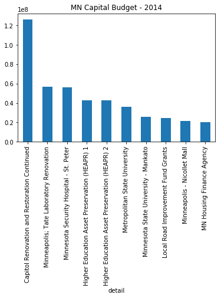

```python
### Need Altair to work first
```


```python
import pandas as pd
import altair as alt
```


```python
alt.renderers.enable('notebook')
```


    RendererRegistry.enable('notebook')


!conda install -c conda-forge altair vega_datasets notebook vega

```python
%matplotlib inline
```


```python
budget = pd.read_csv("data/mn-budget-detail-2014.csv")
```


```python
budget.head()
```


<div>
<style scoped>
    .dataframe tbody tr th:only-of-type {
        vertical-align: middle;
    }

    .dataframe tbody tr th {
        vertical-align: top;
    }

    .dataframe thead th {
        text-align: right;
    }
</style>
<table border="1" class="dataframe">
  <thead>
    <tr style="text-align: right;">
      <th></th>
      <th>category</th>
      <th>detail</th>
      <th>amount</th>
    </tr>
  </thead>
  <tbody>
    <tr>
      <th>0</th>
      <td>UNIVERSITY OF MINNESOTA</td>
      <td>Higher Education Asset Preservation (HEAPR) 1</td>
      <td>42500000</td>
    </tr>
    <tr>
      <th>1</th>
      <td>UNIVERSITY OF MINNESOTA</td>
      <td>Minneapolis; Tate Laboratory Renovation</td>
      <td>56700000</td>
    </tr>
    <tr>
      <th>2</th>
      <td>UNIVERSITY OF MINNESOTA</td>
      <td>Crookston; Wellness Center</td>
      <td>10000000</td>
    </tr>
    <tr>
      <th>3</th>
      <td>UNIVERSITY OF MINNESOTA</td>
      <td>Research Laboratories</td>
      <td>8667000</td>
    </tr>
    <tr>
      <th>4</th>
      <td>UNIVERSITY OF MINNESOTA</td>
      <td>Duluth; Chemical Sciences and Advanced Materia...</td>
      <td>1500000</td>
    </tr>
  </tbody>
</table>
</div>


```python
budget_top_10 = budget.sort_values(by='amount',ascending=False)[:10]
budget_top_10.plot(kind="bar",x=budget_top_10["detail"],
                   title="MN Capital Budget - 2014",
                   legend=False)
```


    <matplotlib.axes._subplots.AxesSubplot at 0x11461f588>





```python
c = alt.Chart(budget_top_10).mark_bar().encode(
    x='detail',
    y='amount')

```


```python
alt.Chart(budget_top_10).mark_bar().encode(
    x=X('detail'),
    y=Y('amount'),
    color="category"
)
```


    ---------------------------------------------------------------------------

    NameError                                 Traceback (most recent call last)

    <ipython-input-9-dbd371227fad> in <module>()
          1 alt.Chart(budget_top_10).mark_bar().encode(
    ----> 2     x=X('detail'),
          3     y=Y('amount'),
          4     color="category"
          5 )


    NameError: name 'X' is not defined


```python
import altair as alt
from vega_datasets import data

# for the notebook only (not for JupyterLab) run this command once per session
alt.renderers.enable('notebook')

iris = data.iris()

alt.Chart(iris).mark_point().encode(
    x='petalLength',
    y='petalWidth',
    color='species'
)
```


<div class="vega-embed" id="659794fe-b294-40a9-8839-5eed4c7ae1e6"></div>

<style>
.vega-embed .error p {
    color: firebrick;
    font-size: 14px;
}
</style>


    


