### Lesson Guide
- [A/B tests (split tests)](#ab-tests)
- [Frequentist A/B test evaluation](#frequentist)
    - [Z-test function to evaluate an A/B test](#st-func)
- [Bayesian split test analysis](#bayes)
- [Load the fitness app data](#data)
    - [Examine the split test arm "schedule"](#schedule)
- [Model conversion rates through day 5 with `pymc3`](#day5)
    - [Set up a `pymc3` model with uniform priors for the probabilities of conversion for arms A and B](#day5-model)
    - [Set up `pm.Bernoulli` distributions to model conversions for arms A and B](#day5-bernoulli)
    - [Fit the model](#day5-fit)
- [Independent practice: build a `pymc3` model through day 11 for the A/B/C test](#ind-practice)
- [Sample from beta distributions to evaluate the split test](#beta)
    - [Create beta distributions representing the conversions vs. failures for each arm for *all* days](#bdists)
    - [Calculate AvB, AvC, and BvC using sampling from the beta distributions](#beta-sampling)
    - [Validate that these reults are the same as a `pymc3` model](#beta-vs-pymc3)
- [Additional resources](#resources)


```python
import matplotlib.pyplot as plt
import numpy as np
import pandas as pd
import seaborn as sns
import scipy.stats as stats

sns.set_style('whitegrid')

%matplotlib inline
%config InlineBackend.figure_format = 'retina'
```

<a id='ab-tests'></a>
## A/B tests (split tests)
---

For every product you use (espcially tech products) it is likely that you are part of a split test. Split tests are incrementally different versions of a product that are being tested on randomly selected users and evaluated on a performance metric. They are a great way to assess whether a proposed change will be beneficial, detrimental, or have no effect.

<a id='frequentist'></a>
## Frequentist A/B test evaluation
---

The t-test is a classic Frequentist test for a significant difference in means between groups.

Below we can generate some fake data and perform a t-test for the difference in means.


```python
# Generate data
a = sorted(np.random.randn(100))
b = sorted(np.random.randn(1) * np.random.randn(80))

# Plot distribution of A
fit = stats.norm.pdf(a, np.mean(a), np.std(a))
plt.plot(a, fit,'-o')
plt.hist(a, normed=True) 
plt.title('Group A')
plt.show()

# Plot distribution of B
fit = stats.norm.pdf(b, np.mean(b), np.std(b))
plt.plot(b, fit,'-o')
plt.hist(b, normed=True) 
plt.title('Group B')
plt.show()

# Perform T-test
print(stats.ttest_ind(a, b))

```


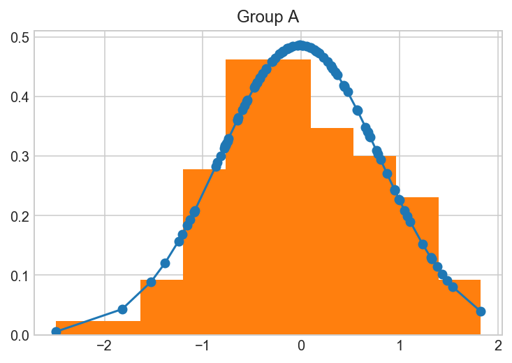


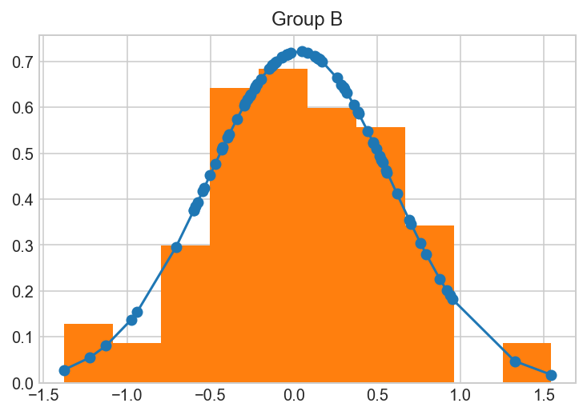


    Ttest_indResult(statistic=-0.4428444534080601, pvalue=0.6584159428844466)


<a id='st-func'></a>
### Z-test function to evaluate an A/B test

In split tests (A/B tests) we successes and failures for each "arm". We are interested in calculating whether the mean difference in rates between the two arms is significantly different. If it is, then we have reason to "winner" the arm of the test that has a higher conversion rate.

Below we can write a function to manually perform a z-test given successes out of a certain number of observations for each of our two arms. We can test it out on some fake data:


```python
# null hypothesis: the samples have identical averages
# if p < 0.05, reject null hypothesis that the two samples are identical
import scipy.stats as stats

# ztest
def ztest(x1, n1, x2, n2, one_tailed=False):
    """
    One- or Two-Tailed Z-test for two samples
    
    Args:
        x1 = # of successes in Sample 1
        n1 = # of observations in Sample 1
        x2 = # of successes in Sample 2
        n2 = # of observations in Sample 2
        one_tailed = Boolean, whether or not the test should be One-Tailed
        
    Return:
        z = Z-stat
    """
    p1 = float(x1) / n1
    p2 = float(x2) / n2    
 
    p = float(x1 + x2) / (n1 + n2)
    se = p * (1. - p) * ((1. / n1) + (1. / n2))
    sse = np.sqrt(se)
    
    z = float(p1 - p2) / sse
    p = 1 - stats.norm.cdf(abs(z))
    
    if not one_tailed:
        p *= 2.
    print(z, p)
    return z, p

# Do a test with fake data:

control_observations = 3141 #n1
control_successes = 1904 # x1
test_observations = 3241 #n2
test_successes = 2134 #x2
## left is z-stat and right is p-value
z_stat, p_value = ztest(control_successes, control_observations, test_successes, test_observations, one_tailed=False)
assert p_value<0.05

def compute_standard_error_prop_two_samples(x1, n1, x2, n2, alpha=0.05):
    p1 = x1/n1
    p2 = x2/n2    
    se = p1*(1-p1)/n1 + p2*(1-p2)/n2
    return np.sqrt(se)
    
def zconf_interval_two_samples(x1, n1, x2, n2, alpha=0.05):
    p1 = x1/n1
    p2 = x2/n2    
    se = compute_standard_error_prop_two_samples(x1, n1, x2, n2)
    z_critical = stats.norm.ppf(1-0.5*alpha)
    return p2-p1-z_critical*se, p2-p1+z_critical*se

ci_low,ci_upp = zconf_interval_two_samples(control_successes, control_observations, test_successes, test_observations)
print(' 95% Confidence Interval = ( {0:.2f}% , {1:.2f}% )'
      .format(100*ci_low, 100*ci_upp))
```

    -4.329912071544117 1.4916889162330804e-05
     95% Confidence Interval = ( 2.86% , 7.59% )


<a id='bayes'></a>
## Bayesian split test analysis
---

One common application of Bayesian analysis in industry is the analysis of split tests. We can use `pymc3` to perform split test analysis or do the process manually by sampling from posterior distributions for the arm conversion rates. 

<a id='data'></a>
## Load the fitness app data
---

The dataset below contains information on user "conversions" on a fitness app on different "arms" of a split test. 

[A "conversion"](https://en.wikipedia.org/wiki/Conversion_marketing) is jargon for whether or not a user performed a desired action or not, typically a purchase.

"Arms" are the jargon for the different versions of a product in a currently running split test. Split tests are also commonly referred to as [A/B tests](https://en.wikipedia.org/wiki/A/B_testing), where A and B denote arms in the test.

**The data has 6 columns:**

    arm: the version of the app this user was randomly assigned to
    gender: male/female
    age: age bins, one of 20-30, 30-40, 40-50
    day: the day (total of 21 days)
    fitness: the user's self reported fitness level from -5 to 5
    converted: 1 if the user purchased the product, 0 if not
    
Each row is a unique user. 


```python
data = pd.read_csv('data/split_test_data.csv')
data['male'] = data.gender.map(lambda x: 1 if x == 'male' else 0)
```


```python
## Quite a big sample, throw the power stat in here to for improved 
## analysis.
data.shape
```


    (725, 7)


<a id='schedule'></a>
### Examine the split test arm schedule

When a new arm is introduced into a split test, it is generally tested at a low percentage of users initially before assignment becomes balanced between the arms. This ensures that if something is terribly wrong with one of the arms it does not ruin the experience for too many potential customers.

Find the counts assigned to each split test arm by day.


```python
print(data.shape)
data.head()
```

    (725, 7)


<div>
<style scoped>
    .dataframe tbody tr th:only-of-type {
        vertical-align: middle;
    }

    .dataframe tbody tr th {
        vertical-align: top;
    }

    .dataframe thead th {
        text-align: right;
    }
</style>
<table border="1" class="dataframe">
  <thead>
    <tr style="text-align: right;">
      <th></th>
      <th>arm</th>
      <th>gender</th>
      <th>age</th>
      <th>day</th>
      <th>fitness</th>
      <th>converted</th>
      <th>male</th>
    </tr>
  </thead>
  <tbody>
    <tr>
      <th>0</th>
      <td>A</td>
      <td>female</td>
      <td>20-30</td>
      <td>0</td>
      <td>-2.0</td>
      <td>0</td>
      <td>0</td>
    </tr>
    <tr>
      <th>1</th>
      <td>A</td>
      <td>female</td>
      <td>40-50</td>
      <td>0</td>
      <td>3.0</td>
      <td>0</td>
      <td>0</td>
    </tr>
    <tr>
      <th>2</th>
      <td>A</td>
      <td>female</td>
      <td>30-40</td>
      <td>0</td>
      <td>-5.0</td>
      <td>0</td>
      <td>0</td>
    </tr>
    <tr>
      <th>3</th>
      <td>A</td>
      <td>female</td>
      <td>20-30</td>
      <td>0</td>
      <td>-4.0</td>
      <td>0</td>
      <td>0</td>
    </tr>
    <tr>
      <th>4</th>
      <td>A</td>
      <td>male</td>
      <td>30-40</td>
      <td>0</td>
      <td>1.0</td>
      <td>1</td>
      <td>1</td>
    </tr>
  </tbody>
</table>
</div>


```python
arms_days = data[['arm','day']]
arms_days.groupby('day')['arm'].value_counts()
```


    day  arm
    0    A      26
    1    A      40
         B       4
    2    A      30
         B       3
    3    A      30
         B       3
    4    A      18
         B      18
    5    A      15
         B      15
    6    A      16
         B      16
    7    A      17
         B      17
    8    A      14
         B      14
         C       3
    9    A      19
         B      19
         C       4
    10   A      12
         B      12
         C       3
    11   A       9
         B       9
         C       9
    12   A      10
         B      10
         C      10
    13   A      15
         B      15
         C      15
    14   A      12
         B      12
         C      12
    15   A      12
         B      12
         C      12
    16   A      11
         B      11
         C      11
    17   A      11
         B      11
         C      11
    18   A      14
         B      14
         C      14
    19   A      12
         B      12
         C      12
    20   A      13
         B      13
         C      13
    Name: arm, dtype: int64


**Look at mean conversion rate overall and by arm.**


```python
data.converted.mean()
```


    0.17517241379310344


```python
data.groupby('arm')['converted'].agg(np.mean)
```


    arm
    A    0.185393
    B    0.116667
    C    0.255814
    Name: converted, dtype: float64


**Look at overall conversion rate differences along age, gender, and fitness.**


```python
data.groupby('age')['converted'].agg(np.mean)
```


    age
    20-30    0.253112
    30-40    0.155738
    40-50    0.116667
    Name: converted, dtype: float64


```python
data.groupby('gender')['converted'].agg(np.mean)
```


    gender
    female    0.206897
    male      0.145889
    Name: converted, dtype: float64


```python
## Interesting relationship, the fitter you are,the more liklely you were
## to convert.
data.groupby('fitness')['converted'].agg(np.mean)
```


    fitness
    -5.0    0.055556
    -4.0    0.026316
    -3.0    0.073171
    -2.0    0.148649
    -1.0    0.086957
     0.0    0.179487
     1.0    0.161290
     2.0    0.171053
     3.0    0.276923
     4.0    0.391892
     5.0    0.484848
    Name: converted, dtype: float64


```python
data.arm.value_counts()
```


    A    356
    B    240
    C    129
    Name: arm, dtype: int64


```python
## I have no, idea why C is there, mor than two makes it hard to 
## work with in frequentist statistics
```


```python
df2 = data[data["arm"].isin(["B","A"])].reset_index(drop=True)
```


```python
df2["converted"].value_counts()

```


    0    502
    1     94
    Name: converted, dtype: int64


```python
# Import statsmodels
import statsmodels.api as sm

# Calculate number of conversions
# Some of these values were defined ealier in this notebook: n_old and n_new

n_old = len(df2[(df2['arm']=='A')])
n_new = len(df2[(df2['arm']=='B')])

convert_old = len(df2[(df2['arm']=='A')&(df2['converted']==1)])
convert_new = len(df2[(df2['arm']=='B')&(df2['converted']==1)])

print("convert_old:", convert_old, 
      "\nconvert_new:", convert_new,
      "\nn_old:",n_old ,
      "\nn_new:",n_new  )


```

    convert_old: 66 
    convert_new: 28 
    n_old: 356 
    n_new: 240


```python
## According to this analysis new clearly performs worse.
## There is some other testing techniques we will test.

# Find z-score and p-value
z_score, p_value = sm.stats.proportions_ztest(count=[convert_new, convert_old], 
                                              nobs=[n_new, n_old])
print("z-score:", z_score,
     "\np-value:", p_value)
```

    z-score: -2.25768200572263 
    p-value: 0.023965491876189363


```python
df2.head()
```


<div>
<style scoped>
    .dataframe tbody tr th:only-of-type {
        vertical-align: middle;
    }

    .dataframe tbody tr th {
        vertical-align: top;
    }

    .dataframe thead th {
        text-align: right;
    }
</style>
<table border="1" class="dataframe">
  <thead>
    <tr style="text-align: right;">
      <th></th>
      <th>arm</th>
      <th>gender</th>
      <th>age</th>
      <th>day</th>
      <th>fitness</th>
      <th>converted</th>
      <th>male</th>
    </tr>
  </thead>
  <tbody>
    <tr>
      <th>0</th>
      <td>A</td>
      <td>female</td>
      <td>20-30</td>
      <td>0</td>
      <td>-2.0</td>
      <td>0</td>
      <td>0</td>
    </tr>
    <tr>
      <th>1</th>
      <td>A</td>
      <td>female</td>
      <td>40-50</td>
      <td>0</td>
      <td>3.0</td>
      <td>0</td>
      <td>0</td>
    </tr>
    <tr>
      <th>2</th>
      <td>A</td>
      <td>female</td>
      <td>30-40</td>
      <td>0</td>
      <td>-5.0</td>
      <td>0</td>
      <td>0</td>
    </tr>
    <tr>
      <th>3</th>
      <td>A</td>
      <td>female</td>
      <td>20-30</td>
      <td>0</td>
      <td>-4.0</td>
      <td>0</td>
      <td>0</td>
    </tr>
    <tr>
      <th>4</th>
      <td>A</td>
      <td>male</td>
      <td>30-40</td>
      <td>0</td>
      <td>1.0</td>
      <td>1</td>
      <td>1</td>
    </tr>
  </tbody>
</table>
</div>


```python
df3 = df2 # Clone dataframe in case of a mistake

## The encoding
df3['intercept'] = pd.Series(np.zeros(len(df3)), index=df3.index)
df3['ab_enc'] = pd.Series(np.zeros(len(df3)), index=df3.index)

# Find indexes that need to be changed for treatment group
index_to_change = df3[df3['arm']=='B'].index

# Change values to one, zero otherwise
df3.set_value(index=index_to_change, col='ab_enc', value=1)
df3.set_value(index=df3.index, col='intercept', value=1)

# Change datatype
df3[['intercept', 'ab_enc']] = df3[['intercept', 'ab_enc']].astype(int)
```

    /Users/dereksnow/anaconda/envs/py36/lib/python3.6/site-packages/ipykernel/__main__.py:11: FutureWarning: set_value is deprecated and will be removed in a future release. Please use .at[] or .iat[] accessors instead
    /Users/dereksnow/anaconda/envs/py36/lib/python3.6/site-packages/ipykernel/__main__.py:12: FutureWarning: set_value is deprecated and will be removed in a future release. Please use .at[] or .iat[] accessors instead


```python
df3.head()
```


<div>
<style scoped>
    .dataframe tbody tr th:only-of-type {
        vertical-align: middle;
    }

    .dataframe tbody tr th {
        vertical-align: top;
    }

    .dataframe thead th {
        text-align: right;
    }
</style>
<table border="1" class="dataframe">
  <thead>
    <tr style="text-align: right;">
      <th></th>
      <th>arm</th>
      <th>gender</th>
      <th>age</th>
      <th>day</th>
      <th>fitness</th>
      <th>converted</th>
      <th>male</th>
      <th>intercept</th>
      <th>ab_enc</th>
    </tr>
  </thead>
  <tbody>
    <tr>
      <th>0</th>
      <td>A</td>
      <td>female</td>
      <td>20-30</td>
      <td>0</td>
      <td>-2.0</td>
      <td>0</td>
      <td>0</td>
      <td>1</td>
      <td>0</td>
    </tr>
    <tr>
      <th>1</th>
      <td>A</td>
      <td>female</td>
      <td>40-50</td>
      <td>0</td>
      <td>3.0</td>
      <td>0</td>
      <td>0</td>
      <td>1</td>
      <td>0</td>
    </tr>
    <tr>
      <th>2</th>
      <td>A</td>
      <td>female</td>
      <td>30-40</td>
      <td>0</td>
      <td>-5.0</td>
      <td>0</td>
      <td>0</td>
      <td>1</td>
      <td>0</td>
    </tr>
    <tr>
      <th>3</th>
      <td>A</td>
      <td>female</td>
      <td>20-30</td>
      <td>0</td>
      <td>-4.0</td>
      <td>0</td>
      <td>0</td>
      <td>1</td>
      <td>0</td>
    </tr>
    <tr>
      <th>4</th>
      <td>A</td>
      <td>male</td>
      <td>30-40</td>
      <td>0</td>
      <td>1.0</td>
      <td>1</td>
      <td>1</td>
      <td>1</td>
      <td>0</td>
    </tr>
  </tbody>
</table>
</div>


```python
## This naturally gets a very similar results apart from
## removing some systematic bias via the intercept.
## because your samples might differ, run full regression.
# Move "converted" to RHS
# df3 = df3[['user_id', 'timestamp', 'group', 'landing_page', 'ab_enc', 'intercept', 'converted']]

# Set up logistic regression
logit = sm.Logit(df3['converted'], df3[['ab_enc', 'intercept']])

# Calculate results
result=logit.fit()

result.summary2() # result.summary() wasn't working for some reason, but this one does
```

    Optimization terminated successfully.
             Current function value: 0.431456
             Iterations 6


<table class="simpletable">
<tr>
        <td>Model:</td>              <td>Logit</td>       <td>No. Iterations:</td>   <td>6.0000</td> 
</tr>
<tr>
  <td>Dependent Variable:</td>     <td>converted</td>    <td>Pseudo R-squared:</td>   <td>0.010</td> 
</tr>
<tr>
         <td>Date:</td>        <td>2018-07-01 15:53</td>       <td>AIC:</td>        <td>518.2960</td>
</tr>
<tr>
   <td>No. Observations:</td>         <td>596</td>             <td>BIC:</td>        <td>527.0765</td>
</tr>
<tr>
       <td>Df Model:</td>              <td>1</td>         <td>Log-Likelihood:</td>   <td>-257.15</td>
</tr>
<tr>
     <td>Df Residuals:</td>           <td>594</td>           <td>LL-Null:</td>       <td>-259.78</td>
</tr>
<tr>
      <td>Converged:</td>           <td>1.0000</td>           <td>Scale:</td>        <td>1.0000</td> 
</tr>
</table>
<table class="simpletable">
<tr>
      <td></td>       <th>Coef.</th>  <th>Std.Err.</th>     <th>z</th>     <th>P>|z|</th> <th>[0.025</th>  <th>0.975]</th> 
</tr>
<tr>
  <th>ab_enc</th>    <td>-0.5442</td>  <td>0.2430</td>   <td>-2.2397</td> <td>0.0251</td> <td>-1.0204</td> <td>-0.0680</td>
</tr>
<tr>
  <th>intercept</th> <td>-1.4802</td>  <td>0.1364</td>  <td>-10.8536</td> <td>0.0000</td> <td>-1.7475</td> <td>-1.2129</td>
</tr>
</table>


```python
df3.head()
```


<div>
<style scoped>
    .dataframe tbody tr th:only-of-type {
        vertical-align: middle;
    }

    .dataframe tbody tr th {
        vertical-align: top;
    }

    .dataframe thead th {
        text-align: right;
    }
</style>
<table border="1" class="dataframe">
  <thead>
    <tr style="text-align: right;">
      <th></th>
      <th>arm</th>
      <th>gender</th>
      <th>age</th>
      <th>day</th>
      <th>fitness</th>
      <th>converted</th>
      <th>male</th>
      <th>intercept</th>
      <th>ab_enc</th>
    </tr>
  </thead>
  <tbody>
    <tr>
      <th>0</th>
      <td>A</td>
      <td>female</td>
      <td>20-30</td>
      <td>0</td>
      <td>-2.0</td>
      <td>0</td>
      <td>0</td>
      <td>1</td>
      <td>0</td>
    </tr>
    <tr>
      <th>1</th>
      <td>A</td>
      <td>female</td>
      <td>40-50</td>
      <td>0</td>
      <td>3.0</td>
      <td>0</td>
      <td>0</td>
      <td>1</td>
      <td>0</td>
    </tr>
    <tr>
      <th>2</th>
      <td>A</td>
      <td>female</td>
      <td>30-40</td>
      <td>0</td>
      <td>-5.0</td>
      <td>0</td>
      <td>0</td>
      <td>1</td>
      <td>0</td>
    </tr>
    <tr>
      <th>3</th>
      <td>A</td>
      <td>female</td>
      <td>20-30</td>
      <td>0</td>
      <td>-4.0</td>
      <td>0</td>
      <td>0</td>
      <td>1</td>
      <td>0</td>
    </tr>
    <tr>
      <th>4</th>
      <td>A</td>
      <td>male</td>
      <td>30-40</td>
      <td>0</td>
      <td>1.0</td>
      <td>1</td>
      <td>1</td>
      <td>1</td>
      <td>0</td>
    </tr>
  </tbody>
</table>
</div>


```python
df3["fitness"] = df3["fitness"].astype(int)
```


```python
df3 = df3.drop("gender",axis=1)
```


```python
df3 = pd.concat((df3["arm"],pd.get_dummies(df3.drop("arm",axis=1))),axis=1)
```


```python
df3.columns
```


    Index(['arm', 'day', 'fitness', 'converted', 'male', 'intercept', 'ab_enc',
           'age_20-30', 'age_30-40', 'age_40-50'],
          dtype='object')


```python
# Create logit_countries object
# Even for the correction in samples, the performnce is still reaonable
logit_countries = sm.Logit(df3['converted'], 
                           df3[['day', 'fitness', 'male', 'intercept', 'ab_enc',
       'age_20-30', 'age_30-40', 'age_40-50']])

# Fit
result2 = logit_countries.fit()
result2.summary2()
```

    Optimization terminated successfully.
             Current function value: 0.377001
             Iterations 7


<table class="simpletable">
<tr>
        <td>Model:</td>              <td>Logit</td>       <td>No. Iterations:</td>   <td>7.0000</td> 
</tr>
<tr>
  <td>Dependent Variable:</td>     <td>converted</td>    <td>Pseudo R-squared:</td>   <td>0.135</td> 
</tr>
<tr>
         <td>Date:</td>        <td>2018-07-01 15:56</td>       <td>AIC:</td>        <td>463.3853</td>
</tr>
<tr>
   <td>No. Observations:</td>         <td>596</td>             <td>BIC:</td>        <td>494.1170</td>
</tr>
<tr>
       <td>Df Model:</td>              <td>6</td>         <td>Log-Likelihood:</td>   <td>-224.69</td>
</tr>
<tr>
     <td>Df Residuals:</td>           <td>589</td>           <td>LL-Null:</td>       <td>-259.78</td>
</tr>
<tr>
      <td>Converged:</td>           <td>1.0000</td>           <td>Scale:</td>        <td>1.0000</td> 
</tr>
</table>
<table class="simpletable">
<tr>
      <td></td>       <th>Coef.</th>    <th>Std.Err.</th>       <th>z</th>     <th>P>|z|</th>     <th>[0.025</th>        <th>0.975]</th>    
</tr>
<tr>
  <th>day</th>       <td>0.0017</td>     <td>0.0203</td>     <td>0.0839</td>  <td>0.9332</td>     <td>-0.0380</td>       <td>0.0414</td>    
</tr>
<tr>
  <th>fitness</th>   <td>0.2977</td>     <td>0.0455</td>     <td>6.5426</td>  <td>0.0000</td>     <td>0.2085</td>        <td>0.3868</td>    
</tr>
<tr>
  <th>male</th>      <td>-0.3301</td>    <td>0.2427</td>     <td>-1.3603</td> <td>0.1737</td>     <td>-0.8057</td>       <td>0.1455</td>    
</tr>
<tr>
  <th>intercept</th> <td>-1.1942</td> <td>13967103.2182</td> <td>-0.0000</td> <td>1.0000</td> <td>-27375020.4703</td> <td>27375018.0818</td>
</tr>
<tr>
  <th>ab_enc</th>    <td>-0.5376</td>    <td>0.2637</td>     <td>-2.0389</td> <td>0.0415</td>     <td>-1.0544</td>       <td>-0.0208</td>   
</tr>
<tr>
  <th>age_20-30</th> <td>0.1462</td>  <td>13967103.2182</td> <td>0.0000</td>  <td>1.0000</td> <td>-27375019.1298</td> <td>27375019.4223</td>
</tr>
<tr>
  <th>age_30-40</th> <td>-0.4182</td> <td>13967103.2182</td> <td>-0.0000</td> <td>1.0000</td> <td>-27375019.6943</td> <td>27375018.8578</td>
</tr>
<tr>
  <th>age_40-50</th> <td>-0.9222</td> <td>13967103.2182</td> <td>-0.0000</td> <td>1.0000</td> <td>-27375020.1983</td> <td>27375018.3538</td>
</tr>
</table>


```python
## Age have no additional effect on conversion, but being a femal and fit, does have an
## effect. The value of ab_enc, didn;t change much, so we can be happy with
## the distribution of the sample.
```

### Some alternative frequentist tests


```python
df3.head()
```


<div>
<style scoped>
    .dataframe tbody tr th:only-of-type {
        vertical-align: middle;
    }

    .dataframe tbody tr th {
        vertical-align: top;
    }

    .dataframe thead th {
        text-align: right;
    }
</style>
<table border="1" class="dataframe">
  <thead>
    <tr style="text-align: right;">
      <th></th>
      <th>arm</th>
      <th>day</th>
      <th>fitness</th>
      <th>converted</th>
      <th>male</th>
      <th>intercept</th>
      <th>ab_enc</th>
      <th>age_20-30</th>
      <th>age_30-40</th>
      <th>age_40-50</th>
    </tr>
  </thead>
  <tbody>
    <tr>
      <th>0</th>
      <td>A</td>
      <td>0</td>
      <td>-2</td>
      <td>0</td>
      <td>0</td>
      <td>1</td>
      <td>0</td>
      <td>1</td>
      <td>0</td>
      <td>0</td>
    </tr>
    <tr>
      <th>1</th>
      <td>A</td>
      <td>0</td>
      <td>3</td>
      <td>0</td>
      <td>0</td>
      <td>1</td>
      <td>0</td>
      <td>0</td>
      <td>0</td>
      <td>1</td>
    </tr>
    <tr>
      <th>2</th>
      <td>A</td>
      <td>0</td>
      <td>-5</td>
      <td>0</td>
      <td>0</td>
      <td>1</td>
      <td>0</td>
      <td>0</td>
      <td>1</td>
      <td>0</td>
    </tr>
    <tr>
      <th>3</th>
      <td>A</td>
      <td>0</td>
      <td>-4</td>
      <td>0</td>
      <td>0</td>
      <td>1</td>
      <td>0</td>
      <td>1</td>
      <td>0</td>
      <td>0</td>
    </tr>
    <tr>
      <th>4</th>
      <td>A</td>
      <td>0</td>
      <td>1</td>
      <td>1</td>
      <td>1</td>
      <td>1</td>
      <td>0</td>
      <td>0</td>
      <td>1</td>
      <td>0</td>
    </tr>
  </tbody>
</table>
</div>


```python
A = df3[df3["arm"]=="A"]["converted"]
B = df3[df3["arm"]=="B"]["converted"]
```

## Split 5 technique

Shows you that it constantly underperforms


```python
import brewer2mpl
brewer_set2 = brewer2mpl.get_map('Set2', 'qualitative', 8).mpl_colors


np.random.seed(1)
Bs = np.array(B)

np.random.shuffle(Bs )
fig, ax = plt.subplots(figsize=(8,4))

Bs.shape[0]/5


Bs = Bs.reshape((5,48))

plt.bar(range(1,6), [Bs[i].mean() for i in range(5)],
    color=brewer_set2[0], align='center', width=.8, label='New Design' )
plt.plot([-2, 6], [A.mean(), A.mean()], 
     color=brewer_set2[1], label='Old Design')
plt.xlim(0.5, 5.5)
plt.title('Split 5 test')
plt.legend();
```


Let's assume we know nothing about the distribution. The Null-hypothesis is that the effect is the same between groups. Therefore, it could be higher or lower than average in control group with 50% chance.

But in this case, all observations appear on the same side! The probability of this happenning under Null is 0.5**5 = 3%

### Brute Force Sampling


We can simulate the Null-hypothesis, to see how likely it is to get the difference as extreme as that, assuming that there is no difference between two groups.


```python
from pylab import *
```


```python
A_B = np.concatenate([A, B])
combined_cohort_size = A_B.shape[0]
sim_size = 10000
sim_diff = np.zeros(sim_size)
```


```python
combined_cohort_size/2
```


    298.0


```python
A_B[:int(combined_cohort_size/2)]
```


    array([0, 0, 0, 1, 1, 0, 0, 0, 0, 0, 0, 0, 1, 0, 0, 0, 0, 0, 0, 1, 1, 0,
           0, 0, 0, 0, 0, 0, 0, 0, 0, 0, 0, 0, 0, 0, 0, 0, 0, 0, 0, 0, 0, 0,
           0, 0, 0, 0, 0, 0, 0, 1, 0, 0, 0, 0, 0, 0, 0, 1, 0, 0, 0, 0, 0, 0,
           0, 0, 0, 0, 0, 0, 0, 0, 0, 0, 0, 0, 0, 0, 0, 0, 0, 0, 0, 1, 1, 0,
           0, 1, 0, 0, 0, 0, 0, 0, 0, 0, 1, 0, 0, 0, 0, 0, 0, 0, 0, 1, 0, 1,
           0, 0, 0, 0, 0, 1, 0, 1, 0, 0, 1, 1, 0, 0, 0, 1, 0, 1, 1, 0, 0, 0,
           0, 0, 1, 0, 0, 0, 0, 0, 0, 1, 0, 0, 1, 0, 0, 0, 0, 0, 0, 1, 0, 0,
           0, 0, 1, 0, 0, 0, 0, 0, 1, 0, 0, 1, 1, 1, 0, 0, 1, 0, 0, 0, 0, 1,
           0, 1, 1, 0, 0, 0, 1, 0, 0, 0, 0, 0, 1, 0, 0, 0, 0, 0, 0, 0, 0, 1,
           0, 1, 0, 0, 0, 0, 0, 0, 0, 0, 0, 0, 0, 0, 0, 0, 0, 1, 0, 0, 0, 0,
           1, 0, 0, 0, 0, 0, 0, 0, 0, 0, 0, 0, 0, 0, 0, 0, 0, 0, 0, 0, 0, 0,
           0, 0, 0, 0, 0, 0, 1, 0, 0, 0, 0, 0, 1, 0, 1, 0, 0, 0, 0, 0, 0, 0,
           0, 0, 0, 0, 0, 0, 0, 0, 0, 0, 0, 1, 0, 0, 0, 0, 0, 0, 0, 0, 0, 0,
           0, 0, 0, 0, 0, 0, 0, 0, 0, 1, 0, 0])


```python
np.random.seed(1)
for s in range(sim_size):
    np.random.shuffle(A_B)
    sim_diff[s] = A_B[:int(combined_cohort_size/2)].mean() - A_B[int(combined_cohort_size/2):].mean()

hist(sim_diff, bins=50, color=brewer_set2[0]);
```


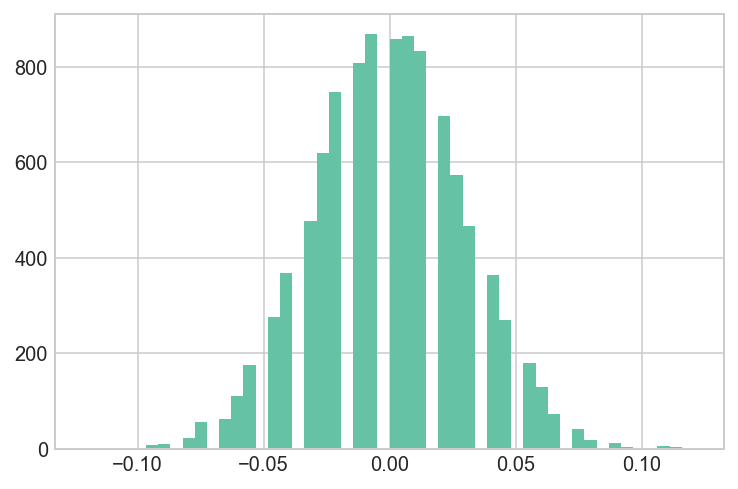


```python
## The difference of obtaining such value is extermely low
## This p-value is stronger than the t-test
mean = convert_new/n_new - convert_old/n_old

(sim_diff<mean).sum()/sim_diff.shape[0]
```


    0.0099


<a id='day5'></a>
## Model conversion rates through day 5 with `pymc3`
---

We will start by just modeling the conversion rate distributions for arms A and B through day 5. At day 5, arm C has still not been introduced yet and so there are just 2 arms.

**Subset the data to the first 5 days**


```python
import pymc3 as pm
```

    /Users/dereksnow/anaconda/envs/py36/lib/python3.6/site-packages/h5py/__init__.py:36: FutureWarning: Conversion of the second argument of issubdtype from `float` to `np.floating` is deprecated. In future, it will be treated as `np.float64 == np.dtype(float).type`.
      from ._conv import register_converters as _register_converters


```python
current = data[data.day < 5]
print current.shape, current.arm.unique()
print current.groupby('arm')['converted'].agg(np.sum)
```

    (172, 7) ['A' 'B']
    arm
    A    26
    B     3
    Name: converted, dtype: int64


<a id='day5-model'></a>
### Set up a `pymc3` model and uniform priors for the probabilities of conversion for arms A and B

Recall that `pymc3` uses the `with ...` syntax for defining models. The first step in setting up a new model is to define the model as the "context" like so:

>```python
with pm.Model() as day5_model:
    #
```

We are going to model the _probability distributions for conversion rates for arms A and B._ As always with Bayesian statistics, we need to define prior distributions for our belief about these probabilities/rates of conversion per arm.

Let's say we have no belief whatsoever about rates, and so we will set an uninformative, flat priors over probabilities from 0 to 1 for both arms. This is equivalent to saying that we believe all conversion rates to be equally likely for both arms.

The syntax for setting up this flat prior is:

>```python
arm_A_prior = pm.Uniform('A_prior', lower=0, upper=1)
```

Set up the priors for both arms inside the `with ...` model block.


```python
with pm.Model() as day5_model:
    
    A_p = pm.Uniform('A_prob', lower=0, upper=1)
    B_p = pm.Uniform('B_prob', lower=0, upper=1)
```

<a id='day5-bernoulli'></a>
### Set up `pm.Bernoulli` distributions to model conversions for arms A and B

Now that you've initialized your model, your `with` statements will be

>```python
with day5_model:
    #
```

Be careful not to re-define the model with `pm.Model()` or it will wipe the uniform priors you set before!

We are now going to set up the "likelihood" portion of the model. This is going to model the $P(data\;|\;\theta)$ part of Bayes theorem.

Our conversions are represented by a vector of 1s and 0s denoting whether or not the user converted or not. This is known as a "Bernoulli" process and pymc3 has an approprite function to handle it:

>```python
A_conversions = pm.Bernoulli('A_conversions', p=arm_A_prior, observed=arm_A_conversions)
```

`p=` is set to the prior for the arm that you defined in the last section. 

`observed=` should be set to the `converted` values for that arm specifically in the data.

By giving it an `observed` parameter, we are telling pymc3 that we want this to evaluate the likelihood of our data (the conversions) against models represented by the `p=` probability argument. We assign `p=` to be our prior belief about conversion rates for that arm because we want to update this belief (convert to posterior) based on the conversion data we have observed for that arm.


```python
with day5_model:
    
    A = pm.Bernoulli('A', p=A_p, observed=df3[df3.arm == "A"].converted.values)
    B = pm.Bernoulli('B', p=B_p, observed=df3[df3.arm == "B"].converted.values) 
    
    AvB = pm.Deterministic('AvB', A_p - B_p)  ## this is the uplift
    ## help describe https://github.com/Volodymyrk/stats-testing-in-python/blob/master/03%20-%20AB%20testing%20Proportions%20with%20z-test.ipynb
```

<a id='day5-fit'></a>
### Fit the model

Now that we've set up the prior distributions and likelihoods, we can actually fit the model.

Below is code that will run the sampling procedure to find the posteriors:

>```python
with day5_model:
    # obtain decent starting values via the find_MAP() function:
    start = pm.find_MAP()
    # construct the "trace" variable that holds samples for all of our distributions:
    trace = pm.sample(50000, start=start)
```

Again you use the context `with day5_model:` to run code for your model.

`start = pm.find_MAP()` will try to find a good starting point for the sampling process. This means that your model will converge on the "likely" area much faster (though it makes the fitting slower initially).

`trace = pm.sample(50000, start=start)` uses the sampling method in `pymc3` to perform 50,000 sampling iterations. This will automatically assign the NUTS sampler for you. The dataset is small so the speed shouldn't be too bad.

When this completes, the `trace` variable now contains the posterior samples for the distributions we specified while constructing the model.

>```python
# We defined our arm A prior distribution to be uniform and named it 'arm_A_prior'. 
# The pm.sample() procedure converted this into our posterior belief for the rate
# of conversions in arm A. You can access these posterior samples using the name
# you gave the variable when you created it:
#
trace['arm_A_prior']
#
# this will be a vector of values that are different potential rates of conversion
# for arm A. A histogram of these rates defines, roughly, the posterior probability
# distribution for the arm A rates after we consider the data we have collected.
```


```python
with day5_model:
    start = pm.find_MAP()
    trace1 = pm.sample(50000, start=start)
```

    logp = -413.12, ||grad|| = 144.94: 100%|██████████| 9/9 [00:00<00:00, 1199.67it/s]
    Auto-assigning NUTS sampler...
    Initializing NUTS using jitter+adapt_diag...
    Multiprocess sampling (2 chains in 2 jobs)
    NUTS: [B_prob_interval__, A_prob_interval__]
    100%|██████████| 50500/50500 [00:43<00:00, 1156.19it/s]


```python
pm.plot_posterior(trace1[5000::3], varnames=['A_prob','B_prob','AvB'],
                  ref_val=0, color='#87ceeb')
```


    array([<matplotlib.axes._subplots.AxesSubplot object at 0x1c1fdba240>,
           <matplotlib.axes._subplots.AxesSubplot object at 0x1c239ef7b8>,
           <matplotlib.axes._subplots.AxesSubplot object at 0x1c239c46d8>],
          dtype=object)


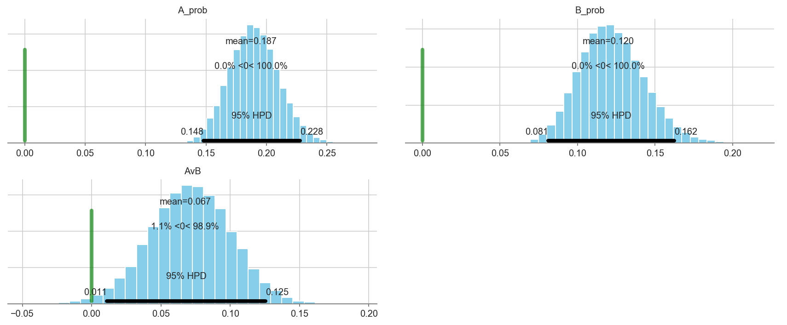


```python
import matplotlib.mlab as mlab

# control_connected, control_installs, test_connected, test_installs

# control_connected = convert_old: 66 
# test_connected = convert_new: 28 
# control_installs = n_old: 356 
# test_installs = n_new: 240

def compute_standard_error_prop_two_samples(x1, n1, x2, n2, alpha=0.05):
    p1 = x1/n1
    p2 = x2/n2    
    se = p1*(1-p1)/n1 + p2*(1-p2)/n2
    return np.sqrt(se)

mean = convert_new/n_new - convert_old/n_old
sigma = compute_standard_error_prop_two_samples(convert_new, n_new, convert_old, n_old)
```


```python
mean
```


    -0.06872659176029963


```python
sigma
```


    0.029216757682663377


```python
import matplotlib.mlab as mlab
## https://github.com/Volodymyrk/stats-testing-in-python/blob/master/03%20-%20AB%20testing%20Proportions%20with%20z-test.ipynb
fig, ax = plt.subplots(figsize=(10,5))
x = np.linspace(0,.12,100)
plt.plot(x,mlab.normpdf(x,mean,sigma), label='Frequentists: $ N(\hat{p_1}-\hat{p_2}, SE)$')
plt.hist(trace1['AvB'], bins=100, normed=True, color='0.8', label='Posterior Distribution');
plt.legend()
plt.suptitle ('Baesian Posterior Distribution vs. Frequentist Standard Error', fontsize=18)
plt.title(' Binomial proportions, uniform priors' )
pass
# fig.savefig('03.03 Bayesian CrI vs CI.png', dpi=200)
```


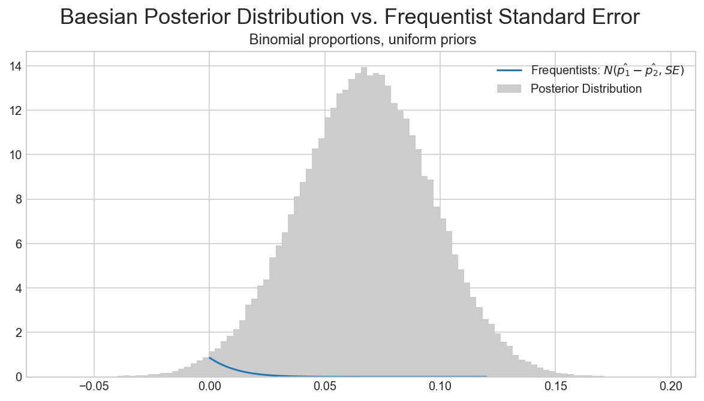


```python
# What is the probability that we gained less than +5% uplift in Facebook sign-ups?
(trace['AvB']<0.05).sum()/len(trace)
```


    0.5486


<a id='ind'></a>
## Independent practice: build a model through day 11 for an A/B/C test
---

Subset the data up through day 11. You will notice now that there are 3 different arms: A, B, and C.

You will need to add in the third arm into the model.

Additionally, calculate 3 "deterministic" variables that look at differences between the three arms:

- `A` vs. `B`
- `A` vs. `C`
- `B` vs. `C`

What action would you take given these results?


```python
current = data[data.day < 11]
print current.shape, current.arm.unique()
```

    (368, 7) ['A' 'B' 'C']


```python
current = data[data["arm"].isin(["B","A","C"])].reset_index(drop=True)
```


```python
with pm.Model() as day11_model:
    
    A_p = pm.Uniform('A_prob', lower=0, upper=1)
    B_p = pm.Uniform('B_prob', lower=0, upper=1)
    C_p = pm.Uniform('C_prob', lower=0, upper=1)
    
    A = pm.Bernoulli('A', p=A_p, observed=current[current.arm == 'A'].converted.values)
    B = pm.Bernoulli('B', p=B_p, observed=current[current.arm == 'B'].converted.values)
    C = pm.Bernoulli('C', p=C_p, observed=current[current.arm == 'C'].converted.values)
    
    AvB = pm.Deterministic('AvB', A_p - B_p)
    AvC = pm.Deterministic('AvC', A_p - C_p)
    BvC = pm.Deterministic('BvC', B_p - C_p)
    
    start = pm.find_MAP()
    trace = pm.sample(50000, start=start)
    
```

    logp = -502.53, ||grad|| = 148.32: 100%|██████████| 10/10 [00:00<00:00, 1463.73it/s]
    Auto-assigning NUTS sampler...
    Initializing NUTS using jitter+adapt_diag...
    Multiprocess sampling (2 chains in 2 jobs)
    NUTS: [C_prob_interval__, B_prob_interval__, A_prob_interval__]
    100%|██████████| 50500/50500 [00:49<00:00, 1015.92it/s]


```python
pm.plot_posterior(trace[5000::3], varnames=['AvB','BvC','AvC'], color='#87ceeb', ref_val=0.)
```


    array([<matplotlib.axes._subplots.AxesSubplot object at 0x1c248e0160>,
           <matplotlib.axes._subplots.AxesSubplot object at 0x1c24913f28>,
           <matplotlib.axes._subplots.AxesSubplot object at 0x1c245f99b0>],
          dtype=object)


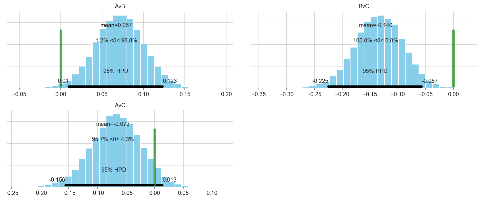


```python
## Another Method
with pm.Model() as day11_model:
    
    A_p = pm.Uniform('A_prob', lower=0, upper=1)
    B_p = pm.Uniform('B_prob', lower=0, upper=1)
    C_p = pm.Uniform('C_prob', lower=0, upper=1)
    
    A = pm.Bernoulli('A', p=A_p, observed=current[current.arm == 'A'].converted.values)
    B = pm.Bernoulli('B', p=B_p, observed=current[current.arm == 'B'].converted.values)
    C = pm.Bernoulli('C', p=C_p, observed=current[current.arm == 'C'].converted.values)
    
    AvB = pm.Deterministic('AvB', A_p - B_p)
    AvC = pm.Deterministic('AvC', A_p - C_p)
    BvC = pm.Deterministic('BvC', B_p - C_p)
    
    start = pm.find_MAP() ## So you can change the shit below
    trace = pm.sample(50000, step=pm.Metropolis(), start=pm.find_MAP(),)
    


_ = pm.traceplot(trace, grid=True) ## and you can change the type plot
# https://github.com/thibalbo/bayesian-abtests-examples/blob/master/rate.ipynb
```

    logp = -502.53, ||grad|| = 148.32: 100%|██████████| 10/10 [00:00<00:00, 1188.36it/s]
    logp = -502.53, ||grad|| = 148.32: 100%|██████████| 10/10 [00:00<00:00, 1302.05it/s]
    Multiprocess sampling (2 chains in 2 jobs)
    CompoundStep
    >Metropolis: [C_prob_interval__]
    >Metropolis: [B_prob_interval__]
    >Metropolis: [A_prob_interval__]
    100%|██████████| 50500/50500 [00:24<00:00, 2094.50it/s]
    The number of effective samples is smaller than 25% for some parameters.


```python
def plot_betas(beta_traces, beta_names, colors=['steelblue','darkred','goldenrod']):
    fig, ax = plt.subplots(figsize=(9,5))
    for i, bn in enumerate(beta_names):
        ax = sns.distplot(beta_traces[i], kde=True, color=colors[i], label=bn)
    ax.legend(loc='upper right')
    plt.show()
```


```python
plot_betas([trace[5000::3]['A_prob'], 
            trace[5000::3]['B_prob'],
            trace[5000::3]['C_prob']],
           ['A_prob','B_prob','C_prob'])
```


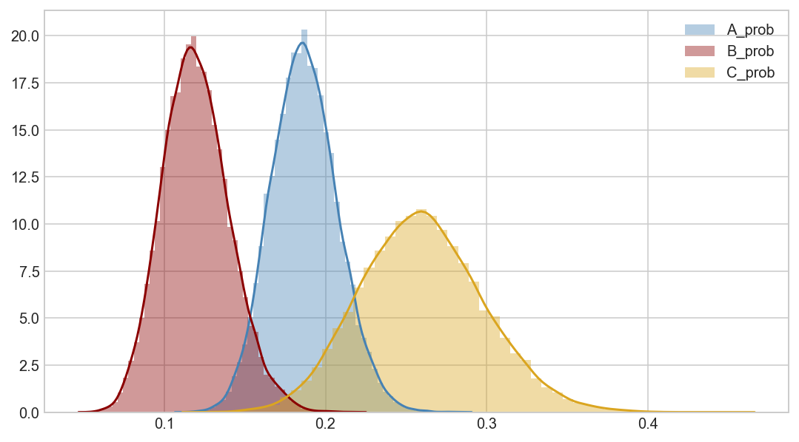


```python
# We can be fairly certain that arm A has a higher conversion rate than arm B.
# There is not enough data to make a statement about arm C.
```

<a id='beta'></a>
## Sample from beta distributions to evaluate the split test
---

Our arms are represented as Bernoulli distributed random variables (binary outcome conversion vs. failure). Our prior distributions model the probability of different rates for the arms. 

> **Note:** a uniform distribution between 0 and 1 is equivalent to a Beta(1,1), or in other words a Beta distribution with 0 successes and 0 failures.

We know that the Beta distribution is a conjugate prior to the binomial likelihood, and therefore the posterior distributions for our arms are also beta distributions.

<a id='bdists'></a>
### Create beta distributions representing the conversions vs. failures for each arm for *all* days.

The beta distributions will be parameterized with alpha and beta, which are equivalent to successes + 1 and failures + 1 respectively.


```python
data.groupby('arm')['converted'].agg([sum, len])
```


<div>
<style scoped>
    .dataframe tbody tr th:only-of-type {
        vertical-align: middle;
    }

    .dataframe tbody tr th {
        vertical-align: top;
    }

    .dataframe thead th {
        text-align: right;
    }
</style>
<table border="1" class="dataframe">
  <thead>
    <tr style="text-align: right;">
      <th></th>
      <th>sum</th>
      <th>len</th>
    </tr>
    <tr>
      <th>arm</th>
      <th></th>
      <th></th>
    </tr>
  </thead>
  <tbody>
    <tr>
      <th>A</th>
      <td>66</td>
      <td>356</td>
    </tr>
    <tr>
      <th>B</th>
      <td>28</td>
      <td>240</td>
    </tr>
    <tr>
      <th>C</th>
      <td>33</td>
      <td>129</td>
    </tr>
  </tbody>
</table>
</div>


```python
a_beta = stats.beta(67, 357)
b_beta = stats.beta(29, 241)
c_beta = stats.beta(34, 130)
```

**Plot the beta distributions across the 0-0.4 range of rates.**


```python
fig, ax = plt.subplots(figsize=(9,5))
rates = np.linspace(0.001, 0.40, 300)
ax.plot(rates, a_beta.pdf(rates), color='steelblue', lw=3, label='A')
ax.plot(rates, b_beta.pdf(rates), color='darkred', lw=3, label='B')
ax.plot(rates, c_beta.pdf(rates), color='goldenrod', lw=3, label='C')
ax.legend(loc='upper right')
plt.show()
```


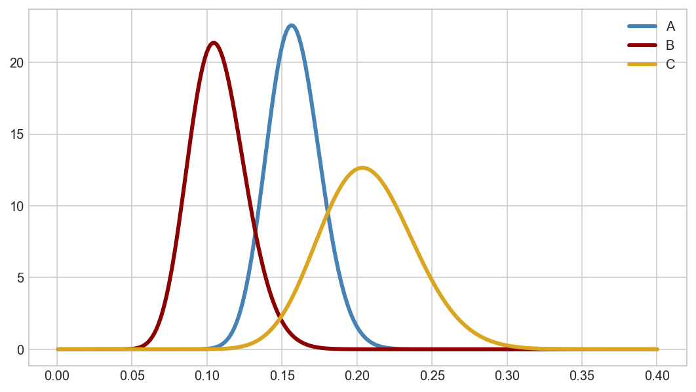


<a id='beta-sampling'></a>
### Calculate AvB, AvC, and BvC using sampling from the beta distribution

The beta distributions for the arm are our posterior distributions for the conversion rate of each arm given the observed data.

We can calculate the distributions of differences in rates between the arms using sampling. The procedure is:
1. Set up a certain number of iterations (1000, for example)
2. For each iteration, take a random draw from each beta distribution
3. Calculate the difference between the sampled rates between the arms
4. Store the differences in lists

Then you can plot these distributions of differences.


```python
a_samples = a_beta.rvs(5000)
b_samples = b_beta.rvs(5000)
c_samples = c_beta.rvs(5000)

AvB = a_samples-b_samples
AvC = a_samples-c_samples
BvC = b_samples-c_samples
```


```python
ax = sns.distplot(AvB)
ax.axvline(0, lw=2, ls='dashed', c='black')
```


    <matplotlib.lines.Line2D at 0x1c245d1cc0>


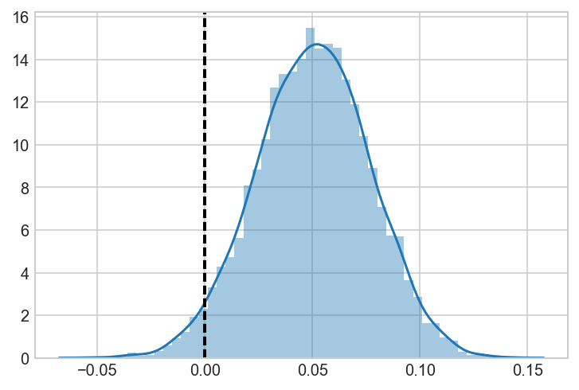


```python
ax = sns.distplot(AvC)
ax.axvline(0, lw=2, ls='dashed', c='black')
```


    <matplotlib.lines.Line2D at 0x1c25736710>


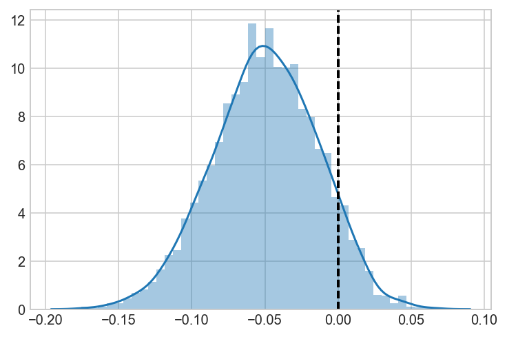


```python
ax = sns.distplot(BvC)
ax.axvline(0, lw=2, ls='dashed', c='black')
```


    <matplotlib.lines.Line2D at 0x1c243ad588>


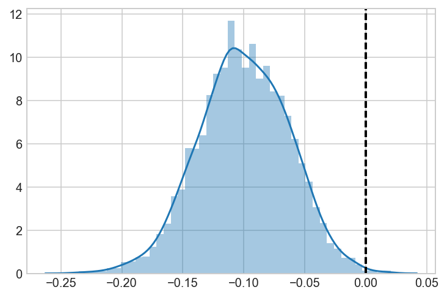


<a id='beta-vs-pymc3'></a>
### Validate that these results are the same as a `pymc3` model

You can just take the model you built for day 11 and adjust it to use all the days. Plot the posterior distributions and validate that the results are (almost) the same as you get from sampling from the beta distributions.


```python
with pm.Model() as all_days_model:
    
    A_p = pm.Uniform('A_prob', lower=0, upper=1)
    B_p = pm.Uniform('B_prob', lower=0, upper=1)
    C_p = pm.Uniform('C_prob', lower=0, upper=1)
    
    A = pm.Bernoulli('A', p=A_p, observed=data[data.arm == 'A'].converted.values)
    B = pm.Bernoulli('B', p=B_p, observed=data[data.arm == 'B'].converted.values)
    C = pm.Bernoulli('C', p=C_p, observed=data[data.arm == 'C'].converted.values)
    
    AvB = pm.Deterministic('AvB', A_p - B_p)
    AvC = pm.Deterministic('AvC', A_p - C_p)
    BvC = pm.Deterministic('BvC', B_p - C_p)
    
    start = pm.find_MAP()
    trace = pm.sample(50000, start=start)
    
```

    logp = -502.53, ||grad|| = 148.32: 100%|██████████| 10/10 [00:00<00:00, 1289.64it/s]
    Auto-assigning NUTS sampler...
    Initializing NUTS using jitter+adapt_diag...
    Multiprocess sampling (2 chains in 2 jobs)
    NUTS: [C_prob_interval__, B_prob_interval__, A_prob_interval__]
    100%|██████████| 50500/50500 [00:46<00:00, 1083.75it/s]


```python
pm.plot_posterior(trace[5000::3], varnames=['AvB','AvC','BvC'], color='#87ceeb', ref_val=0.)
```


    array([<matplotlib.axes._subplots.AxesSubplot object at 0x1c260b9160>,
           <matplotlib.axes._subplots.AxesSubplot object at 0x1c260e9588>,
           <matplotlib.axes._subplots.AxesSubplot object at 0x1c25dc5080>],
          dtype=object)


<a id='resources'></a>
## Additional resources
---
+ [Obama Fundraising](https://blog.optimizely.com/2010/11/29/how-obama-raised-60-million-by-running-a-simple-experiment/) example
+ [Social Media Marketing](https://vwo.com/blog/amd-3600-social-sharing-increase) example
+ [Google Multi-Armed Bandit](https://support.google.com/analytics/answer/2844870?hl=en) explanation
+ [Designing an AB Test](http://www.win-vector.com/blog/2015/06/designing-ab-tests/)
+ [AB Testing Considerations](http://insightdatascience.com/blog/ab_testing_statistics.html)
+ Khan Academy [T-Test vs Z-Tests](https://www.khanacademy.org/math/probability/statistics-inferential/hypothesis-testing/v/z-statistics-vs-t-statistics)
+ Khan Academy [T-Tests and Confidence Intervals](https://www.khanacademy.org/math/probability/statistics-inferential/hypothesis-testing/v/t-statistic-confidence-interval)
+ [NerdWallet's discussion of improving A/B tests](https://assets.nerdwallet.com/blog/wp-content/uploads/2016/05/ab_stats_blog.pdf)
+ Tinder's [example](https://www.wired.com/2016/10/tinder-taps-inner-vegas-guess-people-will-swipe-right/) on concurrent A/B testing for smart photos
